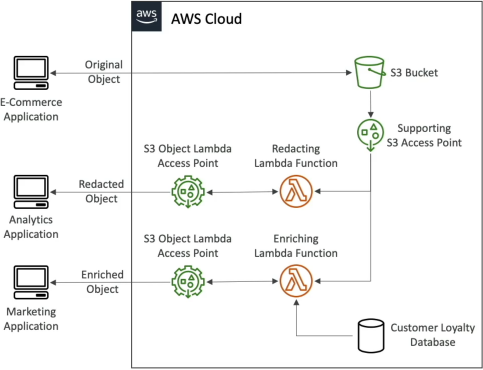

# S3 Object Lambda

**Amazon S3 Object Lambda** allows developers to inject a custom AWS Lambda function directly into the standard S3 data retrieval pipeline (`GET`, `HEAD`, and `LIST` requests). Instead of fetching a static file copy, S3 dynamically routes the raw data payload through your serverless code first, modifying, transforming, or redacting the content on the fly before delivering the tailored payload to the calling client. This multi-view pipeline is achieved by chaining an **S3 Object Lambda Access Point** on top of a supporting standard **S3 Access Point**.

## Key Takeaways

### The Architectural Chain (How Data Morphs)

S3 Object Lambda isn't a standalone database; it is a smart compute wrapper built entirely on top of the S3 Access Points infrastructure we just mastered. The data transformation flows down a strict structural pipeline:

#### 🧩 The Anatomy of the Multi-View Pipeline

Let's trace how Stephane's E-commerce, Analytics, and Marketing applications pull three entirely different payloads out of the exact same master file (`customer_data.csv`):

- **The Core Raw Path (E-Commerce App)**:
  - _The Route_: Hits the primary S3 bucket endpoint directly.
  - _The Payload Result_: Receives the pure, untouched original master file containing names, credit cards, and addresses.
- **The Redacted View Path (Analytics App)**:
  - _The Route_: Fires a `GET` request targeting the `Redaction-Object-Lambda-Access-Point`.
  - _The Interception_: S3 blocks the standard fetch and instantly spins up your `Redact-PII` Lambda function.
  - _The Logic_: The Lambda function automatically pulls the raw CSV file out of S3, strips away the name and SSN text rows, and drops a completely sanitized dataset down to the Analytics client browser.
- **The Enriched View Path (Marketing App)**:
  - _The Route_: Fires a `GET` request targeting the `Enrichment-Object-Lambda-Access-Point`.
  - _The Interception_: S3 spins up an alternate `Enrich-Data` Lambda function.
  - _The Logic_: The Lambda function pulls the raw file from S3, queries an external customer loyalty database to append reward point metrics, and outputs a highly detailed, personalized document straight to the Marketing app.

### High-Leverage Production Use Cases

Senior full-stack engineers deploy S3 Object Lambda to execute dynamic runtime translations across three primary domains:

- **Data Masking and Security Governance (PII Redaction)**: Masking credit card digits (`xxxx-xxxx-xxxx-1234`) or scrub-deleting health records before routing data lake assets into analytics engines or non-production staging sandboxes.
- **Format Mutation (XML to JSON Parsing)**: Transforming legacy on-premise system configurations saved as .xml blocks into modern .json structures dynamically, saving front-end applications from executing expensive translation routines locally.
- **Dynamic Media Customization (Watermarking on the Fly)**: Resizing, compressing, or overlaying a unique user-specific security watermark string across a high-resolution image upload (photo.jpg) based entirely on the specific user account ID that initiated the GET request!

## Exam Tips

**The Structural Prerequisite Trap**: Imagine an exam scenario states, _"You are configuring an S3 Object Lambda Access Point to dynamically convert CSV data into JSON formats for a mobile app client. During the manual provisioning phase inside the AWS CLI, your command throws a configuration exception error stating that a required prerequisite component dependency is missing. What did you forget to build?"_  
**The textbook answer is that you cannot bind an S3 Object Lambda Access Point directly to a raw S3 bucket**. >
To construct the pipeline cleanly, you must create a standard S3 Access Point first! S3 Object Lambda uses the standard Access Point as its underlying security and routing bridge to talk to the bucket file grid. If you fail to supply that supporting access point coordinate, the deployment engine will throw a validation fault and stall out.

**The Supported API Verb Limit**: Another favorite test question monitors which API calls can trigger a Lambda transformation. S3 Object Lambda exclusively intercepts data retrieval commands: GET, HEAD, and LIST. You cannot inject an Object Lambda transformation into an active write PUT execution loop. If a client executes a PUT, the payload routes directly into the base storage bucket unchanged!
