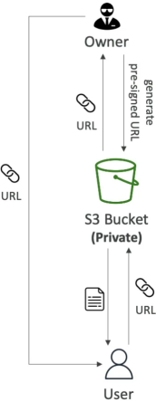

# S3 Pre-Signed URLs

An **Amazon S3 Pre-Signed URL** is a cryptographically signed web address generated programmatically (via Console, CLI, or SDK) that grants temporary, time-restricted access to a private S3 object. The user executing the link **inherits the exact IAM permissions** of the identity that originally compiled the URL. This allows anonymous or external clients to safely execute `GET `(download) or `PUT` (upload) transactions against specific bucket keys without exposing the underlying storage pool to the public.

## Key Takeaways

The beauty of a pre-signed URL is that S3 doesn't have to keep track of it. The authorization logic is entirely mathematical, burned straight into the URL text string using standard **AWS SigV4** signing logic.

### ⚙️ The Execution Lifecycle Steps

- **The Generation**: Your application backend (running under an IAM role with S3 permissions) uses the AWS SDK to compile a link. It packages the target bucket name, object key path, the intended HTTP verb method (`GET` or `PUT`), and an expiration window. It signs this package using its own secret credentials to output a URL containing the query parameter string `X-Amz-Signature`.
- **The Delivery**: Your app hands this plain text link over to an external client (e.g., rendering it as a download button on your frontend dashboard).
- **The Interception & Valuation**: The client browser hits the URL link directly against S3. S3 intercepts the query string parameters, recreates the mathematical signature hash, and verifies that the link has not expired. S3 executes the action and drops or accepts the data matrix cleanly!

### Expiration Constraints & Lifespan Rules

A pre-signed URL is a ticking time bomb—once the clock hits zero, the cryptographic signature is voided, and S3 will block the connection with an `ExpiredToken` or access error block. The generation vector determines the maximum lifespan limits:

| Generation Mechanism Tool   | Maximum Lifespan Boundary Limit | Primary Use Case Scenario                                              |
| --------------------------- | ------------------------------- | ---------------------------------------------------------------------- |
| **AWS Management Console**  | **12 Hours**                    | Quick manual data sharing by administrators inside the web UI grid.    |
| **AWS CLI & SDK Libraries** | **7 Days (168 Hours)**          | "Dynamic automation layers, streaming backends, and app integrations." |

- **The Secret Token Trap (Exam Metric)**: As we learned in our previous cloud architecture modules, if you generate a pre-signed URL using temporary security tokens (like an IAM Role running inside an AWS Lambda function or a local CLI SSO session starting with `ASIA`), **the URL will automatically die the exact second those underlying temporary credentials expire**, completely overriding whatever maximum expiration value (`--expires-in`) you specified in your code!

### Real-World Production Use Cases

- **Premium Media Gating (Downloads)**: Your bucket contains copy-protected video assets or invoice PDFs. The bucket remains private. When an authenticated customer logs into your app and clicks "Download Invoice," your backend validates their login token, generates a pre-signed `GET` URL with a tight 5-minute window, and drops the link onto the UI.
- **Large File Ingestion (Uploads)**: Imagine users need to upload a heavy $2\text{ GB}$ video file to your platform. If they upload it directly to your Node.js application server, your backend will choke on the incoming network bandwidth.
  - _The Fix_: Your client app asks the backend for an S3 Pre-Signed `PUT` URL. The app backend returns the link, and the client browser uploads the massive binary file **directly to S3**, completely bypassing your application servers and saving your compute overhead!

## Exam Tips

**The Inherited Permissions Trap**: Imagine an exam scenario states, _"A junior developer sets up a background Lambda function to generate pre-signed URLs so web clients can upload log archives to an S3 bucket. The Lambda function's IAM Execution Role has full `s3:PutObject` permissions. However, the developer mistakenly configures the SDK code to generate a pre-signed URL targeting an explicit `s3:DeleteObject` method function. What happens when a web client attempts to execute a deletion using that link?"_  
**The textbook answer is that the request will fail with an explicit Access Denied error**. > A pre-signed URL is a zero-trust construct. For a request to execute successfully, two conditions must pass simultaneously:

1. The HTTP method used by the caller must match the method declared when the link was signed.
2. The identity that generated the link must possess active IAM permissions to execute that specific action.
