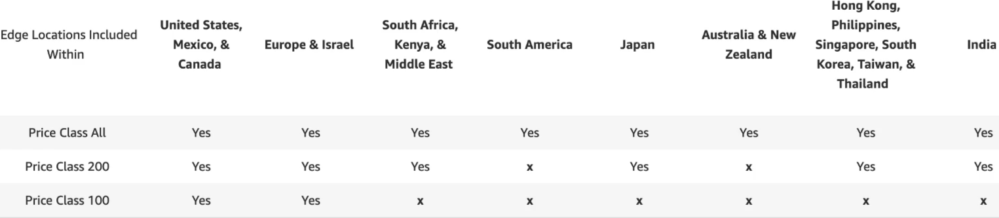
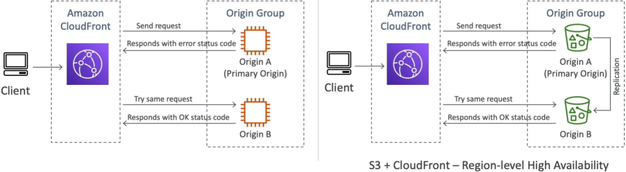
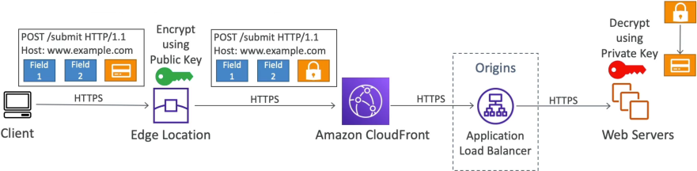

# CloudFront Advanced Concepts

Amazon CloudFront offers advanced tuning layers for global delivery configurations. **Price Classes** allow developers to selectively turn off expensive edge geography groups to optimize billing. For tier-1 resiliency, **Origin Groups** introduce transparent, client-side architectural failover state loops across multi-region storage or active compute backends. To lock down ultra-sensitive payload forms before they even travel down the internal network wire, **Field-Level Encryption** applies mathematical asymmetric ciphers right at the Edge PoP.

## Key Takeaways

### Cost Management: CloudFront Price Classes

Because infrastructure, local power grids, and transit fiber lines cost different amounts depending on the continent, AWS splits its global Data Transfer Out (DTO) fees. For instance, pushing bits out of North America might be exceptionally cost-efficient, but pushing data across edge environments in India or South America can easily double your bills!

To help you control this, CloudFront gives you a cost-optimization dial called **Price Classes**:

- **Price Class 100**: Uses only the lowest-cost edge tiers—North America and Europe only. Global users connecting from outside these boundaries can still read your app, but CloudFront routes their packets over long-distance transit backbones to a Western edge node, sacrificing speed for rock-bottom costs.
- **Price Class 200**: Includes the baseline regions plus Asia, Africa, and the Middle East, cutting out only the absolute most expensive outlier data lanes.
- **Price Class All**: Activates **every single global edge location worldwide** for maximum possible throughput and single-digit milliseconds latency everywhere. However, you will pay full geographic premium prices for traffic traversing premium zones.

### Fault Tolerance: Origin Groups and Multi-Region Failover

While standard Cache Behaviors allow you to route separate paths to completely different places, **Origin Groups** are deployed strictly for **High Availability (HA)** and **Disaster Recovery (DR)**.

An Origin Group bundles a **Primary Origin** and a **Secondary (Backup) Origin** inside a unified cluster logic container.

#### ⚙️ The Automatic Failover Loop:

1. CloudFront handles a user query and attempts to extract the requested object from your **Primary Origin** (e.g., your main web server cluster or S3 bucket).
2. If the primary endpoint experiences an active outage or an internal application crash, it returns an explicit error status code (you can configure CloudFront to watch for: `500`, `502`, `503`, `504`, `403`, or `404`).
3. Instead of bubbling that error screen down to the end-user browser, CloudFront instantly captures the failure event and triggers a seamless **Failover Redirect** straight to your **Secondary Origin**.

#### 🪣 The S3 Cross-Region DR Combo

By applying S3 Cross-Region Replication (CRR) between Bucket A (e.g., Sydney) and Bucket B (e.g., Virginia) and framing them inside a CloudFront Origin Group, you build an ironclad static web setup. If an entire AWS region experiences an active blackout, CloudFront transparently serves your live code from the alternate hemisphere with absolute zero downtime!

### Zero-Trust Compliance: Field-Level Encryption

Standard HTTPS/TLS guarantees encryption "in flight" across the public web. However, the moment that packet clears your Application Load Balancer (ALB) or reverse proxy gateway, it is decrypted back into cleartext data as it travels across your internal VPC subnets to your application layer.

If your corporate security officer mandates absolute compliance boundaries for highly sensitive text inputs (like a 16-digit credit card number or private health identifiers), standard flight encryption is a failure block. You need **Field-Level Encryption**.

#### 🔏 The Asymmetric Blinding Chain:

1. Inside CloudFront, you register a secure cryptographic asymmetric **Public Key** and write a structural policy mapping up to 10 specific HTML POST request field keys (e.g., tracking the form key `cc_payload`).
2. The user submits their transaction data securely via standard HTTPS.
3. The absolute millisecond that packet hits the close **CloudFront Edge Location**, CloudFront strips out the `cc_payload` text string and instantly runs an internal cipher loop using your public key, turning it into encrypted ciphertext garbage.
4. This blinded payload passes down through your internal web proxies, target load balancers, and container nodes. Even if an internal hacker intercepts your network fabrics or an engineer accidentally logs raw requests to CloudWatch, the core data is unreadable.
5. **The Final Decryption Desk**: The packet lands inside your isolated payment microservice backend which securely holds the matching asymmetric **Private Key**. Your proprietary software logic invokes the private key, decrypts the ciphertext, and completes the internal processing pass cleanly.

## Exam Tips

**The Regional Outage Architecture Matrix**: An exam scenario states, _"You host a dynamic, global API endpoint utilizing an Application Load Balancer origin behind a CloudFront distribution. To guarantee maximum high availability during an active regional disaster, you provision an identical backup ALB environment inside a secondary AWS region. How should you configure CloudFront to seamlessly reroute production application web traffic to the backup region without manual intervention or DNS changes?"_  
**The absolute, textbook answer on test day is to configure an S3/ALB Origin Group**. > You register both regional ALB load balancers as separate origins inside your distribution settings. Next, you bundle them inside a new Origin Group, establishing the primary region ALB as the main actor and setting the secondary region ALB inside the backup slot. You map this Origin Group directly onto your target `/api/*` cache behavior rule, checking off HTTP status blocks like 502 Bad Gateway and 503 Service Unavailable as execution triggers. The moment the primary region falters, CloudFront switches the active data path automatically!
