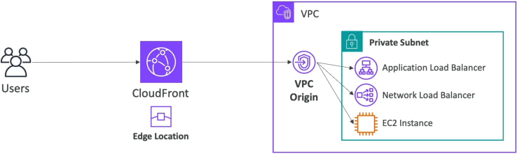
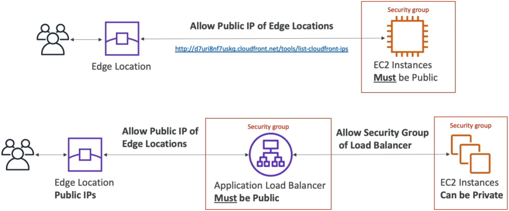

# ALB/EC2 as an Origin

Amazon CloudFront supports routing edge-tier traffic directly into backend compute infrastructure. The modern, gold-standard architecture utilizes **CloudFront VPC Origins**, which establishes a secure, private abstraction layer routing traffic directly into non-internet-facing **private subnets**. This allows Application Load Balancers (ALBs), Network Load Balancers (NLBs), and raw EC2 instances to remain entirely cloaked from the public web wire while maintaining CloudFront as the absolute, single ingress point for global users.

## Key Takeaways

Before this breakthrough feature hit the cloud control plane, routing traffic from CloudFront to an ALB forced you to make that load balancer public.

Now, with **VPC Origins**, your entire compute stack can live completely inside isolated private subnets with **zero internet gateways** or **public IP addresses**.

### ⚙️ The Architectural Workflow

1. **The Core Resource Connection**: Inside the CloudFront console, you navigate to **VPC Origins** and map out a connection pointing straight to the Amazon Resource Name (**ARN**) of your internal, private ALB or EC2 node.
2. **The Private Managed Bridge**: Behind the scenes, CloudFront provisions highly secure, managed network interfaces that map straight into your Virtual Private Cloud.
3. **The Data Pipeline**: When a global viewer hits your distribution domain, CloudFront captures the packet and pipes it across the high-throughput **AWS Backbone Network**, dropping it cleanly past your network perimeter straight onto your private compute nodes.

🔒 **The Security Multiplier**: Because your ALB is explicitly configured as **Internal**, its DNS endpoint resolves exclusively to private, local IP addresses (e.g., `10.0.x.x`). A bad actor sitting on the public web cannot scan, trace, or execute a direct brute-force DDoS attack against your load balancer because it literally does not exist on the public internet layout!

### The Legacy Paradigm: The Public Network Allowed IP Strategy

Stephane highlights the old legacy method because you _will_ run into it when auditing older codebases or answering historical troubleshooting scenarios.

Before VPC Origins existed, you had no choice but to configure your ALB or EC2 instance as **Public / Internet-Facing**. To stop random internet bots from bypassing the CDN, you had to build a complex IP firewall perimeter using **Security Groups**:

### 🛠️ The Maintenance Overhead Loop

1. **The IP Allowlist Matrix**: You had to constantly pull the global, live JSON registry map tracking every single public IP range utilized by hundreds of CloudFront Edge locations.
2. **The Security Group Wall**: You had to add these explicit IP blocks right into the inbound rules of your origin's Security Group, restricting traffic exclusively to CloudFront.
3. **The Modern Fix Upgrade**: To make this legacy design slightly less tedious, AWS introduced an AWS-Managed Prefix List called `com.amazonaws.global.cloudfront.origin-facing`. Instead of hardcoding shifting arrays of IPs, you simply whitelist this prefix ID in your Security Group rule, and AWS keeps the underlying IP maps updated automatically!

## Exam Tips

| Architectural Challenge Requirement                                                    | Legacy / High-Maintenance Option                                                                                             | Modern Gold-Standard Managed Choice                                                           |
| -------------------------------------------------------------------------------------- | ---------------------------------------------------------------------------------------------------------------------------- | --------------------------------------------------------------------------------------------- |
| **Enforce CloudFront as the only entry point for a private ECS cluster behind an ALB** | Build an Internet-Facing ALB and lock down incoming traffic using the CloudFront Managed Prefix List inside Security Groups. | **Deploy an Internal ALB and link it via a CloudFront VPC Origin endpoint.**                  |
| **Pass secret verification tokens down to a custom public HTTP backend origin**        | Managing intricate cross-account VPC peering or transit mesh setups.                                                         | **Configure Custom Header Verification (`X-Origin-Verify`) matched against an AWS WAF rule.** |

**The Custom Header Spoof-Prevention Trap**: Imagine an exam scenario states, _"You are auditing a legacy web application where a public Application Load Balancer acts as a custom origin behind a CloudFront distribution. You want to guarantee that malicious clients cannot bypass CloudFront to attack the public ALB directly. However, the company firewall constraints prevent you from using standard Security Group IP whitelists. How do you secure this ingress path?"_  
**The textbook architectural answer is to implement Custom Header Verification**.

1. Inside your CloudFront Distribution Origin settings, you inject a secret, static custom HTTP header wrapper (e.g., Header Name: `X-Origin-Verify`, Value: `SecretSecretToken123`).
2. CloudFront passes this secret header on every single background origin fetch request.
3. At your public ALB layer (or using an attached **AWS WAF** rule applied to the load balancer), you write an inspection condition: \_If the incoming request possesses the `X-Origin-Verify` header matching your secret token string, allow it through. If the header is missing or incorrect (meaning a hacker is trying to hit the ALB's public IP directly), instantly drop the connection with an HTTP 403 block!
