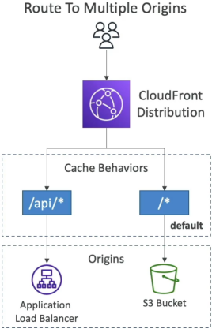
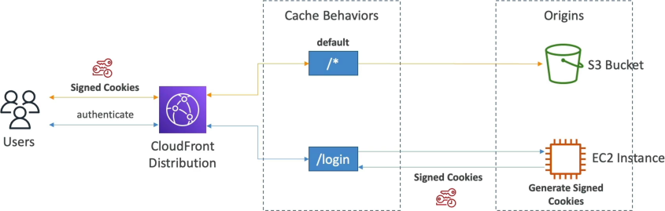

# Cache Behaviors

**A CloudFront Cache Behavior** maps an explicit URL path pattern (e.g., `/images/*`) to a dedicated backend origin, dictating exactly how traffic is routed and cached. Every CloudFront distribution is initialized with a catch-all **Default Cache Behavior** (`/*`) that handles any traffic failing to match a more specific rule. By prioritizing path evaluations from top to bottom, cache behaviors allow developers to isolate public media buckets from dynamic, identity-restricted application layers on a single domain.

## Key Takeaways

Instead of building different domain names for every microservice, you expose a single, unified global entry point to your users. CloudFront evaluates incoming requests against an ordered array list of path patterns:

### 🧩 The Path Matching Precedence Rules:

1. **The First-Match Win**: When a request hits the Edge, CloudFront scans your behavior list starting at **Precedence index 0** and works its way down. The absolute first rule that evaluates to `true` claims the request and terminates the lookup loop.
2. **Specificity Trumps Defaults**: More specific wildcard rules (like `/api/*`) must be positioned at the top of the index chain.
3. **The Default Fallback Catch-all**: The Default Cache Behavior (`/*`) is hard-locked at the absolute bottom of the precedence hierarchy. It cannot be deleted or reordered. If a request path fails to trigger a match against any upper behavioral rule, it falls straight through to the default behavior.

### 📊 Hybrid Routing Configuration Mapping

| Precedence      | Path Pattern    | Targeted Backend Origin       | Applied Cache Policy    | Primary Architectural Purpose                                                                    |
| --------------- | --------------- | ----------------------------- | ----------------------- | ------------------------------------------------------------------------------------------------ |
| **0**           | `/api/*`        | **Application Load Balancer** | `CachingDisabled`       | Passes raw dynamic API JSON payloads straight to EC2 compute nodes with zero caching             |
| **1**           | `/images/*.jpg` | **S3 Asset Bucket**           | `CachingOptimized`      | Caches media binaries directly at the global Edge for up to 1 year with maximum cache hit ratio. |
| **2 (Default)** | `/*`            | **S3 Static Web Bucket**      | `Custom Staging Policy` | Handles core HTML/JS app distribution files with a conservative 24-hour TTL lifecycle.           |

### Dynamic Private Content Gating: Signed URLs vs. Signed Cookies

Stephane breaks down an elite production workflow using behaviors to build a premium subscriber login gate. When you need to protect high-value content (like premium video streams or digital course assets) from being ripped or hotlinked by unauthenticated users, you restrict your cache behavior to only honor **CloudFront Signed Tokens**.

1. **The Login Request**: A user hits `https://my-site.com/login`. This triggers a specific cache behavior mapped to an EC2 auth server origin. The server verifies their password and responds with an HTTP response setting **CloudFront Signed Cookies** inside the client browser session.
2. **The Premium Data Fetch**: The user navigates to a premium asset page, firing a request to `https://my-site.com/premium/video.mp4`.
3. **The Behavior Interception Gate**: This path triggers an upper cache behavior pattern mapped to `/premium/*`. This specific behavior is configured with **Restrict Viewer Access** (Trusted Key Groups) turned on.
4. **The Security Verdict**: CloudFront intercepts the incoming packet and scans the header metadata for your signed cookies. If the cryptographic signature matches and the embedded expiration timer is valid, the edge releases the streaming data out of your private S3 bucket. If a user tries to bypass the login page and hit the path directly without the cookies, CloudFront drops a hard `403 Forbidden` block instantly!

## Exam Tips

**The Media Streaming Architecture Matrix**: An exam scenario states, _"You are developing a video-on-demand platform that streams protected educational content globally via CloudFront. The video player loads an index playlist file (`playlist.m3u8`) which then dynamically triggers the browser to execute hundreds of sequential asynchronous requests to fetch localized video transport stream fragments (`/stream/part1.ts`, `/stream/part2.ts`, etc.) out of a private S3 bucket origin. Which security mechanism protects these assets with minimal code modification?"_  
**The absolute, textbook answer on test day is to choose CloudFront Signed Cookies over Signed URLs**. > Signed URLs are designed to gate access to a single, explicit file path string link. If you tried to use them for a video stream, your backend would have to programmatically compile hundreds of unique signed URLs on the fly for every single individual video segment chunk, completely breaking standard HLS streaming players.  
Signed Cookies allow you to grant a client generalized access to multiple restricted file paths under a broad directory prefix wildcard simultaneously. By dropping the signed cookie onto the browser session workspace, the web client inherits automatic read access to every media fragment matching the `/stream/*` behavior pattern, letting the native video player stream the entire movie flawlessly without modifying a single URL string link!
