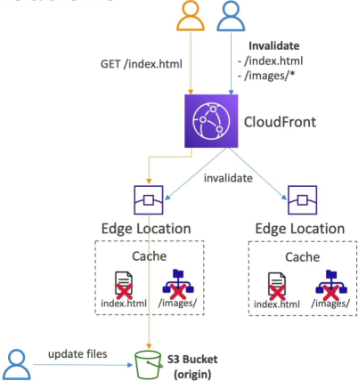

# Cache Invalidations

A **CloudFront Cache Invalidation** is an explicit, administrative command issued to the CloudFront control plane that instructs all global Edge locations to instantly purge specified objects from their local storage caches. By forcefully wiping out the remaining Time-To-Live (TTL) lifespan of an asset, the next incoming end-user request is guaranteed to trigger a **Cache Miss**, forcing the Edge to fetch the updated master file directly from your backend origin.

## Key Takeaways

By default, files stay locked inside Edge memory until their TTL expires. When you update your source S3 bucket, CloudFront is completely blind to that change. Here is the mechanical step-by-step of how an invalidation forces a global refresh:

### 🔄 The Purge & Re-Fetch Sequence

1. **The Origin Mutation**: You upload a brand-new `index.html` and a fresh batch of assets into your master S3 origin bucket.
2. **The Invalidation Dispatch**: You issue a CloudFront Invalidation command passing specific path selectors (e.g., `/index.html` and `/images/*`).
3. **The Global Eviction**: CloudFront blasts this instruction across its entire network of hundreds of global Edge locations. The edge nodes immediately delete the matching cached entries from their local volatile memory.
4. **The Forced Cache Miss**: A user visits your site. Their local Edge location realizes its copy of `index.html` is completely gone. It triggers a **Cache Miss**, routes back to the S3 bucket over the private AWS backbone, captures your fresh new file, caches it, and serves it to the user instantly!

### Syntax Rules & Path Filtering

When writing an invalidation script or using the console, you target files using explicit string patterns:

- **Specific Object Invalidation**: Targets one exact file path.
  - _Example Path_: `/index.html` or `/css/main.css`
- **Wildcard Directory Invalidation (`*`)**: Clears an entire nested asset branch or folder system simultaneously.
  - _Example Path_: `/images/*` (Purges every file inside the images directory).
- **Massive Global Purge**: Evicts your entire global footprint in one single sweep.
  - _Example Path_: `/*` (Use this cautiously in production, as it drops your overall Cache Hit Ratio to absolute zero, causing a massive wave of concurrent traffic to slam your origin server all at once!).

## Exam Tips

**The Cost Optimization Trap**: Imagine an exam scenario states, _"Your company deploys frontend single-page application updates multiple times a day to an S3 bucket behind CloudFront. To guarantee users always see the latest code, the build pipeline triggers a global `/*` cache invalidation on every single commit. As deployments scale, your company notices a massive spike in AWS CloudFront billing costs, despite total user traffic remaining completely flat. How do you resolve this with minimal engineering overhead?"_  
**The architectural answer relies on adopting a Cache-Busting/Object-Versioning strategy instead of relying on frequent invalidations.** >
AWS grants you 1,000 free invalidation paths per month; after that, you are billed per path execution.  
Instead of manually purging files, you configure your build tool (like Webpack or Vite) to append a unique cryptographic hash fingerprint straight to the output filenames on every build (e.g., app.v1.js updates to app.v2.js).  
Because the filename itself is completely new, it automatically bypasses the old cache and triggers a clean fetch. This approach saves you money, provides instant rollouts, and keeps your old static assets safely cached for users who haven't refreshed their browsers yet!
