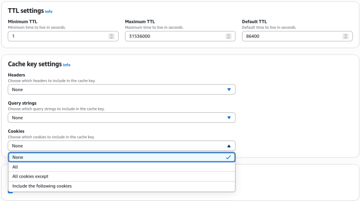
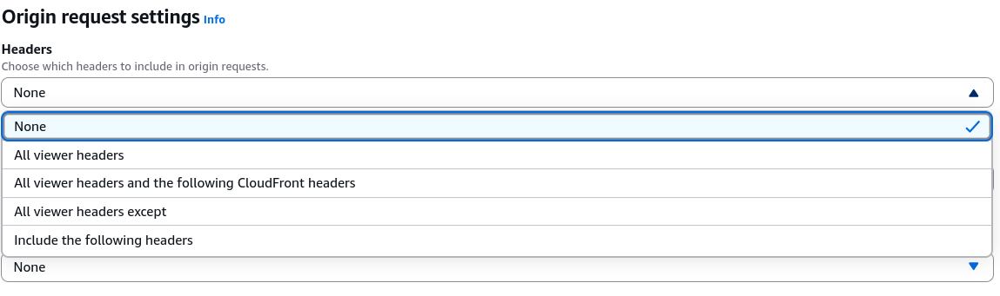
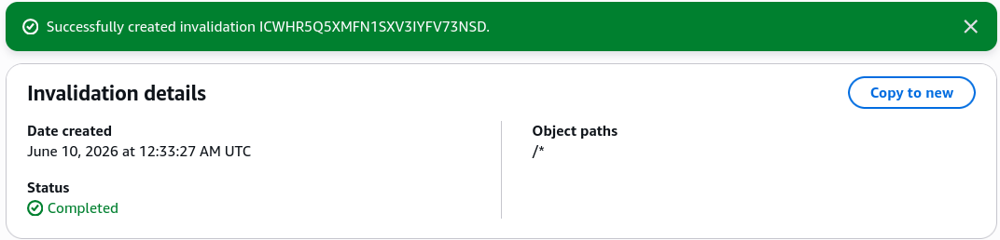
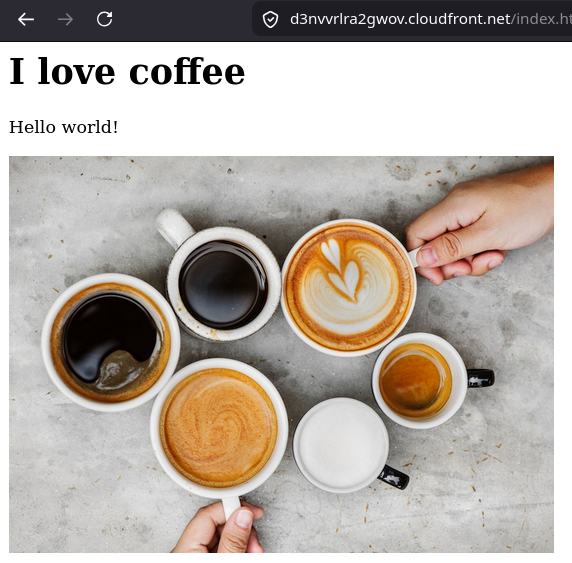

# Caching & Caching Invalidations Hands-on

Stephane's hands-on lab drops us straight into the live console engine rooms where you can actually see the difference between mutating a master storage file in S3 and forcing the global edge nodes to realize that a mutation occurred.

## Hands On

### Phase 1: Navigating the Cache Policy Construction Zone

- Open your **Amazon CloudFront Console** dashboard and click into your active distribution.
- Select the **Behaviors** tab panel, choose your catch-all **Default Behavior (`/*`)**, and click **Edit**.
- Scroll down to the **Cache key and origin request** container block. This is where you architect how CloudFront parses incoming web metadata tokens.
- **Build a Mock Cache Policy**:
  - Click **Create cache policy** to open the policy designer wizard window.
  - **TTL Bounds Engine**: Note how you possess absolute control over your asset lifespans via three explicit knobs: Minimum TTL, Maximum TTL, and Default TTL.
  - **Cache Key Settings**: Look at the granular whitelist filtering options. You can explicitly choose which HTTP headers, cookies, or tracking query parameters alter your primary Cache Key string.
  - _The Security Reminder_: Anything whitelisted here modifies the cache storage key and automatically forwards straight down to your origin backend!
    
- **Build a Mock Origin Request Policy**
  - Close the cache policy wizard and click **Create origin request policy**.
  - Observe how the configuration fields look identical to the cache policy layout (Headers, Cookies, Query Strings).
  - _The Golden Rule_: Whitelisting elements here appends them to your outbound origin request thread strictly _on a cache miss_, completely shielding your global Cache Key from fragmenting!
    

### Phase 2: Simulating the Stale Cache Problem

- Open up your local text editor, pull up your sandbox `index.html` file code layer, and update a text row to simulate an emergency web change.
- Save the document layer. Jump over to your **Amazon S3 Bucket Console** tab (`demo-cloudfront-rendy`) and click **Upload → Add files**. Drop your updated `index.html` file into the wizard and hit Upload to replace the old file block.
- **The S3 Verification Pass**: Click on the `index.html` overview profile page and click **Open**. S3 loads your new code instantly.
- **The CloudFront Stale Block Pass**: Open a fresh tab, navigate straight to your public global CloudFront domain endpoint URL (`https://d12345example.cloudfront.net/index.html`), and hit refresh.
- **The Result**: The UI still stubbornly shows the old code version.
- _Why?_ Because your distribution behavior is locked onto a default 24-hour TTL timer window cache profile. The local Edge location is hitting a standard **Cache Hit** on its internal disk drives, serving the old file layer and completely ignoring your fresh S3 bucket update! 🛑

### Phase 3: Triggering the Global Invalidation Purge

- To drop this edge wall, toggle back over to your **Amazon CloudFront Distribution** management space.
- Click into the **Invalidations** sub-tab menu panel and click **Create invalidation**.
- **The Invalidation Input Payload**: Inside the object path configuration field text box, pass a global wildcard string to wipe the entire repository matrix simultaneously: `/*`
- Click the **Create invalidation** execution button.
- Watch the status transition indicator spin through `In Progress` until it hits a clean `Completed` check state. CloudFront has officially cleared the volatile caches across hundreds of global PoPs.
  

### Phase 4: Validating the Inflight Refresh Loop

- Return directly to your active browser tab containing your **CloudFront Domain address string**.
- Force a hard browser pipeline reload (`Ctrl + F5` or `Cmd + Shift + R`).
- **The Result**: The screen updates instantly to display your fresh new code version.
- _The Mechanics_: The invalidation command wiped out the old file footprint inside Edge memory. When you reloaded the browser, the Edge location hit a clean **Cache Miss**, raced back across the private AWS network to extract the fresh HTML code from your S3 bucket origin, saved it locally, and pushed the new code down to your application screen.  
  

## Exam Tips

**The Blast-Radius Throttling Trap**: Imagine an exam scenario states, _"You manage a high-traffic e-commerce storefront utilizing an S3 bucket origin behind a CloudFront distribution. Your team pushes a tiny CSS text adjustment to the `/styles/global.css` file path. To ensure users pull the update, an automated pipeline triggers a global `/*` cache invalidation.  
The moment the invalidation runs, your backend database and S3 tracking layers instantly collapse under a massive spike of concurrent traffic requests, throwing 503 Service Unavailable exceptions down to global shoppers. What went wrong, and how do you resolve it?"_  
**The diagnostic answer relies on calculating the architectural blast radius of your invalidation syntax**. >
When you issue a sweeping global wildcard invalidation (`/*`) on a live production system, you are aggressively erasing every single file, image, layout script, and video asset cached globally. >
The next million concurrent shoppers hitting your site across the world all experience a simultaneous **Cache Miss**. Because there is no edge cache left to buffer the load, your app tries to **fetch every single asset from scratch at the exact same second**. This completely floods your origin infrastructure with cache-miss traffic, triggering a self-inflicted Denial of Service (DoS) event!  
The direct technical fix is to **limit your invalidation blast radius**. You must update your automation build configurations to pass the tightest, most explicit file path selector possible (e.g., target only `/styles/global.css`), leaving the rest of your heavy image and structure caches safely intact inside the global Edge nodes!
