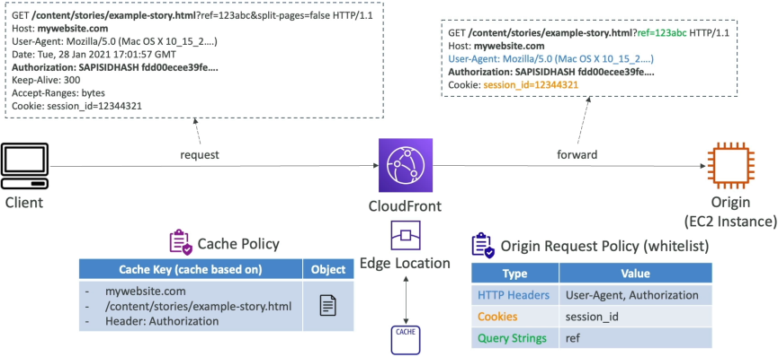

# Caching & Caching Policies

Amazon CloudFront leverages a deterministic string called a **Cache Key** to uniquely identify and map cached assets inside an Edge location's volatile memory. By default, the Cache Key consists strictly of the **Host Name** and the **URL Resource Path**. To deliver dynamic, localized content, developers utilize Cache Policies to inject HTTP headers, cookies, or query strings into that Cache Key. Alternatively, to pass data down to the backend without fragmenting the cache storage space, engineers deploy separate **Origin Request Policies** to append metadata strictly to the outbound origin request thread.

## Key Takeaways

### Deconstructing the CloudFront Cache Key

Think of the CloudFront cache as a massive, distributed hash map (`Map<String, BinaryObject>`). The key you look up is the Cache Key.

If two completely different global users fire a request over the wire and their request parameters compile into the exact same Cache Key string, the second user scores an instant **Cache Hit**, pulling the asset right out of the local Edge memory pool within single-digit milliseconds!

### 🧩 The Default Mapping Blueprint

```math
\text{Default Cache Key} = \text{Host Name} + \text{URL Resource Path}
```

- _Example URL_: `https://my-app.com/content/stories/story.html`
- _The Default Key_: `my-app.com/content/stories/story.html`

If you don't adjust anything else, any query parameters, cookies, or extra headers attached to that request are completely ignored by the cache checking engine.

### The Power of Cache Policies: Controlling TTL and Keys

When your backend origin serves customized content—like translating a blog post on the fly based on an HTTP language header—the default Cache Key is too blunt. If a user requests a page in French (`Accept-Language: fr-fr`), S3 fetches the French file and caches it under the default key. If a second user requests the exact same URL path but wants English (`Accept-Language: en-us`), CloudFront will hit a false match on the default key and serve them the French cached file! 🛑

To stop this data leakage, you attach a **Cache Policy** to your distribution behavior to enhance the Cache Key footprint.

### ⚙️ What can you configure in a Cache Policy?

1. **The Time-To-Live (TTL) Bounds**: You dictate the absolute expiration fences for your cached assets:
   - **Minimum TTL**: Defaults to $0\text{ seconds}$.
   - **Maximum TTL**: Up to $31,536,000\text{ seconds}$ ($1\text{ year}$).
   - **Default TTL**: Typically $86,400\text{ seconds}$ ($24\text{ hours}$).
   - _Note_: You can also let your code control these timers directly from your origin server using HTTP headers like `Cache-Control: max-age=3600` or `Expires`.
2. **The Cache Key Attributes (Headers, Cookies, Query Strings)**: You specify exactly which web metadata fields should modify the Cache Key:
   - **None**: Best performance fallback. No extra parameters affect the key.
   - **Whitelist**: Only include explicitly declared fields (e.g., whitelist the `Accept-Language` header).
   - **All Except**: Includes all parameters except those explicitly excluded.
   - **All**: Includes entire arrays of strings in the key.

:::warning
**The Architecture Trade-off Law**: Every single field you append to a Cache Policy automatically forwards that parameter down to the origin request pool. However, **more fields = worse caching performance!** If you include a highly unique user header (like a device coordinate or a fast-shifting timestamp query), your Cache Keys fragment into millions of unique variations. Your Cache Hit Ratio will crater, and your origin server will collapse under cache-miss traffic!
:::

### Cache Policy vs. Origin Request Policy: The Big Divide

This is the absolute number-one concept developers mess up on the exam. Stephane spent a lot of time simplifying this, so let's lock it down into a crystal-clear architectural law.

Sometimes, your backend code desperately needs to see a user variable (like a custom tracking query parameter `?ref=twitter` or a browser session identity cookie), but **you do not want that data to alter or fragment your global cache key**. To handle this split execution path, you deploy an **Origin Request Policy** _in tandem_ with your Cache Policy:



### 📊 The Ultimate Architectural Decision Matrix

| Dimension Attribute         | Cache Policy                                                                                                      | Origin Request Policy                                                                                                 |
| --------------------------- | ----------------------------------------------------------------------------------------------------------------- | --------------------------------------------------------------------------------------------------------------------- |
| **Primary Functional Goal** | Configures the **Cache Key structural hash** and sets the object aging TTL boundaries inside Edge memory.         | Appends extra client metadata to the outbound request thread **strictly on a Cache Miss**.                            |
| **Impact on Caching**       | **Massive**. Controls whether a request triggers an immediate Cache Hit or a Cache Miss.                          | **Zero**. Has completely no impact on how files are checked or stored inside Edge cache.                              |
| **Data Forwarding Rule**    | Any parameter whitelisted here is **automatically forwarded** to the origin server.                               | Passes parameters to the origin server **without** adding them to the Cache Key hash.                                 |
| **Typical Use Case**        | Injecting an `Authorization` header or an internal language string required to serve a customized file variation. | Passing along detailed user analytics metrics (`User-Agent`, tracking query strings) to your logging server backend." |

## Exam Tips

### The Instant Cache Eviction Pattern (Invalidations)

**The Stale Code Emergency**: Imagine an exam scenario states, _"Your development team just pushed an emergency frontend bugfix update to your S3 origin bucket, replacing an old broken `app.js` file script. However, global clients are reporting that they are still pulling down the old broken code version when they visit your domain URL endpoint. The file has a Default TTL configuration set to 24 hours. How do you force CloudFront to distribute the fresh code immediately without changing the file path?"_  
**The textbook answer is to create a CloudFront Cache Invalidation**. >
Instead of waiting out the 24-hour TTL clock countdown, you can issue an invalidation command passing an explicit object path or a wild card variable pattern string (`/app.js` or `\*`). S3 maps the target across its entire network of hundreds of global Edge nodes, stripping out the old volatile data caches within seconds. The very next user request forces a clean Cache Miss to pull your fresh code straight out of the origin bucket!

### The CloudFront Custom Injection Trick

**The Secure Header Injection**: Another favorite test question scenarios reads: _"You have an API gateway origin behind a CloudFront distribution, and you want to ensure that only requests routed directly through your CDN are permitted to execute code on your backend. You want to pass a secret API key signature header from the Edge down to the origin, but you do not want the client browser to ever see or possess this secret key. Where do you configure this?"_  
**The architectural answer is to configure Custom Headers inside your Origin Request Policy settings**. >
S3 lets you append static custom HTTP header values directly at the distribution origin definition layer. When a client fires a naked request to the Edge, CloudFront catches the packet, injects your secret signature key header during the origin request assembly phase, and drops it straight onto your backend server API gateway, completely hidden from the public web wire!
