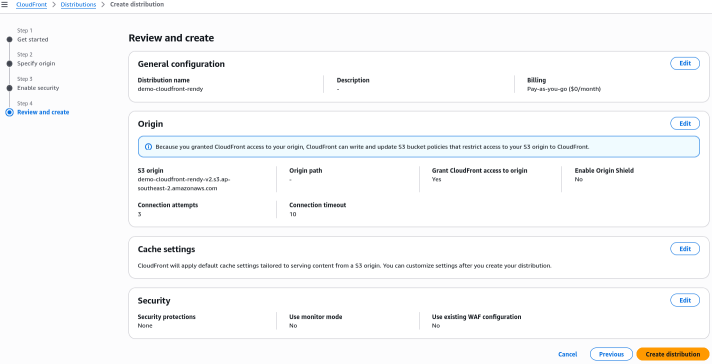
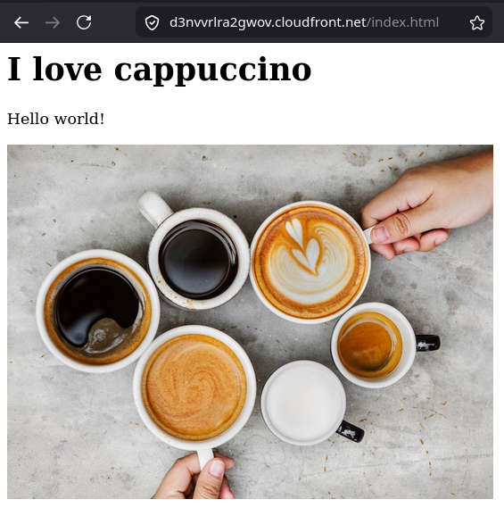

# CloudFront Hands On

This hands-on lab covers provisioning an isolated private S3 storage bucket, initializing a modern Amazon CloudFront Distribution bound to that S3 origin, deploying an **Origin Access Control (OAC)** trust policy to secure data channels, and auditing how Edge caches intercept asset requests to completely eliminate latency overhead.

## Hands On

### Phase 1: Initialize the Private Data Vault

- Open the **Amazon S3 Console** and click **Create bucket**.
- **Bucket name**: Type `demo-cloudfront-rendy`.
- **AWS Region**: Select Sydney (ap-southeast-2).
- Leave all secondary configuration parameters at their absolute default values (ensuring **Block Public Access** is checked _On_) and click **Create bucket**.
- Click into your new bucket, click **Upload → Add files**, and drop three testing files into the container: `beach.jpg`, `coffee.jpg`, and a basic `index.html` file layout. Hit **Upload**.
- The Security Boundary Audit: Click on the `index.html` file link, and try to browse directly via its native Object URL string path $\longrightarrow$ The browser will immediately block the connection with an `Access Denied (403)` error wrapper. Your bucket is perfectly locked down.

### Phase 2: Deploy the CloudFront Distribution Framework

- Open a new browser tab and navigate straight to the **Amazon CloudFront Console**.
- Click **Create distribution**.
- Name it something unique like `demo-cloudfront-rendy`.
- _Note_: If you have a existing Route 53 managed domain, you can optionally attach a custom CNAME alias to your distribution here. For this lab, we will skip that step and just use the default CloudFront domain name.
- **Origin Selection**: In the Origin domain selection box, click inside the field and select your newly minted `demo-cloudfront-rendy` S3 bucket from the automated dropdown selector pool.
- **Settings**: Leave the Allow private S3 bucket access (OAC) checkbox On to automatically update the **S3 Bucket Policy** to allow CloudFront to access the bucket securely.
- **Origin & Cache Settings**: Leave the default **Origin settings** and **Cache settings**
- **WAF Perimeter Setup**: For this staging sandbox sandbox loop, toggle the _Web Application Firewall (WAF)_ switch option to _Do not enable_ (saving you firewall execution overhead).
- Scroll to the bottom of the active creation wizard window and click **Create distribution**.



### Phase 3: Check the S3 Bucket Policy

- While the CloudFront distribution is still in the Deploying state, jump back into your S3 Console tab and click into your `demo-cloudfront-rendy` bucket.
- Click the **Permissions** tab and scroll down to the **Bucket Policy** editor block.
- **The OAC Policy Template**: You will see that S3 automatically injected a custom JSON policy statement to allow the CloudFront service principal to read objects out of your bucket securely.

```json
{
  "Version": "2008-10-17",
  "Id": "PolicyForCloudFrontPrivateContent",
  "Statement": [
    {
      "Sid": "AllowCloudFrontServicePrincipal",
      "Effect": "Allow",
      "Principal": {
        "Service": "cloudfront.amazonaws.com"
      },
      "Action": "s3:GetObject",
      "Resource": "arn:aws:s3:::demo-cloudfront-rendy-v2/*",
      "Condition": {
        "ArnLike": {
          "AWS:SourceArn": "arn:aws:cloudfront::747554530150:distribution/EJ4RUF1TWA3P"
        }
      }
    }
  ]
}
```

### Phase 4: Execute Global Retrieval Tracking & Edge Verification

- Toggle back into your **CloudFront Distribution Dashboard** view window.
- Locate the generated **Distribution domain name** metadata string parameter and copy it directly to your clipboard layout:

```math
\text{CF Endpoint Domain} = \text{\texttt{d12345example.cloudfront.net}}
```

- Open a fresh web browser address bar panel and paste the link. If you hit enter on the raw root domain path, you will catch an expected, default S3 access restriction XML file because no default root index routing was configured.
- **The Route Validation Tests**: Append the explicit filename paths to the end of your custom CDN endpoint address bar string loop to trace asset retrieval processing:
  - **Test A**: `https://d12345example.cloudfront.net/coffee.jpg` $\longrightarrow$ SUCCESS!
  - **Test B**: `https://d12345example.cloudfront.net/beach.jpg` $\longrightarrow$ SUCCESS!
  - **Test C**: `https://d12345example.cloudfront.net/index.html` $\longrightarrow$ TOTAL VICTORY! Your full HTML document loads seamlessly, effortlessly pulling and rendering the accompanying image assets.


