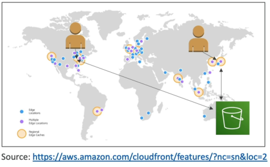
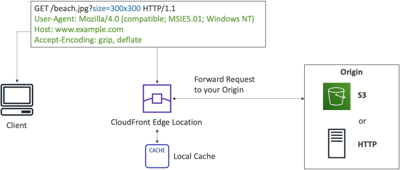
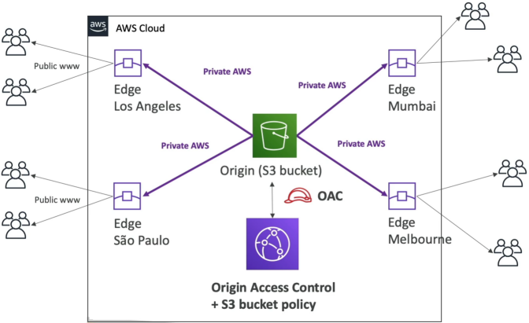

# CloudFront - Overview

**Amazon CloudFront** is a managed global Content Delivery Network (**CDN**) that dramatically accelerates read performance and reduces latency by caching static and dynamic web assets (HTML, JS, images, video chunks) across a massive network of 750+ global Points of Presence (PoPs). By terminating connection requests close to the end user at specialized Edge Locations, CloudFront shields your backend Origins from heavy traffic loads and provides built-in, perimeter-level protection against distributed denial-of-service (DDoS) security attacks.

## Key Takeaways

CloudFront doesn't store your master files permanently; it acts as an intelligent, high-speed proxy layer between the global public web wire and your actual infrastructure backends (Origins).

### 🔄 The Cache Miss and Cache Hit Lifecycle:

1. **The Inbound Request**: A user in Los Angeles fires a request to view a file (`logo.png`). The browser automatically routes the packet to the nearest localized CloudFront Edge Location in LA.
2. **The Cache Miss**: The Edge Location checks its local volatile memory drives. If it has never seen this file before, it registers a Cache Miss.
3. **The Origin Fetch**: The Edge Location reaches back across the ultra-fast, private AWS Backbone Network to pull the original raw `logo.png` file directly out of your master backend origin (e.g., an S3 bucket or an EC2 instance).
4. **The Caching Action**: The Edge Location delivers the file to the user's browser and simultaneously writes a copy of that file into its local drive cache.
5. **The Cache Hit**: A few seconds later, a second user in LA requests the exact same `logo.png` file. The Edge Location checks its drives, finds the matching file, and registers a Cache Hit. It serves the data instantly from its local cache, completely bypassing your backend origin and saving you compute overhead!
   

### Supported Backend Origins (The Infrastructure Lineup)

When you spin up a CloudFront **Distribution**, you must configure its destination **Origin**. CloudFront natively hooks into three primary structural backend models:

#### 📥 1. Amazon S3 Buckets

- **The Target Use Case**: Delivering and caching static media files, documents, and web binaries globally.
- **The Security Boundary**: You lock down your S3 bucket from the public internet entirely and force traffic to flow exclusively through your CDN by deploying **Origin Access Control (OAC)**. S3 automatically validates the inbound CloudFront signatures via an updated S3 Bucket Policy document.
  

#### 🏢 2. AWS VPC Origins

- **The Target Use Case**: Firmly shielding application architectures that live strictly inside private, non-internet-facing subnets.
- **The Connection Mechanic**: CloudFront links natively to private **Application Load Balancers (ALBs)**, Network Load Balancers (NLBs), or standard EC2 instances inside your private network without requiring a public internet routing gateway. It manages secure ENI endpoints directly inside your VPC, completely cloaking your backend from the public internet!

#### 🌐 3. Custom Origins (HTTP Endpoints)

- **The Target Use Case**: Routing traffic to any public, valid HTTP/HTTPS endpoint.
- **The Options**: This includes an S3 bucket configured as a _Static S3 Website_ (which routes over standard HTTP webs, unlike raw bucket API endpoints) or any public, on-premise application load balancer cluster.

### Edge Security and DDoS Shielding

Because CloudFront is distributed across hundreds of locations worldwide, it acts as your cloud account's frontline buffer zone.

- **DDoS Containment**: In a Distributed Denial of Service (DDoS) attack, bad actors launch millions of automated bot threads to crash your servers. Because CloudFront terminates requests at the global edge network, the attack traffic is naturally scattered across 750+ locations, keeping your centralized backend servers breathing smoothly.
- Perimeter Add-ons: You can stack **AWS Shield** (for Layer 3/4 network attack mitigation) and **AWS WAF (Web Application Firewall)** directly on top of your CloudFront distribution to inspect incoming packets, filter out malicious SQL injection scripts, or block bad client IPs before they ever touch your application layer.

## Exam Tips

| Comparison Metric          | Amazon CloudFront (CDN)                                                                | S3 Cross-Region Replication (CRR)                                                                                   |
| -------------------------- | -------------------------------------------------------------------------------------- | ------------------------------------------------------------------------------------------------------------------- |
| **Network Infrastructure** | Global Edge Network (750+ PoPs)                                                        | "Specific, paired AWS Regions (Instance-to-Instance)"                                                               |
| **Primary Data Behavior**  | Temporary Cache Layer (Files expire based on a Time-To-Live TTL timer)                 | Permanent Duplicate Storage (Near real-time 1-to-1 binary synchronization)                                          |
| **Gold-Standard Use Case** | "Highly accelerated delivery of static assets, images, and video fragments worldwide." | "Cross-region disaster recovery, data sovereignty regulatory compliance, and localized low-latency dynamic writes." |

### The Architectural Decision Rules

- If a scenario states: _"You have static application assets that need to be instantly readable by a massive global user base with the lowest latency possible."_ $\longrightarrow$ Choose CloudFront.
- If a scenario states: _"Your database or compliance team requires an identical, permanent mirror copy of an entire S3 bucket to be backed up into another geographic region for disaster recovery mapping."_ $\longrightarrow$ Choose S3 Cross-Region Replication (CRR).
