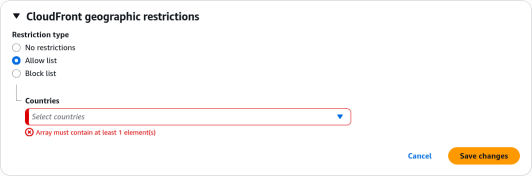

# Geo Restriction

**CloudFront Geo Restriction** allows developers to permit or block access to an entire distribution based entirely on the geographic country of origin of the inbound viewer. By intercepting packets at the Edge, CloudFront references an internal, high-accuracy **Geo-IP database** to evaluate the caller's IP address. If a user breaches your defined parameter boundaries, CloudFront drops the network thread immediately at the closest Point of Presence (PoP), returning an HTTP `403 Forbidden` error before the request ever touches your backend infrastructure.

## Key Takeaways

You can only configure one geographic restriction type per CloudFront distribution behavior layer. You must choose between these two core operational states:

- **The Whitelist (Allow List)**: Absolute zero-trust gating. You explicitly declare a tight list of approved countries (e.g., US and Canada). Anyone clicking your URL from outside those precise borders is locked out out-of-the-box.
- **The Blacklist (Block List)**: Broad global distribution with targeted exclusions. Your content remains wide open to the entire world, except for the explicit countries you add to your banned roster.

### Under the Hood: The Geo-IP Handshake

The absolute beauty of this setup is that it requires **zero infrastructure code modification** on your backend servers.

1. A viewer fires an HTTP request to your CloudFront domain name.
2. The packet hits the local Edge location node
3. CloudFront extracts the client's raw IP address from the TCP packet header metadata.
4. The Edge runs a blazing-fast, localized lookup against a continuously updated **Third-Party Geo-IP database** to map that IP string straight to an ISO country code (e.g., `ID` for Indonesia, `AU` for Australia).
5. CloudFront checks your distribution configuration array. If the country code is whitelisted, the data flows. If it's blacklisted, the gate drops instantly!

## Exam Tips

| Security Requirement Profile                                                                  | Baseline CloudFront Geo Restriction                               | Advanced AWS WAF (Web Application Firewall)                            |
| --------------------------------------------------------------------------------------------- | ----------------------------------------------------------------- | ---------------------------------------------------------------------- |
| **Gating entire domain paths by country code for copyright compliance**                       | ✅ Yes (Low overhead, managed natively at the distribution layer) | Yes (But introduces extra billing cost and rule configuration)         |
| **Blocking specific malicious IP addresses or whole CIDR network blocks**                     | ❌ No                                                             | ✅ Yes (Via explicit IP Match Conditions)                              |
| **Restricting traffic to a specific city, state, or postal ZIP code coordinate**              | ❌ No (Country-level accuracy only)                               | ✅ Yes (Advanced geographic matches down to regional metrics)          |
| **Blocking a country only from hitting your `/api/checkout` path while keeping `/blog` open** | ❌ No (Applies globally to the entire distribution profile)       | ✅ Yes (Can target explicit URI string matches and request parameters) |

**The Granular Path Gating Trap**: Imagine an exam scenario states, _"You host a global e-commerce application behind a single Amazon CloudFront distribution. Due to strict fraud-prevention compliance metrics, you must block users physically located in a specific high-risk nation from hitting your secure checkout API endpoint (`/api/v1/checkout`). However, your marketing team mandates that users from that exact same country must still be permitted to browse your public marketing blog pages (`/blog/*`) completely unhindered. How do you implement this?"_  
**The textbook trap choice here is to enable standard CloudFront Geo Restriction**. > If you turn on native CloudFront Geoblocking for that country, you will completely blind your entire website domain to that region, blocking the marketing blog right along with the checkout desk!  
**The correct architectural answer is to deploy an AWS WAF (Web Application Firewall) WebACL** right on top of your CloudFront distribution. >Inside AWS WAF, you can write a highly granular, multi-conditional rule statement: _IF_ the country of origin matches the target high-risk nation _AND_ the URI path string begins with `/api/v1/checkout`, _THEN_ execute a hard `BLOCK`. This protects your secure financial endpoint while leaving the rest of your global static marketing content completely open to the world!
