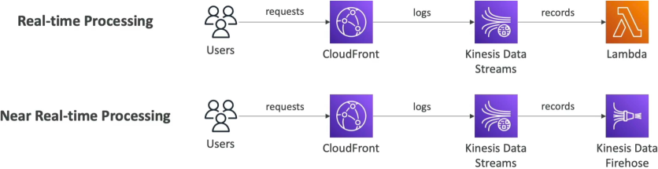

# Real-Time Logs

**CloudFront Real-Time Logs** provide real-time, event-driven monitoring of all HTTP/HTTPS requests intercepted across the global edge network. Instead of batching data into flat files, this feature streams log records directly into an **Amazon Kinesis Data Stream** with sub-second delivery latency. Developers can tune data volume using a configurable **Sampling Rate**, select precise log dimensions, and filter streams by specific **Cache Behaviors** to power near-instantaneous security forensics or performance analytics pipelines.

## Key Takeaways

### The Real-Time Streaming Pipeline (How Traffic Flows)

The most critical architectural rule to memorize for CloudFront Real-Time Logs is the destination target constraint: **CloudFront cannot send real-time logs directly to Amazon S3**. They must be delivered into an active streaming bus framework.

#### ⚙️ The Two Core Downstream Execution Tracks:

1. **The Instant Serverless Track (True Real-Time)**:
   - _The Pipeline_: `CloudFront Edge` $\longrightarrow$ `Kinesis Data Stream` $\longrightarrow$ `AWS Lambda`.
   - _The Logic_: An active AWS Lambda function continuously polls the Kinesis shards. The moment an anomaly occurs (like an IP address executing 500 requests a second), Lambda triggers an automated script to update your AWS WAF rules and block the attacker instantly.
2. ## The Analytical Batch Delivery Track (Near Real-Time)
   - _The Pipeline_: `CloudFront Edge` $\longrightarrow$ `Kinesis Data Stream` $\longrightarrow$ `Kinesis Data Firehose` $\longrightarrow$ `Amazon S3 / Amazon OpenSearch`.
   - _The Logic_: Kinesis Data Firehose acts as a managed data buffer. It ingests the real-time stream, groups the records into micro-batches (e.g., every 60 seconds or 5 MB), and flushes them cleanly into OpenSearch dashboards for live log parsing or an S3 warehouse for long-term audit storage.

### Optimization and Fine-Grained Controls

Because high-traffic platforms process billions of requests a day, streaming every single transaction line can quickly lead to massive Kinesis shard billing overhead. S3 provides three major dials to keep costs and data footprints optimized:

- **The Sampling Rate Percentage**: You don't have to capture everything. You can configure a precise integer value from $1\%$ to $100\%$ specifying the exact percentage of total random traffic queries you want pushed down the stream. For example, setting a $5\%$ sampling rate on a massive e-commerce storefront still yields excellent statistical telemetry data while cutting $95\%$ of your logging execution bills!
- **Cache Behavior Isolation**: You can isolate your real-time logging configurations to target explicit path patterns. If you only care about monitoring performance bottlenecks on your active backend API, you attach the real-time log configuration purely to your `/api/*` cache behavior, leaving your static public images (`/images/*`) completely out of the pipeline.
- **Custom Field Selectors**: You can strip out unnecessary data blocks. CloudFront exposes over 30 distinct field options (such as `time-to-first-byte`, `sc-bytes`, `c-ip`, and `cs-user-agent`). You select only the specific metrics your dashboard needs to maintain tight, clean log line footprints.

## Exam Tips

| Metric Vector                      | Standard S3 Access Logs                             | Real-Time Logs                                      |
| ---------------------------------- | --------------------------------------------------- | --------------------------------------------------- |
| **Immediate Delivery Destination** | **Amazon S3 Buckets**                               | **Amazon Kinesis Data Streams**                     |
| **Latency SLA Window**             | Batch delivery (Up to several hours)                | **Sub-second streaming** (Within milliseconds)      |
| **Additional Base Costs**          | Free, native feature (Pay only for S3 storage)      | Additional charges apply per log line generated     |
| **Granular Path Filtering**        | ❌ Applies globally across the entire bucket layout | ✅ Supported (Can bind to specific Cache Behaviors) |
| **Primary Architectural Role**     | Historical compliance audits, cold-data analysis    | Live security forensics, real-time alerting         |

**The Compliance Storage Trap**: Imagine an exam scenario states, _"You are architecting a real-time security dashboard for a global application using CloudFront. Your compliance officer mandates that all edge logs must be analyzed within seconds of generation to catch active fraud vectors. Furthermore, an exact long-term raw copy of every single log record must be safely archived inside an Amazon S3 bucket for a 7-year retention period. How do you implement this cost-effectively?"_  
**The textbook, multi-step answer on test day relies on chaining streaming data services**:

1. You enable **CloudFront Real-Time Logs** and configure them to stream $100\%$ of data events directly into an Amazon Kinesis Data Stream.
2. You attach an **Amazon Kinesis Data Firehose** delivery stream directly to that Kinesis stream instance.
3. Inside Kinesis Firehose, you split the execution loop: you set the main delivery target path to feed directly into your **Amazon OpenSearch Service** cluster for your real-time analytical dashboards, and simultaneously configure Firehose's native **Backup/S3 Destination** parameter to automatically drop an un-mutated copy of the raw compressed records straight down to your long-term S3 archive bucket!
