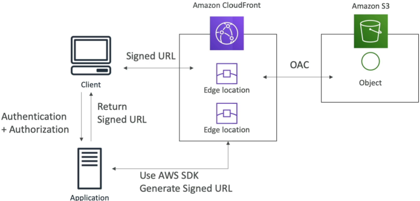

# Signed URL/Cookies

**CloudFront Signed URLs and Signed Cookies** provide cryptographic gating mechanisms to restrict public viewer access to high-value data distributions. By appending signature tokens generated via an application backend utilizing the AWS SDK, users inherit temporary read permissions validated directly at the Edge. These access tokens enforce precise security guardrails, including strict expiration timestamps (**TTL**), client-side network source restrictions (**IP ranges**), and explicit path pattern bounds.

## Key Takeaways

When your backend application code hooks into the AWS SDK to mint a signed URL or cookie, it forces the token to adhere to a strict cryptographic policy document. You can configure three high-leverage guardrails:

- **Expiration Date & Time (The Core TTL)**: The exact millisecond your token self-destructs. For transient media like a movie stream or an audio file, you set this aggressively low (e.g., 5 to 15 minutes). For localized user-specific offline dashboard configurations, you can extend the lifetime for days or weeks.
- **IP Address Range Allowlist**: A strict CIDR network restriction block (e.g., `192.0.2.0/24`). If a malicious hacker steals the signed URL string but attempts to open it from an IP outside of your customer's corporate network range, CloudFront drops the network request instantly at the Edge with a hard `403 Forbidden` error!
- **Trusted Signers (Key Groups)**: Dictates which public/private key-pair sets are authorized to validate signatures across your distribution behavior profile.

### Signed URLs vs. Signed Cookies

The conceptual flow between your client app, your authentication backend, and the global edge network follows a clean, decoupled protocol:

#### ⚙️ The Multi-Tier Execution Lifecycle:

1. **The Inbound Handshake**: The web client connects to your front-end web portal and authenticates against your login page backend.
2. **The Signature Minting**: Once verified, your application backend runs a localized routine using the AWS SDK to programmatically compute a custom cryptographic signature using an asymmetric private key.
3. **The Token Handback**: The application backend returns either a Signed URL link string or dumps an encrypted Signed Cookie payload straight into the client's browser profile.
4. **The Edge Retrieval**: The client browser fires the signed request directly to the nearest CloudFront Edge location. The Edge checks the token's signature using the public key in its Trusted Key Group, verifies the policy constraints, and streams the asset straight out of your hidden OAC-protected S3 origin bucket.

### CloudFront vs. S3 Pre-Signed URLs

AWS loves checking if you can spot when to use a CloudFront signature versus a native S3 bucket signature.

#### 🌐 CloudFront Signed URLs / Cookies

- **The Mechanism**: Binds authorization rules to a **Distribution Path Pattern**, entirely independent of the backend storage or compute tier (works seamlessly for S3, ALBs, EC2, or custom HTTP origins).
- **The Edge Advantage**: Fully leverages the power of global CDN edge caching! If a thousand authorized users call for the same file chunk with separate signatures, CloudFront can still pull the file out of its local Edge memory cache, protecting your core infrastructure origin from crashing.
- **The Protocol Features**: Allows advanced, multi-layer filtering parameters like IP address range blocks and wildcard directory targets.

#### 🪣 S3 Pre-Signed URLs

- **The Mechanism**: Grants a third party temporary proxy security rights to act _exactly_ as the IAM principal identity who signed the URL. If a Senior Developer signs an S3 pre-signed URL using their access keys, the person opening that link inherits the exact IAM execution privileges of that Senior Developer.
- **The Direct Pipeline**: Bypasses CloudFront completely. The client application connects directly to the localized S3 regional endpoint URL bucket grid.
- **The Primary Limit**: Zero global caching benefits. Every click executes a raw read/write hit on the S3 architecture. Furthermore, it does not support advanced IP firewalls or dynamic global wildcard directory paths.

## Exam Tips

| Technical Scenario Requirement Profile                                                       | CloudFront Signed URLs / Cookies                                                 | S3 Pre-Signed URLs                                                                                     |
| -------------------------------------------------------------------------------------------- | -------------------------------------------------------------------------------- | ------------------------------------------------------------------------------------------------------ |
| **You want to cache premium video assets globally at low latency**                           | ✅ Choose CloudFront. (S3 Pre-signed URLs completely bypass edge caches)         | ❌ Never choice                                                                                        |
| **Your origin is a private ALB or an on-premise custom web server**                          | ✅ Choose CloudFront. (S3 pre-signed URLs are structurally locked to S3 objects) | ❌ Impossible choice                                                                                   |
| **Users need to securely upload large raw logs directly to a storage bucket bypassing CDNs** | ❌ Harder setup                                                                  | ✅ Choose S3 Pre-Signed URLs. (Supports clean, temporary PUT access tokens directly into an S3 bucket) |
| **You need to restrict file downloads strictly to a specific corporate office IP subnet**    | ✅ Choose CloudFront. (Supports explicit IP address range matching)              | ❌ No native IP filtering                                                                              |
