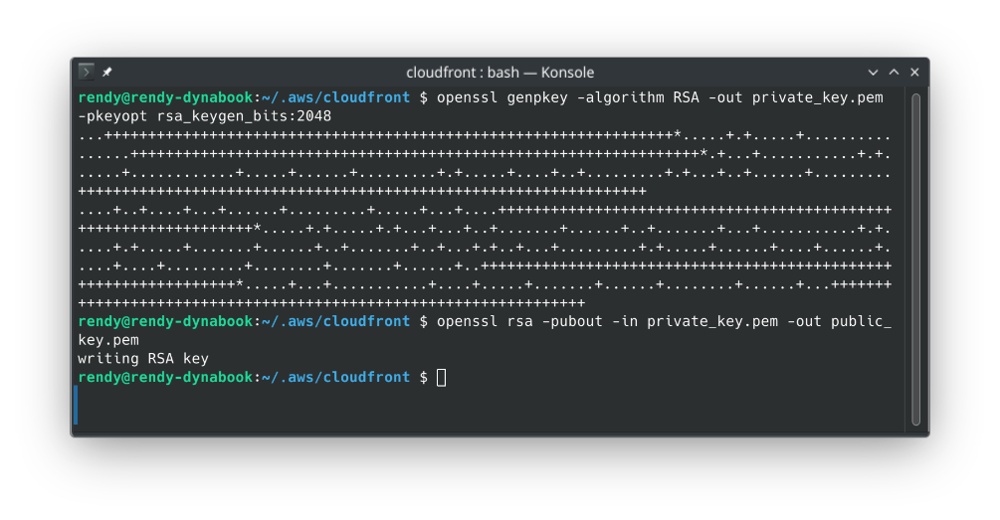
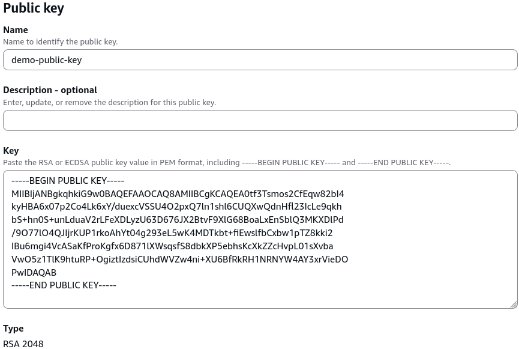
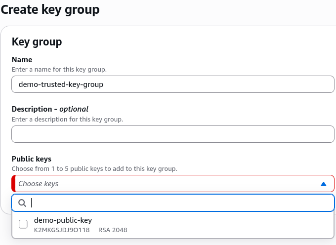

# Signed URL - Key Groups + Hands On

AWS separates CloudFront token generation into two structural models: **Trusted Key Groups** (the modern standard, allowing IAM role authorization and programmatic API management) and **Legacy Root Key Pairs** (an un-automatable anti-pattern locked entirely to the AWS Account Root User). To establish a secure signing pipeline, an application backend utilizes an asymmetric **Private Key** to mint signed URL strings, while the CloudFront Edge network references a matching **Public Key** enclosed within a Key Group behavior rule to cryptographically validate the inbound token signatures.

## Key Takeaways

The security verification loop relies on standard asymmetric RSA **cryptography**. The key-pair split allows you to distribute signing power without exposing your core verification parameters.

### 🗝️ The Division of Keys:

- **The Private Key (Keep Secret)**: Your application backend nodes (like an Amazon EC2 instance fleet or an AWS Lambda function running inside a private subnet) store this file securely. Your code uses it to mathematically sign user strings and append the query params (`?X-Amz-Signature=...`).
- **The Public Key (Share Globally)**: You upload this public file straight into the CloudFront control plane. S3 duplicates this key across hundreds of global Edge locations so the nodes can decrypt and verify your application's signature hashes on the fly.

### Step-by-Step Lab Execution Checklist

#### Phase 1: Generate the Cryptographic Primitive

- Open an RSA Key Generator utility (or fire your local terminal bash shell tool using the openssl command engine).
- **The Compliance Rule**: You must explicitly generate an RSA key-pair with a hard-coded key length of 2,048 bits. Larger or smaller bit configurations will cause the CloudFront API compiler to drop the upload block!
- Separate the output into two clear files:
  - `private_key.pem` (Your backend application signing asset).
  - `public_key.pem` (Your global CloudFront validation asset).
    

#### Phase 2: Register the Public Key with CloudFront

- Open your **Amazon CloudFront Console** dashboard and scroll down the left-hand navigation column workspace to the **Key Management** sub-section.
- Click on **Public keys**, then hit the blue **Create public key** button.
- Configuration Specifications
  - **Name**: Type `demo-public-key`.
  - **Key value**: Paste the entire plaintext string block of your generated Public Key asset (ensuring the `-----BEGIN PUBLIC KEY-----` and `-----END PUBLIC KEY-----` header capsules are included cleanly).
- Click **Create public key**.
  

#### Phase 3: Construct the Trusted Key Group Architecture

- With your public key safely stored inside the AWS control plane, click on **Key groups** directly under the left-hand **Key Management** menu tab.
- Click **Create key group**.
- **Assemble the Matrix**
  - **Name**: Type `demo-trusted-key-group`.
  - **Public keys**: Click inside the dropdown selector wrapper and check the box next to your newly registered `demo-public-key-v2`.
  - _Note_: S3 lets you bundle up to 5 separate public keys simultaneously inside a single key group container, allowing you to execute zero-downtime rolling key rotations with absolute ease!
- Click **Create key group**. This key group ARN can now be attached straight to any custom CloudFront behavior to enforce strict content gating.
  

#### Phase 4: Auditing the Legacy Paradigm (The Root Account Trap)

- To fully witness why the older system fails production audits, Stephane shows the legacy fallback sequence:
- Navigate to your top-right profile name dropdown wrapper while logged in strictly as the **AWS Account Root User** and click **My Security Credentials**.
- Locate the old, hidden **CloudFront key pairs** section container card.
- **The Structural Roadblock**: Notice how this panel explicitly forces you to use the master account email root user just to download a public/private credential token.
- Because this panel is outside of standard IAM resource mappings, you are completely blocked from using automated deployment frameworks (like CloudFormation or Terraform) to programmatically cycle these keys, leaving your architecture highly vulnerable to key leakage or credential stagnation.

### The Modern Trust-Verification Pipeline

Once this setup is fully deployed, the background network handshake operates on a clean separation of concerns:

```
┌─────────────────────────────────┐
│     Application Backend         │ (Lambda, ECS, or EC2 Node)
│  - Possesses the Private Key    │
└────────────────┬────────────────┘
                 │
                 ├──► 🔏 Signs URL with SigV4 String ──► [ Drops link onto Web UI ]
                 │
                 ▼
┌─────────────────────────────────┐
│   CloudFront Global Edge Node   │ (Points of Presence)
│  - Imports Trusted Key Group    │
│  - Houses the uploaded Public Key│
└────────────────▲────────────────┘
                 │
   (Viewer clicks link / passes Cookie)
                 │
                 ▼
        [ Validation Check ] ────► Mathematical verification matches?
                                       ├──► ✅ YES ──► Stream Private S3 Binary Object
                                       └──► ❌ NO  ──► Drop Thread instantly (403 Forbidden)
```

## Exam Tips

| Key Management Protocol Type | Automated API Rotation Available                   | IAM User Access Privileges Permitted                   | Key Generation Sizing Restriction | Primary Architectural Status         |
| ---------------------------- | -------------------------------------------------- | ------------------------------------------------------ | --------------------------------- | ------------------------------------ |
| **CloudFront Key Pairs**     | ❌ **No** (Completely manual)                      | ❌ No (**Root Account Only** requirement)              | 2,048-bit standard                | **Legacy / Deprecated Anti-Pattern** |
| **Trusted Key Groups**       | ✅ **Yes** (Full programmatic control via SDK/CLI) | ✅ **Yes** (Granular IAM permission scoping supported) | **Strictly 2,048-bit RSA**        | **AWS Production Gold Standard**     |

**The Zero-Downtime Key Rotation Blueprint**: Imagine an exam scenario states, _"Your enterprise application utilizes a CloudFront distribution behavior to gate access to premium documents. The security team mandates a compliance rule where the cryptographic keys used to sign the asset URLs must be rotated every 90 days. Furthermore, the rotation process must incur absolute zero downtime for global clients currently using the system. How do you design this rotation architecture?"_  
**The textbook, multi-step programmatic answer on test day relies on Trusted Key Groups**:

1. Your automated background rotation script runs a local routine to generate a brand-new, secondary 2,048-bit RSA key pair block.
2. The script calls the CloudFront API (`CreatePublicKey`) to register the fresh public key string inside the control plane.
3. The script calls the `UpdateKeyGroup` API to **append the new public key directly into your existing Trusted Key Group** wrapper alongside the old key. (Because the group can hold up to 5 keys, both signatures are now legally recognized as valid by the Edge locations!).
4. Your deployment script updates your backend application environment variables to start using the brand-new private key to sign outbound URLs.
5. After a safe cooling period (allowing all legacy user URLs to expire naturally), your automated script issues a final API call to remove the old public key from the key group configuration, completing a flawless, zero-downtime crypto rotation cycle!
