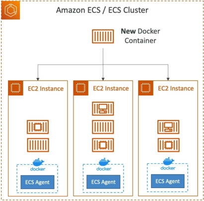
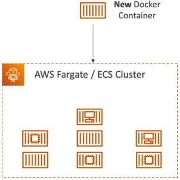
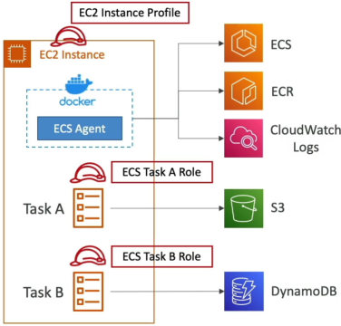
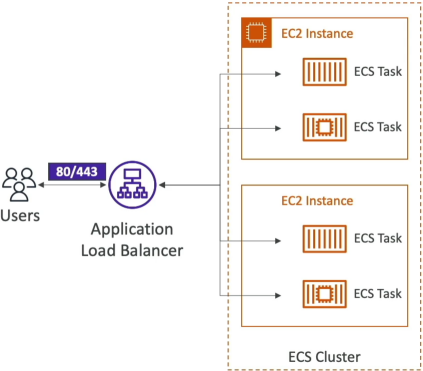
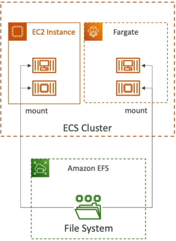

# Amazon ECS

**Amazon ECS** is a highly scalable, fast container management service designed to run, stop, and manage Docker containers on a cluster wrapper. Developers choose between the infrastructure-heavy **EC2 Launch Type** (where you manage the host nodes) and the serverless **Fargate Launch Type** (where AWS manages the underlying compute tier completely). Security is maintained by strictly decoupling cluster agent identities from application microservice layer profiles using Task Roles and Task Execution Roles.

## Key Takeaways

### EC2 vs. Fargate Launch Types

The choice between how your cluster allocates underlying hardware compute power determines your daily operations maintenance budget:

#### 🖥️ The EC2 Launch Type (Infrastructure Control)

- **The Mechanics**: Your ECS cluster is directly backed by an Auto Scaling Group of physical **EC2 Instances** running in your account.
- **The Requirement**: Each instance must be pre-loaded with an **Amazon ECS Container Agent** (baked natively into the _ECS-Optimized AMI_). The agent registers the instance into your logical cluster grid.
- **Your Maintenance Overhead**: High. You are responsible for executing OS security patches, managing individual host instance storage limits, and setting up cluster auto-scaling thresholds.
  

#### ⚡ The Fargate Launch Type (Absolute Serverless)

- **The Mechanics**: You do not provision a single EC2 instance inside your subnet pool. You simply outline your container footprint in a blueprint configuration metadata layout called a **Task Definition**.
- **The Scaling Behavior**: You tell AWS exactly how much performance power you need (vCPU and RAM allocation).
- AWS handles spinning up the underlying execution fabrics instantly. Scaling your app is as easy as increasing your target task integer constraint. It's the gold standard for minimal engineering overhead!
  

### The IAM Identity Matrix (Decoupling the Security Plane)

This is a notorious trap zone on the DVA-C02 exam. AWS splits the task execution permissions into three entirely distinct IAM contexts. Mixing these up will instantly drop your deployment threads or leak system credentials.

#### 🛡️ Identity A: The EC2 Instance Profile Role

- **Applicability**: EC2 Launch Type Only (Completely non-existent on Fargate).
- **The Responsibility**: Assumed by the background **ECS Container Agent** running on the host OS. It gives the host machine authority to register itself into your ECS control plane registry.

#### 🔏 Identity B: The ECS Task Execution Role

- **Applicability**: Both **EC2 and Fargate**.
- **The Responsibility**: This is the role used by the infrastructure pipeline **before the container application logic even starts**. It gives AWS permission to pull your private Docker images from **Amazon ECR**, spin up **CloudWatch Logs** streams, and securely pull environmental database keys from **Secrets Manager** or the **SSM Parameter Store**.

#### 🔐 Identity C: The ECS Task Role

- **Applicability**: Both **EC2 and Fargate**.
- **The Responsibility**: This role is assigned directly to your running **container workload application process**. Your Node.js or Java application code inherits this role dynamically. If your container code needs to write a file to **Amazon S3** or run an aggregation scan query against **Amazon DynamoDB**, you bake those explicit permissions right here.

### Networking & Storage Core Integrations

To scale enterprise apps, your containers must talk out to the web and persist state data smoothly across task lifecycles:

- **Load Balancer Integration**: To expose microservices, you mount an Application Load Balancer (ALB) right in front of your ECS Service. ECS natively integrates with the ALB's target group mapping systems. If a task scales up or dies, ECS instantly registers or drains the dynamic network port lines without breaking external client traffic arrays.
  
- **Persistent Shared Storage (EFS Combo)**: Containers are transient by nature—if a task restarts, its local ephemeral disk data is wiped out completely. To preserve application state data across a fleet of global tasks scattered across multiple Availability Zones, you mount a serverless Amazon EFS (Elastic File System) volume directly onto the container folder mount points:

Tasks running concurrently anywhere inside your network VPC can read and write to this shared storage plane simultaneously, making it perfect for Content Management Systems (CMS) or decentralized asset processors!

## Exam Tips

**The Image Pull Failure Diagnostics**: Imagine an exam scenario states, _"You deploy a microservice application onto an Amazon ECS Fargate cluster. During initial system staging initialization, the tasks immediately crash and return an explicit error string: image selection error: context access denied / unable to pull image from ECR. You verify your application code does not make any AWS API calls yet. Which configuration adjustment resolves the failure?"_  
**The textbook diagnostic answer rests entirely on the Task Execution Role**.

- The Trap: Junior developers will jump into the settings and add ECR permissions to the standard Task Role. The task will continue to crash.
- The Fix: Because pulling the container block image from the ECR registry happens before your container app logic is running, the entity executing the request is the ECS host manager itself. You must navigate into your task definition configuration and ensure your Task Execution Role has explicit `ecr:GetDownloadUrlForLayer` and `ecr:BatchGetImage` policy permissions checked on!
