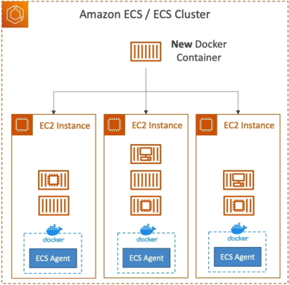
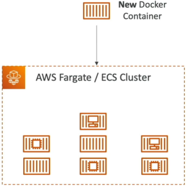
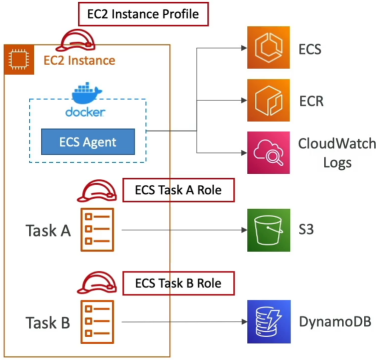
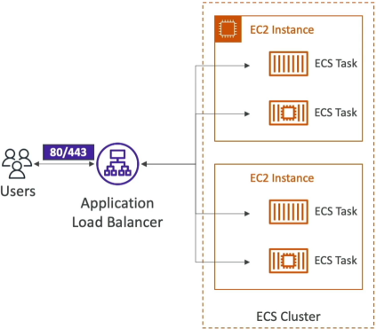
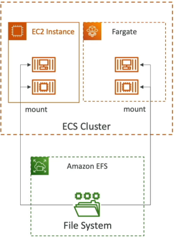
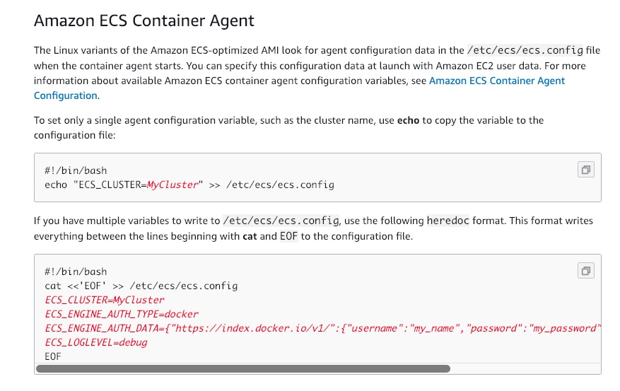
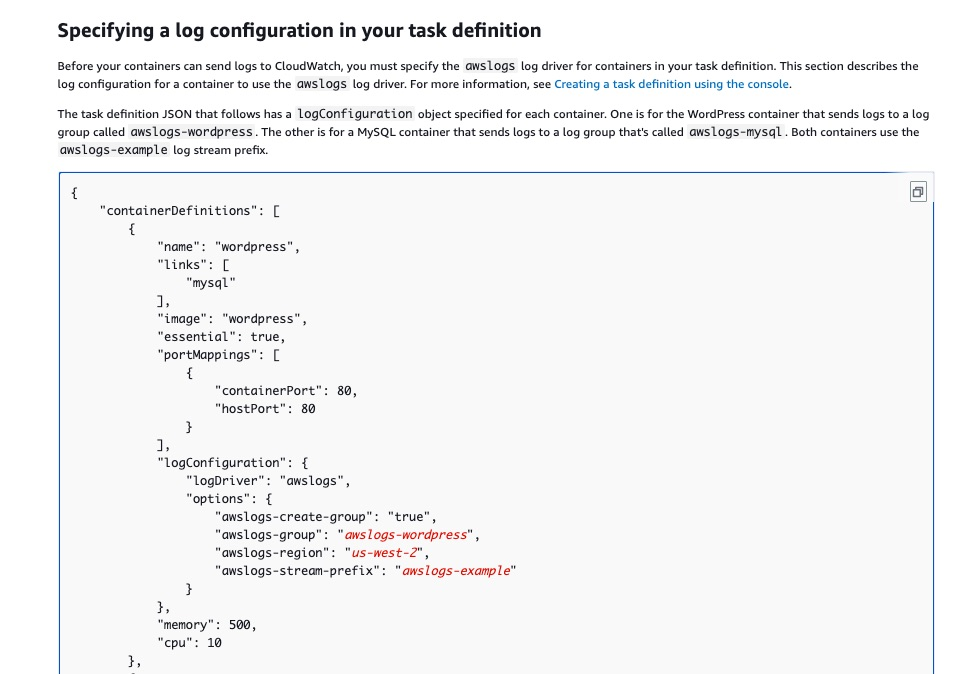
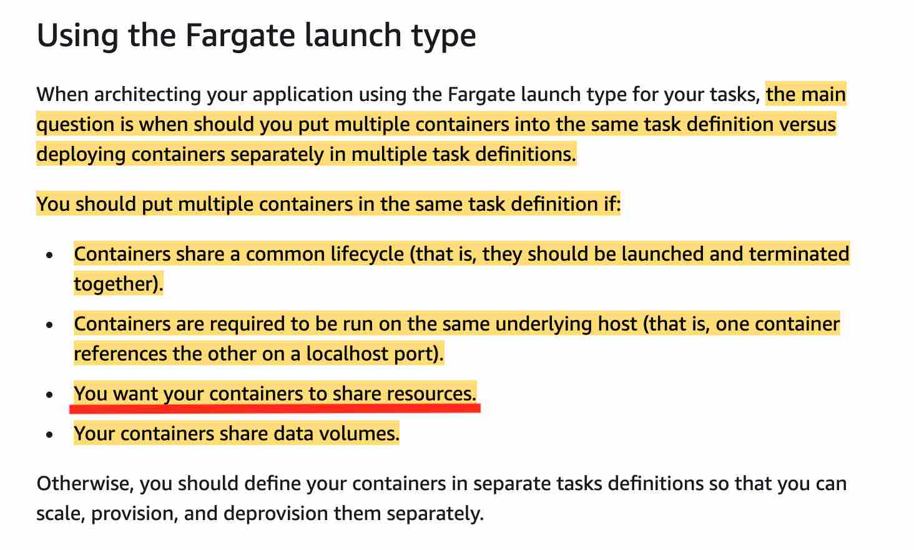

# Amazon ECS

**Amazon ECS** is a highly scalable, fast container management service designed to run, stop, and manage Docker containers on a cluster wrapper. Developers choose between the infrastructure-heavy **EC2 Launch Type** (where you manage the host nodes) and the serverless **Fargate Launch Type** (where AWS manages the underlying compute tier completely). Security is maintained by strictly decoupling cluster agent identities from application microservice layer profiles using Task Roles and Task Execution Roles.

## Key Takeaways

### EC2 vs. Fargate Launch Types

The choice between how your cluster allocates underlying hardware compute power determines your daily operations maintenance budget:

#### 🖥️ The EC2 Launch Type (Infrastructure Control)

- **The Mechanics**: Your ECS cluster is directly backed by an Auto Scaling Group of physical **EC2 Instances** running in your account.
- **The Requirement**: Each instance must be pre-loaded with an **Amazon ECS Container Agent** (baked natively into the _ECS-Optimized AMI_). The agent registers the instance into your logical cluster grid.
- **Your Maintenance Overhead**: High. You are responsible for executing OS security patches, managing individual host instance storage limits, and setting up cluster auto-scaling thresholds.
  

#### ⚡ The Fargate Launch Type (Absolute Serverless)

- **The Mechanics**: You do not provision a single EC2 instance inside your subnet pool. You simply outline your container footprint in a blueprint configuration metadata layout called a **Task Definition**.
- **The Scaling Behavior**: You tell AWS exactly how much performance power you need (vCPU and RAM allocation).
- AWS handles spinning up the underlying execution fabrics instantly. Scaling your app is as easy as increasing your target task integer constraint. It's the gold standard for minimal engineering overhead!
  

### The IAM Identity Matrix (Decoupling the Security Plane)

This is a notorious trap zone on the DVA-C02 exam. AWS splits the task execution permissions into three entirely distinct IAM contexts. Mixing these up will instantly drop your deployment threads or leak system credentials.

#### 🛡️ Identity A: The EC2 Instance Profile Role

- **Applicability**: EC2 Launch Type Only (Completely non-existent on Fargate).
- **The Responsibility**: Assumed by the background **ECS Container Agent** running on the host OS. It gives the host machine authority to register itself into your ECS control plane registry.

#### 🔏 Identity B: The ECS Task Execution Role

- **Applicability**: Both **EC2 and Fargate**.
- **The Responsibility**: This is the role used by the infrastructure pipeline **before the container application logic even starts**. It gives AWS permission to pull your private Docker images from **Amazon ECR**, spin up **CloudWatch Logs** streams, and securely pull environmental database keys from **Secrets Manager** or the **SSM Parameter Store**.

#### 🔐 Identity C: The ECS Task Role

- **Applicability**: Both **EC2 and Fargate**.
- **The Responsibility**: This role is assigned directly to your running **container workload application process**. Your Node.js or Java application code inherits this role dynamically. If your container code needs to write a file to **Amazon S3** or run an aggregation scan query against **Amazon DynamoDB**, you bake those explicit permissions right here.

### Networking & Storage Core Integrations

To scale enterprise apps, your containers must talk out to the web and persist state data smoothly across task lifecycles:

- **Load Balancer Integration**: To expose microservices, you mount an Application Load Balancer (ALB) right in front of your ECS Service. ECS natively integrates with the ALB's target group mapping systems. If a task scales up or dies, ECS instantly registers or drains the dynamic network port lines without breaking external client traffic arrays.
  
- **Persistent Shared Storage (EFS Combo)**: Containers are transient by nature—if a task restarts, its local ephemeral disk data is wiped out completely. To preserve application state data across a fleet of global tasks scattered across multiple Availability Zones, you mount a serverless Amazon EFS (Elastic File System) volume directly onto the container folder mount points:

Tasks running concurrently anywhere inside your network VPC can read and write to this shared storage plane simultaneously, making it perfect for Content Management Systems (CMS) or decentralized asset processors!

## Exam Tips

**The Image Pull Failure Diagnostics**: Imagine an exam scenario states, _"You deploy a microservice application onto an Amazon ECS Fargate cluster. During initial system staging initialization, the tasks immediately crash and return an explicit error string: image selection error: context access denied / unable to pull image from ECR. You verify your application code does not make any AWS API calls yet. Which configuration adjustment resolves the failure?"_  
**The textbook diagnostic answer rests entirely on the Task Execution Role**.

- The Trap: Junior developers will jump into the settings and add ECR permissions to the standard Task Role. The task will continue to crash.
- The Fix: Because pulling the container block image from the ECR registry happens before your container app logic is running, the entity executing the request is the ECS host manager itself. You must navigate into your task definition configuration and ensure your Task Execution Role has explicit `ecr:GetDownloadUrlForLayer` and `ecr:BatchGetImage` policy permissions checked on!

### Practice Scenario

**Question 1**: You are working for a shipping company that is automating the creation of ECS clusters with an Auto Scaling Group using an AWS CloudFormation template that accepts cluster name as its parameters. Initially, you launch the template with input value 'MainCluster', which deployed five instances across two availability zones. The second time, you launch the template with an input value 'SecondCluster'. However, the instances created in the second run were also launched in 'MainCluster' even after specifying a different cluster name.

What is the root cause of this issue?

- [ ] The ECS agent Docker image must be re-built to connect to the other clusters
- [ ] The cluster name Parameter has not been updated in the file /etc/ecs/ecs.config during bootstrap
- [ ] The security groups on the EC2 instance are pointing to the wrong ECS cluster
- [ ] The EC2 instance is missing IAM permissions to join the other clusters

Correct Answer

- [ ] The ECS agent Docker image must be re-built to connect to the other clusters
  - **Explanation**: Since the first set of instances got created from the template without any issues, there is no issue with the ECS agent here.
- [x] The cluster name Parameter has not been updated in the file /etc/ecs/ecs.config during bootstrap
  - **Explanation**: In the ecs.config file you have to configure the parameter ECS_CLUSTER='your_cluster_name' to register the container instance with a cluster named 'your_cluster_name'.  
    
- [ ] The security groups on the EC2 instance are pointing to the wrong ECS cluster
  - **Explanation**: Security groups govern the rules about the incoming network traffic to your ECS containers. The issue here is not about user access and hence is a wrong choice for the current use case.
- [ ] The EC2 instance is missing IAM permissions to join the other clusters
  - **Explanation**: EC2 instances are getting registered to the first cluster, so permissions are not an issue here and hence this statement is an incorrect choice for the current use case.

**Question 2**: An application runs on Amazon Elastic Container Service (Amazon ECS) on AWS Fargate. The company's audit requirements mandate that logging and storing of application log data must be done centrally on AWS.

How will you configure this requirement?

- [ ] Use the awslogs log driver to send log information to CloudWatch Logs. To turn on the awslogs log driver, your Amazon ECS container instances require at least version 1.9.0 of the container agent
- [ ] Download and install the unified CloudWatch agent on the ECS instances to collect internal system-level metrics and application logs from the instances. The logs collected by the unified CloudWatch agent are processed and stored in Amazon CloudWatch logs and can be queried for report generation
- [ ] Use the awslogs log driver to configure the containers in your tasks to send log information to CloudWatch Logs. Add the required logConfiguration parameters to your task definition
- [ ] Amazon ECS metric data is automatically sent to CloudWatch in 1-minute periods. Amazon ECS service using the Fargate launch type has CloudWatch CPU and memory utilization metrics that can be enabled from the ECS console

Correct Answer

- [ ] Use the awslogs log driver to send log information to CloudWatch Logs. To turn on the awslogs log driver, your Amazon ECS container instances require at least version 1.9.0 of the container agent
  - **Explanation**: This statement applies to the EC2 launch type (where you manage the underlying container instances and agent version), not the serverless Fargate launch type.
- [ ] Download and install the unified CloudWatch agent on the ECS instances to collect internal system-level metrics and application logs from the instances. The logs collected by the unified CloudWatch agent are processed and stored in Amazon CloudWatch logs and can be queried for report generation
  - **Explanation**: ECS Fargate is serverless, so you do not have direct access to host instances to manually download and install host-level software agents.
- [x] Use the awslogs log driver to configure the containers in your tasks to send log information to CloudWatch Logs. Add the required logConfiguration parameters to your task definition
  - **Explanation**: Using the awslogs log driver you can configure the containers in your tasks to send log information to CloudWatch Logs. If you're using the Fargate launch type for your tasks, you need to add the required logConfiguration parameters to your task definition to turn on the awslogs log driver.

    Before your containers can send logs to CloudWatch, you must specify the awslogs log driver for containers in your task definition. The example task definition JSON that follows has a logConfiguration object specified for each container. One is for the WordPress container that sends logs to a log group called awslogs-wordpress. The other is for a MySQL container that sends logs to a log group that's called awslogs-mysql. Both containers use the awslogs-example log stream. prefix.

    Specifying a log configuration in your task definition:  
     

- [ ] Amazon ECS metric data is automatically sent to CloudWatch in 1-minute periods. Amazon ECS service using the Fargate launch type has CloudWatch CPU and memory utilization metrics that can be enabled from the ECS console
  - **Explanation**: CloudWatch CPU and memory utilization metrics are resource/performance metrics, not application logs. This does not address the audit requirement for storing application log data.

**Question 3**: The development team at an e-commerce company wants to run a serverless data store service on two docker containers that share resources.

Which of the following ECS configurations can be used to facilitate this use-case?

- [ ] Put the two containers into a single task definition using a Fargate Launch Type
- [ ] Put the two containers into a single task definition using an EC2 Launch Type
- [ ] Put the two containers into two separate task definitions using a Fargate Launch Type
- [ ] Put the two containers into two separate task definitions using an EC2 Launch Type

Correct Answer

- [x] Put the two containers into a single task definition using a Fargate Launch Type
  - **Explanation**: Amazon Elastic Container Service (Amazon ECS) is a highly scalable, fast, container management service that makes it easy to run, stop, and manage Docker containers on a cluster. You can host your cluster on a serverless infrastructure that is managed by Amazon ECS by launching your services or tasks using the Fargate launch type. For more control over your infrastructure, you can host your tasks on a cluster of Amazon Elastic Compute Cloud (Amazon EC2) instances that you manage by using the EC2 launch type.  
    

    As the development team is looking for a serverless data store service, therefore the two containers should be launched into a single task definition using a Fargate Launch Type. Using a single task definition allows the two containers to share resources. Please see these use-cases for Fargate Launch type when you should put multiple containers into the same task definition:  
     

- [ ] Put the two containers into a single task definition using an EC2 Launch Type
  - **Explanation**: The EC2 launch type requires provisioning and managing underlying EC2 instances, which does not meet the requirement for a serverless data store service.
- [ ] Put the two containers into two separate task definitions using a Fargate Launch Type
  - **Explanation**: Placing containers in separate task definitions isolates them, preventing them from sharing resources directly within the same task boundary.
- [ ] Put the two containers into two separate task definitions using an EC2 Launch Type
  - **Explanation**: This uses the non-serverless EC2 launch type and separates the containers into distinct tasks, failing both the serverless and resource-sharing requirements.

