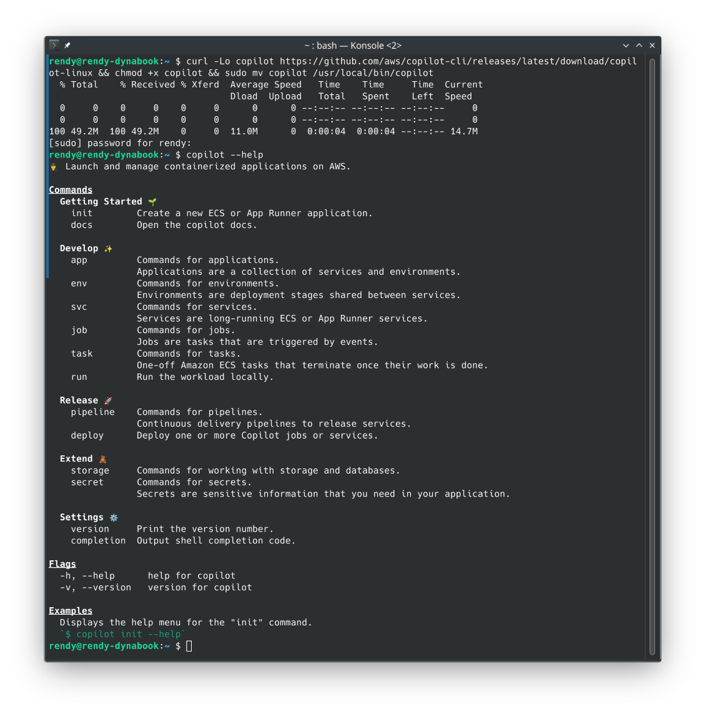
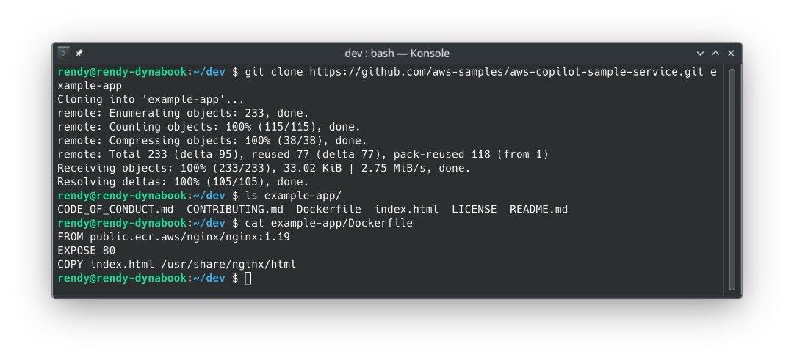
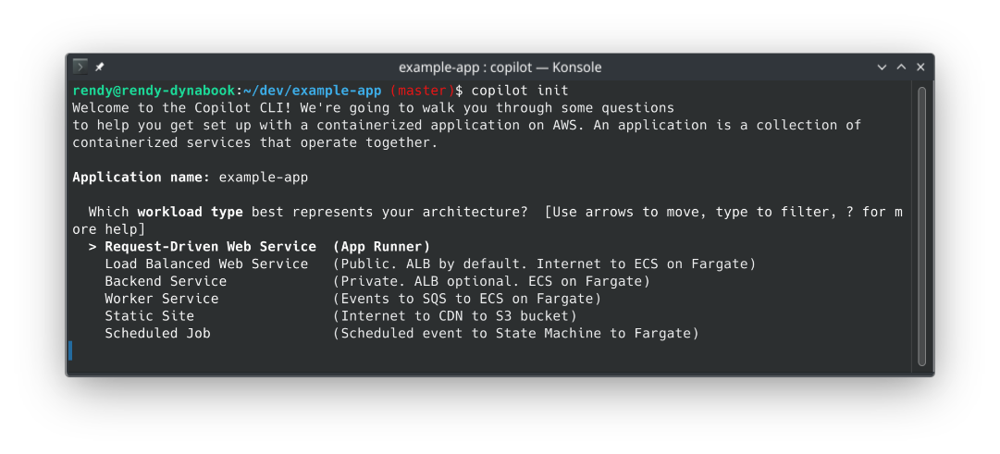
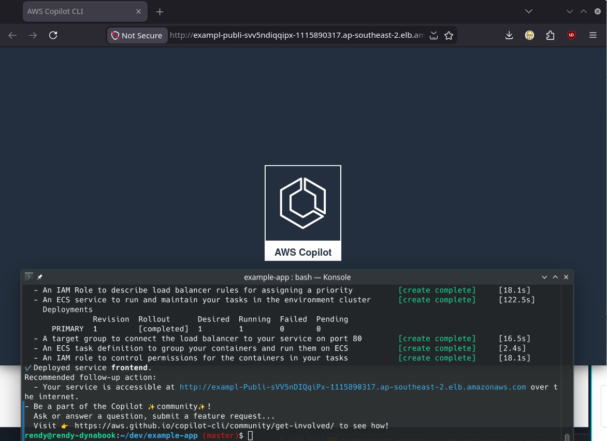

# AWS Copilot - Hands On

:::tip
AWS officially transitioned the AWS Copilot CLI to **End-of-Support (EOS)** on **June 12, 2026**.  
While the tool remains active as an open-source GitHub project, AWS is redirecting teams toward modern primitives for container abstraction. On test day and in your current builds:

- For the fastest **click-to-deploy container path with absolute zero infrastructure management**, look to the brand-new **Amazon ECS Express Mode**.
- For full programmatic control over complex microservice meshes, the industry has standardized heavily on the **AWS Cloud Development Kit (CDK)** (using constructs like `ApplicationLoadBalancedFargateService`).
  :::

## Hands On

This hands-on session steps through compiling and deploying a containerized architecture using the AWS Copilot CLI. By parsing a local root directory configuration file, Copilot auto-provisions a multi-environment CloudFormation Stack Set containing an **Amazon ECR** registry, an **Elastic Load Balancer Target Group**, isolated **VPC subnets**, and an active auto-scaling **ECS Service running on AWS Fargate**.

## Hands On

### Phase 1: Local Terminal Environment Verification

- Follow the installation instructions in the [AWS Copilot GitHub repository](https://aws.github.io/copilot-cli/docs/getting-started/install/) to set up the CLI on your local machine.
- Open your local terminal workspace shell (ensuring your local **Docker Engine/Desktop** and **AWS CLI** utilities are booted and fully authenticated).
- Install the Copilot executable binary and run `copilot --help` to verify the CLI is properly configured and ready to use.



## Phase 2: Clone the Microservice Application Source
- Pull down the verified [Copilot-ready demonstration application](https://github.com/aws-samples/aws-copilot-sample-service) blueprint from the public code catalogs:
```bash
git clone https://github.com/aws-samples/aws-copilot-sample-service.git example-app
cd example-app
```
- _The Directory Audit_: Notice that the project root contains a standard application source file layout paired with a clean, low-profile Dockerfile. This is all Copilot needs to orchestrate the entire cloud setup.


### Phase 3: Trigger the Automation Blueprint (copilot init)

Fire the initialization wizard script to start profiling your application configuration:
```bash
copilot init
```
The CLI steps you through an interactive, opinionated infrastructure configuration prompt:
1. **What is your application's name?** Type `example-app`.
2. **Which workload type best represents your service architecture?** Select `Load Balanced Web Service` (This tells Copilot to wire up a public-facing Application Load Balancer routed down to serverless containers).
3. **What do you want to name this specific service?** Type `frontend`.
4. Which Dockerfile do you want to build? Select the localized `./Dockerfile` path detected by the scanner.



### Phase 4: Deploying to the Target Cloud Environment

- Copilot compiles a backend CloudFormation Stack Set, sets up administrative IAM pipeline roles, and asks if you are ready to deploy an  environment.
- Type `y` (Yes) to confirm, and type `test` when prompted to define your target environment partition identifier name.
- The Behind-the-Scenes Build Sequence: Copilot takes over the wheel completely, automatically executing the following operations in sequence:
    1. Compiles your local application code into an immutable Docker image layer.
    2. Provisions a private **Amazon ECR repository** container vault in your account and pushes the image layers upstream.
    3. Provisions a secure, isolated **VPC network perimeter spanning multiple Availability Zones**.
    4. Generates an **Application Load Balancer (ALB)**, internet listeners, target groups, and CloudWatch log groups.
    5. Mounts an active **ECS Cluster** and boots your service task running serverlessly on **AWS Fargate** inside the private subnets.
- Once the progress trackers complete, the CLI prints out a clean, public HTTP link string. Copy the link, drop it into your browser tab, and boom—the **AWS Copilot logo application** renders cleanly over the live web wire! 🚀



### Deconstructing the Architecture-as-Code Manifests

The coolest part about Copilot is that it doesn't leave your setups hidden away. It materializes your entire configuration blueprint right inside your local directory structure under a hidden folder layout:
```
📁 example-app (Your Root Repository)
└── 📁 copilot/
    ├── 📁 environments/
    │   └── 📁 test/
    │       └── 📄 manifest.yml  <── Defines your VPC settings, CIDR blocks, and Env metadata
    └── 📁 front-end/
        └── 📄 manifest.yml       <── Controls vCPU, RAM increments, and scaling limits
```

By opening up your copilot/front-end/manifest.yml file, you can easily view or adjust your production properties as clean, declarative code blocks:
```yaml
name: frontend
type: Load Balanced Web Service
http:
  path: '/'
  healthcheck: '/'
image:
  build: Dockerfile
  port: 80
cpu: 256
memory: 512
count: 1
exec: true
network:
  connect: true
```
If you ever want to alter your computing metrics, you simply type a different integer directly into this local file, execute a quick `copilot deploy` command in your shell, and Copilot will automatically patch and roll out an updated CloudFormation stack revision seamlessly!

### 🧼 Phase 5: Absolute Cost-Containment Deep Sweep

To guarantee zero unexpected line-item tracking charges hit your credit card statements, execute the global wipe command inside your terminal the moment your testing loops finish:
```bash
copilot app delete
```
Copilot connects straight back to the CloudFormation control panels, methodically tearing down the ECS tasks, destroying the ALB routing lines, deleting the ECR images, and dropping your environmental resource count cleanly back to zero.

## Exam Tips

**The Legacy Tool Modernization Scenario**: Imagine an exam scenario states, _"Your development team currently manages a suite of serverless container applications on AWS Fargate using a declarative toolset that relies on an automated `copilot/manifest.yml` workflow. Due to corporate policy changes and tool deprecation timelines, the cloud architecture division mandates that your team must migrate your microservices away from AWS Copilot while retaining 100% fine-grained control over your security roles, enterprise deployment models, and IAM permissions inside standard programming languages. Which migration path should you select?"_  
**The textbook gold-standard architectural answer is to migrate your workloads over to the AWS Cloud Development Kit (CDK).** 
- **The Trap**: Avoid choices that suggest manually rewriting everything inside raw, flat JSON text blocks for ECS Task Definitions or adopting the raw CloudFormation templates generated by Copilot directly. While technically functional, editing those massive, machine-generated templates is a major operational nightmare.
- The Fix: Migrating to the **AWS CDK** allows you to completely replace the convenience layer that Copilot provided using full programmatic object constructs. You can spin up an entire production architecture in a few lines of TypeScript or Python using pre-built classes like `ApplicationLoadBalancedFargateService`. S3 automatically handles compiling your assets, building your Docker images, generating secure IAM boundaries, and rolling out clean deployments while keeping your team on a fully supported, production-grade cloud foundation!