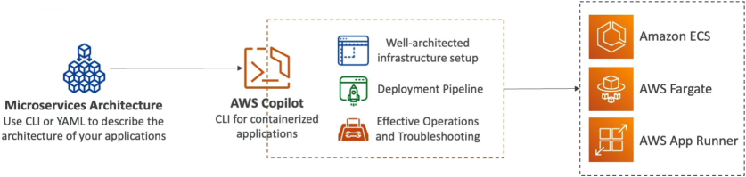

# AWS Copilot - Overview

**AWS Copilot** is an open-source CLI orchestration tool that automates the building, releasing, and operating of production-ready containerized workloads on AWS. It handles the heavy lifting of provisioning well-architected infrastructure—including **VPCs, ECS Clusters, Fargate tasks, ECR repositories, App Runner instances, and Elastic Load Balancers (ELBs)**—under the hood using best-practice templates. Developers describe their high-level microservice architecture using a simple, localized declarative manifest file, and Copilot brings the entire grid to life.

## Key Takeaways

### The Abstracted Pipeline

To truly appreciate Copilot, look at what it does to the standard container deployment pipeline. Instead of forcing you to build out 7 different components in order, Copilot acts as a single control layer over your entire tech stack:

#### ⚙️ The One-Command Magic:

- **The Codebase**: You write your standard web app code and drop a basic `Dockerfile` into your project root directory.
- **The Manifest Initialization**: You run `copilot init` in your terminal. Copilot scans your local files, asks a few simple questions (like your app name and port settings), and auto-generates a clean, low-profile configuration file called a `Manifest`.
- **The Automated Cloud Provisioning**: When you execute `copilot deploy`, Copilot rolls up its sleeves and builds your local Docker image, auto-provisions a private **Amazon ECR** repository, pushes the image layers upstream, spins up an isolated, secure **VPC with private/public subnets**, creates an **Application Load Balancer**, defines your **ECS Task Definitions**, and boots the workload serverlessly on **AWS Fargate** or **AWS App Runner**!

### Core Operational Features & Topologies

Copilot is built specifically around the mental model of how software engineering teams actually build apps in production, dividing the stack into logical organizational layers:

- **Multi-Environment Orchestration**: Copilot natively understands that you don't just push straight to production. With simple commands like `copilot env deploy`, you can effortlessly clone your entire microservice framework across distinct execution boundaries like `test`, `staging`, and `prod` with completely isolated network perimeters.
- **Declarative Microservice Manifests**: Instead of writing 400 lines of raw CloudFormation or CDK, you adjust simple attributes inside a highly readable, localized YAML file to control your task's CPU/RAM step allocations, scaling boundaries, and health paths.
- **Production Observability & Triage**: No need to jump back and forth between different CloudWatch logs tabs. Right from your local terminal workspace, you can execute operational commands to monitor system health:
  - `copilot svc logs`: Streams your live application stdout/stderr logs straight to your local terminal.
  - `copilot svc status`: Gives you an immediate, precise breakdown of your task lifecycles, container health status, and active routing stats.
- **Native CI/CD Automation**: By executing `copilot pipeline init`, the CLI analyzes your git repository setup and auto-generates a complete, multi-environment **AWS CodePipeline** deployment manifest. The moment you push a git commit to your main branch, AWS handles the rest of the build and rollout seamlessly!

## Exam Tips

| Tool Selection Profile       | Infrastructure Ownership Level                                                                | Underlying Configuration Engine                       | Primary Use Case                                                           |
| ---------------------------- | --------------------------------------------------------------------------------------------- | ----------------------------------------------------- | -------------------------------------------------------------------------- |
| **Raw ECS / CloudFormation** | Complete, granular, low-level manual control. You wire every single subnet and listener rule. | Raw JSON / YAML blocks.                               | Specialized, highly customized corporate enterprise grids.                 |
| **AWS Copilot CLI**          | Zero-to-minimal infrastructure plumbing. Focuses on application architectures.                | Automatically generates best-practice AWS blueprints. | Rapidly building, scaling, and operating standard container microservices. |

**The Fast-Velocity Microservice Challenge**: Imagine an exam scenario states, _"Your development team wants to deploy a new containerized microservice web application using a serverless model on AWS Fargate. The developers are highly experienced with Docker but have minimal experience provisioning AWS networking components, load balancers, or continuous delivery pipelines, and they need to push the app live within a tight timeline. Which deployment path provides the fastest time-to-market with absolute zero manual infrastructure wiring?"_
**The textbook gold-standard answer is to utilize the AWS Copilot CLI**.

- **The Trap**: Avoid distractors suggesting that the team manually write raw CloudFormation stacks or build out custom ECS Task definitions and load balancers piece-by-piece from the AWS Console. This introduces major human configuration error risks and kills deployment velocity.
- **The Fix**: Because the team already has a working Dockerfile, running copilot init and copilot deploy completely bypasses the complexity of setting up VPCs, ECR, and ELBs manually. Copilot handles the entire underlying layout automatically using highly secure, well-architected default settings, letting the team go live in minutes!
