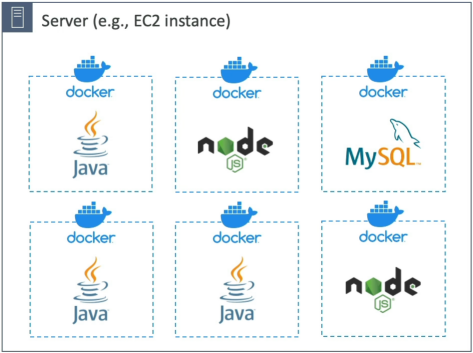
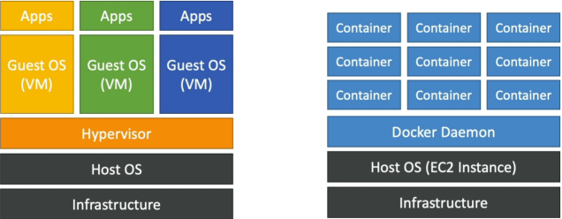
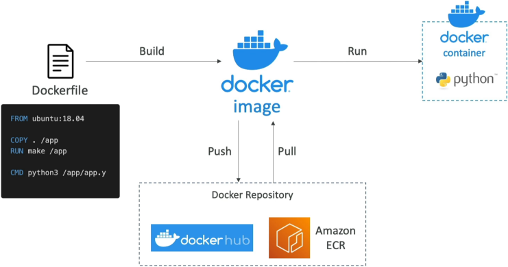

# Docker Introduction

**Docker** is a standardized containerization platform that enables developers to package application environments into lightweight, portable, and predictable artifacts called **Docker Images**. Unlike full-scale Virtual Machines (VMs) that require dedicated guest operating systems, Docker containers share the host machine’s underlying kernel through a centralized **Docker Daemon**. This dramatically reduces infrastructure footprint overhead and allows multiple isolated application layers to run concurrently on a single compute node.



## Key Takeaways

### Virtual Machines vs. Docker Containers

Understanding the structural boundaries between a Virtual Machine (like an EC2 instance) and a Docker container is a fundamental concept for application optimization.

#### 🖥️ The Virtual Machine Lifecycle (Heavy Isolation)

- **The Stack Layers**: `Hardware Infrastructure` $\longrightarrow$ `Host OS` $\longrightarrow$ `Hypervisor Engine` $\longrightarrow$ `Guest OS` $\longrightarrow$ `App Libraries/Code`.
- **The Mechanics**: Every time you spin up a VM, it must bootstrap a completely independent, heavy-weight Guest Operating System kernel into memory. This ensures strict isolation boundaries, but wastes substantial storage space and memory overhead just to run basic runtime engines.

#### 📦 The Docker Container Lifecycle (Lightweight Efficiency)

- **The Stack Layers**: `Hardware Infrastructure` $\longrightarrow$ `Host OS` $\longrightarrow$ `Docker Daemon Engine` $\longrightarrow$ `Isolated Binaries/App Code`.
- **The Mechanics**: Docker bypasses the hypervisor layer entirely. Instead, every active container running on the machine shares the **exact same host operating system kernel**. Docker uses native Linux kernel isolation primitives (Namespaces and Control Groups / `cgroups`) to wall off processes from each other, letting you run dozens of microservices on a single server node.



### The Local-to-Cloud Deployment Workflow



To containerize your code and push it to production, your application pipeline executes a predictable, three-step development sequence:

```
📜 1. Write Dockerfile  ──( docker build )──►  💾 2. Compile Docker Image
                                                      │
                                                ( docker push )
                                                      │
                                                      ▼
 🚀 3. Run Active Container ◄──( docker pull )───  🌐 Cloud Registry (ECR / Hub)
```

#### Step 1: Write the Blueprint (Dockerfile)

```Dockerfile
# 1. Pull an official, lightweight runtime base image
FROM node:20-alpine

# 2. Establish our working app directory container path
WORKDIR /app

# 3. Inject our dependency declarations and run assembly
COPY package*.json ./
RUN npm install

# 4. Copy the rest of our full-stack codebase assets over
COPY . .

# 5. Declare the outbound networking port bounds and start script
EXPOSE 8080
CMD ["node", "server.js"]
```

#### Step 2: Compile the Artifact (Image)

You execute the local shell compilation tool command: `docker build -t my-api:v1 .`. Docker steps through your Dockerfile layers and outputs a immutable, read-only static artifact called a **Docker Image**.

#### Step 3: Ship and Execute (Registry to Container)

- **Push**: You upload your finished image up to an asset cloud repository vault using `docker push`. You can send it to Docker Hub (public open-source library catalog) or Amazon ECR (Elastic Container Registry) (your enterprise-grade private cloud registry).
- **Pull & Run**: Your target production cloud host fetches the image package (`docker pull`) and boots it up (`docker run`). The instant that read-only image layer initializes an active runtime instance context, it transforms into an active, running **Docker Container**!

### The AWS Container Management Suite

Once your architecture scales beyond a single server running manual container commands, you deploy **AWS Managed Orchestration Platforms** to handle automated health checks, blue/green deployments, and scaling mechanics:

| Logo                          | AWS Managed Container Service               | Core Infrastructure Deployment Role                                                                                       | Primary Target Profile Use Case                                                                                         |
| ----------------------------- | ------------------------------------------- | ------------------------------------------------------------------------------------------------------------------------- | ----------------------------------------------------------------------------------------------------------------------- |
|      | **Amazon ECR (Elastic Container Registry)** | Managed secure asset registry warehouse used to store, scan, and distribute private Docker images.                        | Secure internal pipeline storage for compiled application build artifacts.                                              |
|      | **Amazon ECS** (Elastic Container Service)  | AWS’s native, highly efficient container orchestration platform built to scale massive microservice layouts natively.     | Standard AWS workloads requiring tight integration with AWS IAM, CloudWatch, and ELB components.                        |
|      | **Amazon EKS** (Elastic Kubernetes Service) | AWS’s managed tracking plane for Kubernetes, supporting open-source standard cluster synchronization tools.               | Hybrid-cloud systems migrating standardized Kubernetes workloads (`kubectl`) from on-premise hardware straight to AWS.  |
|  | **AWS Fargate**                             | Serverless compute engine for containers. Eliminates the need to provision, patch, or manage underlying EC2 server nodes. | Hands-off container deployments where you simply pay for the exact virtual CPU and memory resources requested per task. |

## Exam Tips

**The Infrastructure Maintenance Triage**: Imagine an exam scenario states, _"You are deploying a microservices application layer via Amazon ECS. The development team wants to ensure that containers automatically scale up during high-traffic windows. However, the company has no dedicated systems engineering staff and explicitly mandates that developers must have absolute zero responsibility for OS security patching, EC2 host provisioning, or cluster capacity adjustments. Which capacity host model should you select?"_  
**The absolute, definitive answer on test day is to choose Amazon ECS running on AWS Fargate**.

- If you configure an ECS EC2 Launch Type, you are still responsible for managing the underlying EC2 container instance cluster nodes—meaning your team must continuously track **EC2 Auto Scaling groups**, execute **AMI security patches**, and **maintain host OS storage capacity**.
- If you pivot to the AWS Fargate Launch Type, the underlying compute layer becomes completely **serverless**. You stop thinking about servers completely. You simply specify your required container resources (e.g., **Task needs $0.5\text{ vCPU}$ and $1\text{ GB}$ of memory** footprint), and AWS instantly provisions the runtime fabric invisibly, handling all patching and host scaling behind the scenes!
