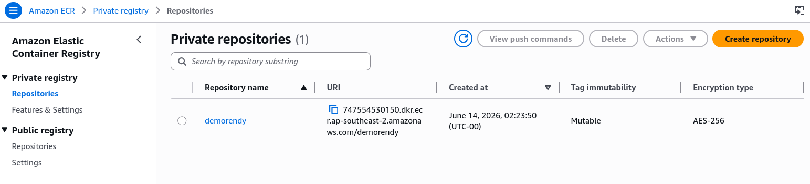
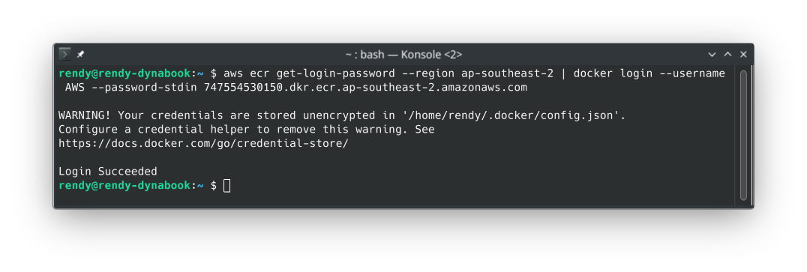
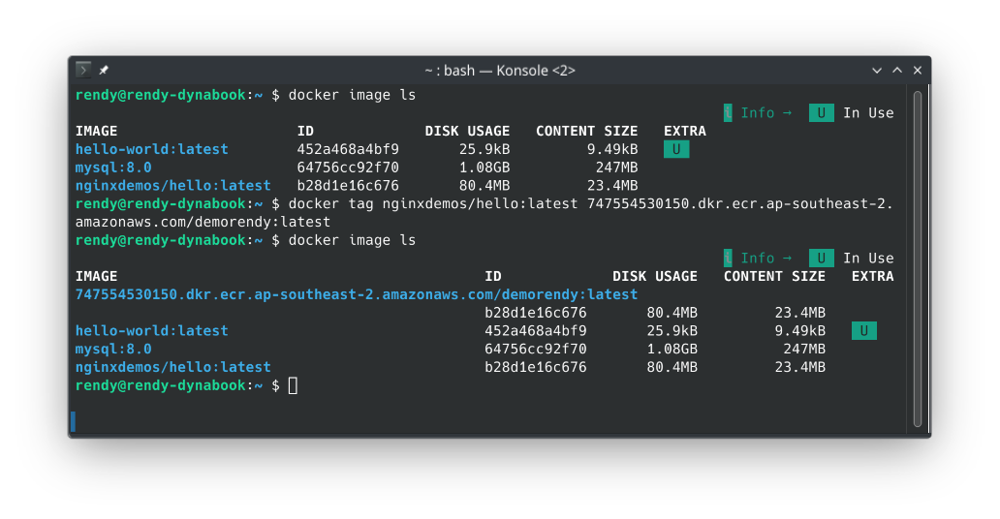
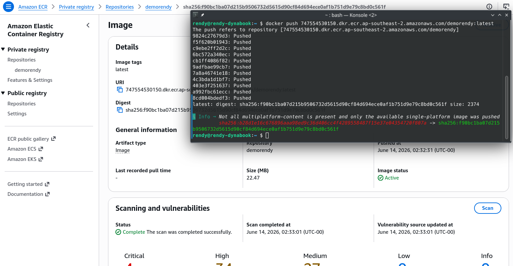

# ECR - Hands On

This hands-on lab outlines the process for authenticating a localized Docker CLI client against a private Amazon ECR registry endpoint, downloading an open-source public container asset (`nginxdemos/hello`), re-tagging it using target AWS cloud coordinates, and executing an authorized upstream push loop.

## Hands On

### Phase 1: Initialize the ECR Vault Registry

- Open the **Amazon ECR Console** dashboard.
- Click **Create repository** and select the **Private** visibility switch.
- **Global Naming Parameter**: Type `demorendy` inside the _Repository_ name field block.
- Leave secondary configurations like _Tag Immutability_ and _KMS Encryption_ at their default baseline values and click **Create repository**.
- Inside the dashboard repository table grid, notice your repository is completely blank with **0 images** allocated. Click the **View push commands** utility button to inspect your account's explicit destination string parameters.
  

### Phase 2: The Cryptographic Authentication Bridge (`get-login-password`)

Open your local terminal workspace shell (making sure your local Docker Engine daemon application is booted and active). Before you can run any push operations, you must pipe a short authorization token bridge across your terminal applications:

```bash
aws ecr get-login-password --region ap-southeast-2 | docker login --username AWS --password-stdin 747554530150.dkr.ecr.ap-southeast-2.amazonaws.com
```

- **The Behind-the-Scenes Handshake**: The first command segment (`aws ecr get-login-password`) authenticates using your local AWS CLI credentials and fetches a randomized, temporary cryptographic string token that lasts for exactly 12 hours.
- **The Stdin Pipe**: The | character catches that password token string and drops it straight into the standard input (`--password-stdin`) of the `docker login` utility using the static user identity key `AWS`.
- The terminal will print a clean confirmation string: `Login Succeeded!`
  

### Phase 3: Pull and Re-Tag the Container Artifact

Pull down the testing image artifact from public Docker Hub onto your local machine workspace:

```bash
docker pull nginxdemos/hello:latest
```

- **The Rename**: The Docker daemon is blind to where images are supposed to go until you explicitly stamp an AWS endpoint tag straight onto the asset name. Run a `docker tag` command matching this structure:

```bash
docker tag nginxdemos/hello:latest 747554530150.dkr.ecr.ap-southeast-2.amazonaws.com/demorendy:latest
```



### Phase 4: Fire the Upstream Code Push Stream

- With your image perfectly tagged to match your private repository ARN layout coordinates, fire the upstream data synchronization pass:

```bash
docker push 747554530150.dkr.ecr.ap-southeast-2.amazonaws.com/demorendy:latest
```

- **The Validation Pass**: Watch the progress indicators slice through your image layers, upload them to the cloud back-end, and output a clean hash digest tracking identifier.
- Return to your **Amazon ECR Console dashboard page** and click refresh.
- **The Result**: The image asset is officially sitting inside your cloud registry vault! S3 has generated an entry stamped with the tag `:latest` along with a precise size tracking value, ready to be safely pulled down by an automated ECS task definition framework.
  

## Exam Tips

| Command Generation Profile     | Underlying Passing Mechanism                                                                       | Exposes Credentials in Local Bash History                 | Primary Production Status   |
| ------------------------------ | -------------------------------------------------------------------------------------------------- | --------------------------------------------------------- | --------------------------- |
| **aws ecr get-login**          | Prints out a full plaintext `docker login -u AWS -p <long-token-string>` text block to the screen. | ❌ Yes (Massive corporate security risk)                  | Deprecated / Legacy V1 Tool |
| **aws ecr get-login-password** | Outputs strictly a raw, secure string password token to stdout.                                    | ✅ No (Safely masked when channeled via --password-stdin) | Current AWS Gold Standard   |

**The CodeBuild Pipeline Crash Triage**: Imagine an exam scenario states, _"You are auditing an old automated build file (buildspec.yml) running inside an AWS CodeBuild environment. The pipeline compiles a container, but constantly fails during the pre-build authorization phase, throwing a command usage error when it executes: `$(aws ecr get-login --no-include-email)`. How do you upgrade this pipeline asset with minimal risk?"_
**The textbook correction strategy is to migrate the build step syntax over to get-login-password.**

- Old-school AWS CLI v1 utilized get-login, which literally spit out a giant command block you had to wrap inside an evaluation shell macro (`$()`). It has been completely stripped out of modern container build environments.
- To clear the blocking error, you open the YAML manifest code and update the pre-build command line block to use the modern pipe framework instead:

```YAML
pre_build:
  commands:
    - aws ecr get-login-password --region $AWS_DEFAULT_REGION | docker login --username AWS --password-stdin $AWS_ACCOUNT_ID.dkr.ecr.$AWS_DEFAULT_REGION.amazonaws.com
```

This eliminates the old syntax arguments, masks your authorization tokens from plain-text exposure in build logs, and updates your continuous delivery systems to run flawlessly!
