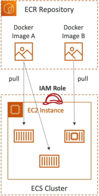

# Amazon ECR

**Amazon ECR** is a fully managed, production-grade Docker container registry designed to securely store, version, scan, and deploy container image artifacts. Operating with underlying data persistence backed natively by the extreme durability of **Amazon S3**, ECR provides seamless orchestration handshakes with Amazon ECS and AWS Fargate. Every single image interaction inside ECR is cryptographically gated and audited via **AWS IAM**, completely eliminating unauthorized data access paths.

## Key Takeaways

The beauty of ECR is how cleanly it loops into your active compute grids. It acts as the critical bridge between your local development terminal (or automated CI/CD pipeline) and your running cloud containers.

#### 🔄 The Secure Asset Flow:

1. **The Code Build**: You compile your custom application code locally or via a build agent (e.g., AWS CodePipeline), producing a static read-only **Docker Image**.
2. **The Cryptographic Push**: Your pipeline authenticates against the AWS control plane, executes an authorized `docker push` terminal command, and sends the image straight to your private ECR repository bucket.
3. **The S3 Underlay Vault**: Behind the scenes, **ECR drops your raw image layers directly into an ultra-durable Amazon S3 storage bucket** managed entirely by AWS. This guarantees your core infrastructure artifacts inherit 99.999999999% data durability!
4. **The Cluster Pull**: When your active ECS Service or Fargate orchestration engine scales out and demands a new container task instance, it fires a secure backend fetch call down to ECR, grabs the image, mounts it onto the serverless runtime environment, and fires up the active container app process cleanly.

### Core Operational Security & Feature Tiers

ECR is way more than just a dumb storage drive for binaries; it packages a full suite of enterprise automation tools to protect your supply chain:

- **Granular IAM Gatekeeping**: Absolute zero-trust security. Before an EC2 instance or a Fargate task can execute a `docker pull` command to extract an image layer, it must possess an attached **Task Execution Role** with explicit, whitelisted IAM policy permissions (like `ecr:BatchGetImage` and `ecr:GetDownloadUrlForLayer`).
- **Image Vulnerability Scanning**: ECR integrates directly with common vulnerability databases to automatically audit your code layers. The second your image finishes uploading, ECR scans the container filesystem for known software bugs, security holes, or outdated packages, dropping a comprehensive diagnostic report straight into your telemetry dashboard.
- **Image Tagging & Versioning**: Supports strict semantic version mapping tags (e.g., matching tags like `:v1.0.4`, `:production`, or `:latest`). You can toggle **Tag Immutability** to prevent developers from accidentally overwriting an active release version with broken code layers!
- **Lifecycle Policies**: Automates house-cleaning inside your asset warehouse. You can write simple rules to optimize costs, such as: _"Automatically delete any untagged images, or purge older deployment builds once a single repository accumulates more than 14 version layers."_

#### 💼 Private Registries vs. The ECR Public Gallery

When you spin up an ECR repository, you pick between two operational modes:

- **Private Repositories (The Enterprise Default)**: Complete lock-down mode. Accessible strictly within your AWS account profile boundaries or via explicit cross-account IAM trust policies.
- **Public Repositories (The ECR Public Gallery)**: Designed for sharing open-source utilities or public software products globally. Anyone in the world can pull these images down without even owning an AWS account!

## Exam Tips

**The CLI Push Authentication Failure**: Imagine an exam scenario states, _"You are configuring an automated bash script running inside a third-party CI/CD server to automatically compile a Docker image and push it up to a private Amazon ECR repository. You verify the server has matching AWS credentials with full IAM administrative access policies attached. However, when the script attempts to execute the standard docker push command, the terminal instantly throws a hard error block: Repository access denied / unauthorized. How do you resolve this error?"_  
**The textbook diagnostic answer relies on executing the explicit ECR login token handshake**.

- **The Trap**: Do not jump into IAM settings and try to add more permissions. The error isn't coming from AWS IAM; it's coming from your local Docker daemon terminal application!
- **The Fix**: The standard Docker CLI client does not natively understand how to parse raw AWS IAM credentials. Before your script can push code layers, it must execute a pre-flight authentication bridge call via the AWS CLI:  
  $\text{Auth Bridge Script}⟶\text{aws ecr get-login-password}$  
  This API call fetches a temporary, cryptographically wrapped authorization token string that lasts for 12 hours. The script pipes this token straight into the `docker login` command, unlocking the pipeline gate so your deployment streams can execute flawlessly!
