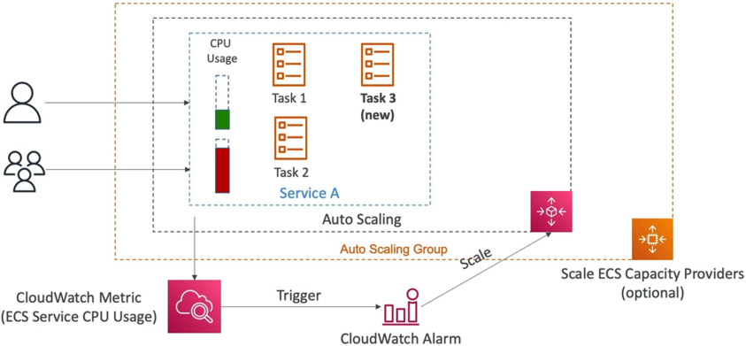
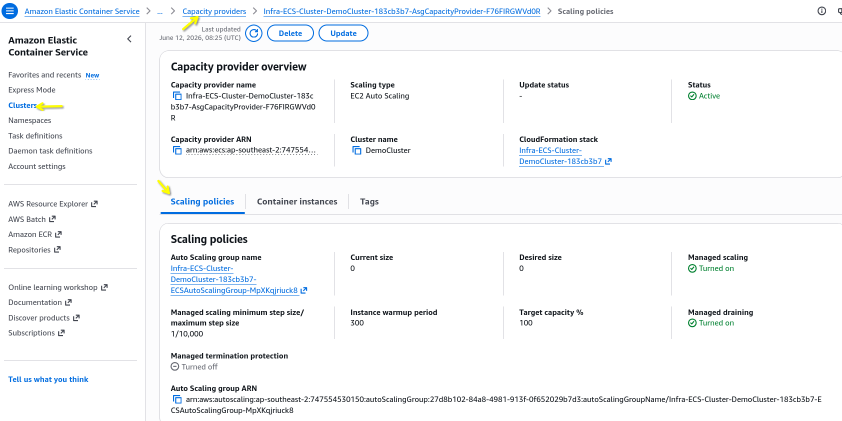

# ECS Auto Scaling

**ECS Service Auto Scaling automates** the horizontal scaling of container workloads using **AWS Application Auto Scaling**. It tracks task execution load via CloudWatch metrics, adjusting the desired task integer count dynamically. If utilizing the **EC2 Launch Type**, developers pair task scaling with an **ECS Cluster Capacity Provider** to intelligently scale the underlying host hardware nodes concurrently, eliminating container provisioning blockades.

## Key Takeaways

### What Triggers Scaling?

To trigger horizontal task scaling, Application Auto Scaling natively intercepts telemetry data pipelines from **Amazon CloudWatch**. You must lock down these three specific metric dimensions for the exam:

| Metric Type                          | Data Source Origin         | Production Architectural Profile                                                                                                                                               |
| ------------------------------------ | -------------------------- | ------------------------------------------------------------------------------------------------------------------------------------------------------------------------------ |
| `ECSServiceAverageCPUUtilization`    | ECS Service Container Core | Perfect for compute-heavy workloads like media encoding or mathematical algorithmic sorting patterns.                                                                          |
| `ECSServiceAverageMemoryUtilization` | ECS Service Container RAM  | Essential for memory-intensive jobs, deep caching layers, or heavy JVM/Node execution runtimes.                                                                                |
| `ALBRequestCountPerTarget`           | Application Load Balancer  | **The Proactive Trigger**: Scales up new tasks based directly on incoming raw HTTP request volume before the containers even begin to experience high CPU or memory thrashing! |

#### 🛠️ Scaling Strategy Profiles:

- **Target Tracking**: The easiest setup. You just pick a target value (e.g., _"Keep average cluster CPU at exactly 60%"_). AWS handles the math, scaling up or down to ride that threshold line perfectly.
- **Step Scaling**: Scales based on the explicit size of an alarm breach (e.g., if CPU hits 70%, add 1 task; if CPU spikes past 90%, aggressively inject 4 tasks immediately).
- **Scheduled Scaling**: Pre-allocates resources for predictable, known traffic calendars (e.g., _"Scale up to 20 tasks every Friday at 4 PM before the weekend rush hits"_).

### The Dual-Layer Scaling Architecture (The Matrix)

**Scaling your application tasks does NOT automatically scale your underlying servers!** You must decouple the two distinct layers:

#### Layer 1: The Task Scaling Plane (The Software)

- **The Manager**: Managed by **AWS Application Auto Scaling**.
- **The Metric**: Watches CPU/Memory of your containers.
- **The Action**: Modifies the `DesiredCount` parameter of your ECS Service (e.g., changing tasks from 2⟶5).

#### Layer 2: The Cluster Scaling Plane (The Hardware)

- **The Problem**: If your Task Scaling Plane wants to spin up 3 more tasks, but your underlying EC2 host servers are already pinned at 100% capacity, those new tasks will get stuck in a hard `PENDING` state block. The software scaled, but the physical hardware is full!
- **The Solution (The ECS Cluster Capacity Provider)**: Instead of writing complex, messy CloudWatch alarms to scale your Auto Scaling Group (ASG) based on host server CPU metrics, you assign an **ECS Capacity Provider** to the cluster.
- The Capacity Provider is hyper-intelligent: the split-second it notices a task is marked `PENDING` due to a lack of cluster cluster hardware, it hooks straight into the backend ASG, instantly forcing new EC2 instances to boot up and join the cluster fabric to absorb the workloads!



### ⚡ Why Fargate is the Ultimate Architect Move

When you deploy your ECS cluster running on the AWS Fargate Launch Type, Layer 2 disappears from your architecture completely!

```math
\text{Fargate Scaling Simplicity} = \text{Task Scale Alarm Triggered} \longrightarrow \text{AWS injects serverless runtime instantly} \longrightarrow \text{Zero Host Infrastructure Management}
```

Because Fargate is completely serverless, there are no EC2 instances to manage or scale. The second Application Auto Scaling demands 10 more tasks, AWS provisions the execution environment under the hood invisibly. This is why the exam heavily pushes Fargate as the architectural gold standard for modern engineering workloads.

## Exam Tips

**The Stuck Container Provisioning Trap**: Imagine an exam scenario states, _"You host a microservices API platform running on an Amazon ECS cluster backed by an EC2 Launch Type. You have configured an Application Auto Scaling policy to step-scale your tasks when the `ALBRequestCountPerTarget` metric breaches a set threshold. During a massive flash sale, traffic skyrockets. CloudWatch logs show the auto-scaling policy fired successfully and updated the service's desired task count to 12. However, 8 of the new tasks are completely stuck in a PENDING state, and clients are receiving HTTP 503 errors. How do you resolve this architectural bottleneck with the least operational overhead?"_
**The textbook structural answer relies on implementing an ECS Capacity Provider mapped to your Auto Scaling Group.**

- **The Trap**: Avoid answers suggesting you should scale your EC2 cluster using standard EC2 CPU utilization alarms. If your current host instances are full, their CPU might look stable, but they lack the raw slots (CPU/Memory headroom) to place the new containers.
- **The Fix**: You must create an **ECS Cluster Capacity Provider**, bind it directly to the EC2 Auto Scaling Group, and activate **Managed Scaling**. When the task layer scales out and creates pending workloads, the Capacity Provider evaluates the cluster's resource shortfall, calculates the exact capacity deficit, and instantly tells the ASG to scale up the host instances so the pending tasks can transition into a healthy `RUNNING` state!
  
