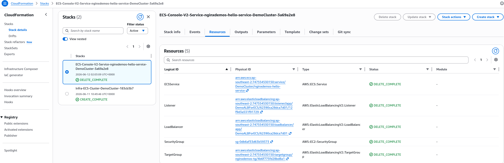
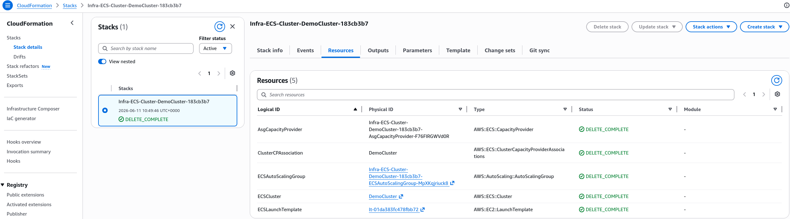

# ECS Clean Up - Hands On

This hands-on teardown guide covers the safe, sequential decommissioning of an Amazon ECS infrastructure footprint. To prevent resource-locking dependencies, the deletion workflow follows a strict outward-in order of operations: scaling running service container tasks down to zero, deleting the parent ECS Service to trigger the deletion of dependent **Application Load Balancers (ALBs)** and **Target Groups** via CloudFormation, destroying the **ECS Cluster** to clean up underlying **Auto Scaling Groups (ASGs)**, and cleanly deregistering lingering **Task Definition** metadata.

## Step-by-Step Tear Down Workflow

To avoid running into stuck dependency blocks where a network interface or security group refuses to delete because another resource is still holding onto it, you must execute your cleanup in this exact sequential order:

```Plaintext
🎯 Step 1: Scale Tasks to 0  ──►  🛑 Step 2: Delete ECS Service (ALB/TGs drop)
                                                 │
                                                 ▼
 📜 Step 4: Deregister Tasks  ◄──  🏗️ Step 3: Delete ECS Cluster (ASG/Hosts drop)
```

### 🛑 Step 1: Drain active tasks and destroy the ECS Service

- Open your **Amazon ECS Console** dashboard and click into your active DemoCluster.
- Select your long-running service (`nginxdemos-hello-service`) and click **Update**.
- Change the **Desired tasks** count integer value down to `0` and complete the update wizard. This signals the scheduler to safely drain active client traffic and stop all running Fargate containers.
- Once the running task metric hits zero, click the **Delete service** button at the top of the service dashboard, type `delete` into the confirmation field box, and hit **confirm**.
- **The CloudFormation Handshake**: The moment you confirm deletion, ECS fires an internal API call to **AWS CloudFormation**. CloudFormation takes full ownership of the teardown process, systematically destroying the **ECS Service wrapper**, your **Application Load Balancer (ALB)**, the listening port routing rules, the target groups, and the associated inbound security groups seamlessly!
  

### 🏗️ Step 2: Demolish the Cluster Boundary and Host Nodes

- Wait until the service deletion states transition to a complete success status.
- Navigate back to the top-level **Clusters** overview pane layout.
- Select your `DemoCluster` and click the **Delete cluster** execution button. Type `delete DemoCluster` in the validation window text box and hit confirm.
- **The Infrastructure Deletion Loop**: CloudFormation spins up a secondary automation thread to wipe your cluster workspace infrastructure. This process automatically targets and terminates:
  - The **ECS Capacity Providers** definitions.
  - The underlying EC2 **Auto Scaling Group (ASG)** cluster network footprint.
  - The physical **EC2 Host Instances** currently idling in your subnets.
  - The underlying **EC2 Launch Templates** and infrastructure metadata maps.



### 📜 Step 3: Deregister Stale Task Definitions (Optional)

- Task definitions are purely text-based JSON metadata blue-prints stored inside the AWS configuration tables. **They carry absolute zero base hosting costs**. Leaving 50 revisions of a task definition inside your account will never cost you a single penny!
- However, if you want a completely clean workspace environment with zero layout clutter:
  - Click on **Task definitions** in the left navigation sidebar pane.
  - Click into the `nginxdemos-hello` or `wordpress` family folder workspace.
  - Select the active revisions checkboxes, click the **Actions** dropdown menu button block, and click **Deregister**. This changes their structural state to `INACTIVE`, permanently hiding them from your active deployment pipelines!

## Exam Tips

**The Stuck CloudFormation Deletion Loop**: Imagine an exam scenario states, _"You use an AWS CloudFormation stack template script to spin up an Amazon ECS cluster running self-managed EC2 host instances inside a custom VPC. After finishing your development testing phase, you trigger a `DeleteStack` action via CloudFormation to clean up all resources.
After 20 minutes, the CloudFormation status indicator states DELETE_FAILED. The event log reveals that the underlying VPC and Subnets could not be deleted because an active resource dependency block is still bound to the infrastructure. You verify that all EC2 instances were successfully terminated. What is causing this cleanup blocker?"_
**The textbook structural answer relies on identifying hidden Elastic Network Interfaces (ENIs).**  
When you launch an ECS Service or open tasks utilizing the `awsvpc` network mode, the ECS cluster manager automatically provisions physical Elastic Network Interfaces (ENIs) straight into your subnets to give your tasks independent private IP addresses.  
If you attempt to delete your core network infrastructure layers before you manually tell the ECS Service scheduler to scale its desired task counts down to zero, those managed ENIs remain dynamically attached and locked inside your subnets. Because CloudFormation is forbidden from destroying an active subnet housing an active network interface, the deletion loop locks up and throws a hard failure block!
To resolve the roadblock, you **must always scale your container task workloads down to zero first**, allowing ECS to safely detach and delete the managed ENI fabrics before firing your final CloudFormation system deletion sweeps!
