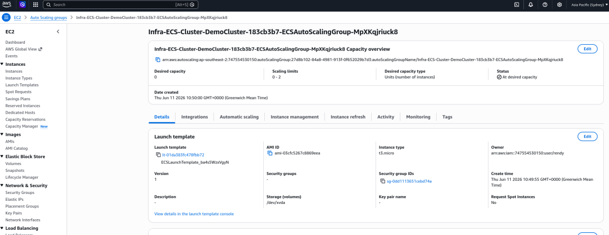
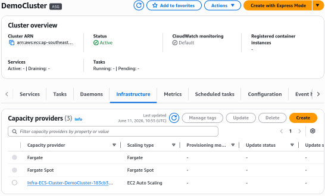
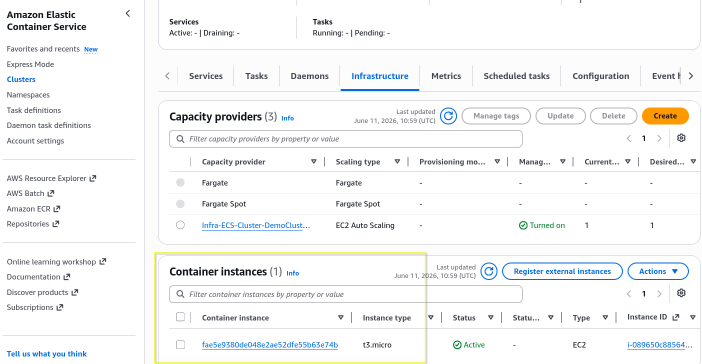

# Creating ECS Cluster - Hands On

This hands-on lab covers the step-by-step assembly of an Amazon ECS cluster workspace using the modern AWS Management Console. It details how to select structural capacity modes, provision an asynchronous **Auto Scaling Group (ASG)** backed by lightweight `t3.micro` EC2 instances, execute the automated **ECS Container Agent** registration handshake, and audit the three major infrastructure capacity providers within the logical cluster plane.

## Hands On

### Phase 1: Initialize the Cluster Boundary

- Open the **Amazon ECS Console** and click on **Clusters** in the left sidebar dashboard.
- Click **Create cluster**
- Global Metadata naming: In the _Cluster name_ field box, type `DemoCluster`.

### Phase 2: Architect the Compute Capacity Layer

Scroll down to the **Infrastructure** panel zone. This is where you pick your deployment strategy. The modern UI displays three distinct choices:

```Plaintext
1. Fargate Only  ───────────────► ⚡ 100% Serverless. Zero server maintenance.
2. Fargate and Managed Instances ─► 🛠️ AWS automatically configures/scales background EC2 nodes.
3. Fargate and Self-managed ────► 🏗️ Classic ASG execution. High control over node specifications.
```

- **The Managed Instance Track**: Select **Fargate and Managed Instances** to let AWS handle the underlying EC2 host node management for you. This is the ideal choice for most production workloads because it gives you the best of both worlds: the ease of serverless task execution with the option to run on dedicated EC2 instances when needed.
- **Configure the Auto Scaling Group (ASG)**
  - Check the box to activate an Amazon EC2 **Auto Scaling group**.
  - **Operating System/Architecture**: Select the **Amazon Linux 2023 (ECS-Optimized) AMI**. (This ensures the background agent is pre-baked onto the drive disk!).
  - **Instance type**: Type or select `t3.micro` to keep our compute nodes lightweight and within the budget tiers.
  - **Capacity constraints**: Set your scaling fences to a Minimum of 0 and a Maximum of 2 instances.
  - **SSH Access**: Leave turned off (No key-pair requested) to maintain maximum network boundary lock-down.
  - **Storage Bounds**: Retain the default baseline root volume specification size of `30 GiB`.
- Leave the VPC and subnet networks mapped out onto your standard default region settings and click **Create**.

### Phase 3: Auditing the Automated Infrastructure Handshake

- While the cluster creation orchestrator cycles in the background, open a separate console tab and jump over to the **Amazon EC2 Auto Scaling Groups Dashboard**.
- **The Behind-the-Scenes Shift**: Notice that an automated structural infrastructure layout group named `Infra-ECS-Cluster-...` has been dynamically created for you! S3 has configured the scaling parameters to span cleanly across three distinct Availability Zones (AZs) to guarantee high availability out of the box.
  

### Phase 4: Dissecting the Finished Capacity Providers

- Toggle back into your active **ECS Cluster Console** view and click inside your newly minted `DemoCluster`.
- Switch over to the top-level **Infrastructure** tab menu grid panel. Here, you will see three specialized engine slots running concurrently inside your workspace:

```math
\text{DemoCluster Processing Matrix} = \begin{cases} \text{\texttt{FARGATE}} & \longrightarrow \text{Standard serverless task execution engine.} \\ \text{\texttt{FARGATE\_SPOT}} & \longrightarrow \text{High-discount serverless spare capacity allocation lanes.} \\ \text{\texttt{ASG Provider}} & \longrightarrow \text{Your manual, self-managed EC2 instance cluster grid.} \end{cases}
```



### Phase 5: Force a Manual Capacity Injection Pass

- To watch a physical host join the cluster fabric in near real-time, navigate back to your **Auto Scaling Group** configuration pane tab.
- Click **Edit**, locate the **Desired capacity** argument integer row, and manually toggle the constraint value from `0` ⟶ `1`. Hit **Update**.
- **The Agent Handshake**: The ASG fires a new `t3.micro` instance node inside your subnets. As the operating system bootstraps, the pre-baked **ECS Container Agent** wakes up, runs a discovery call using the instance profile keys, locates your `DemoCluster` control boundary, and executes a secure registration loop.
- **The Result**: A fresh, active EC2 host node entry is now officially listed in the table tracking table grid panel! The panel dynamically shows that the cluster now possesses **2048 CPU units** and roughly **916 MB of memory footprint capacity** completely free and waiting to accept your microservice container workloads.



## Exam Tips

**The Phantom Instance Diagnostic Failure**: Imagine an exam scenario states, _"You use an automated Terraform code template script to spin up a custom, self-managed EC2 instance auto-scaling group using a standard, generic corporate **Ubuntu Linux AMI**. You explicitly verify that the EC2 instances boot up cleanly and show a healthy status inside the EC2 console. However, when you log into the Amazon ECS console, your cluster properties display zero active Container Instances, preventing any tasks from being deployed. What configuration step did you miss?"_  
**The textbook architectural answer hinges entirely on the ECS Agent installation and runtime metadata variables**.  
For an EC2 instance to successfully declare itself a member of an ECS cluster grid, two strict parameters must execute simultaneously:

1. **The Core Agent Installation**: Because you deployed a generic Ubuntu AMI instead of an official ECS-Optimized Amazon Linux AMI, the host OS lacks the physical **Amazon ECS Container Agent script** entirely! You must manually write a user-data installation script block to install the `amazon-ecs-agent` executable package onto the node.
2. **The Cluster Target Variable declaration**: Even with the agent installed, it needs to know _which_ cluster to join. You must append a localized shell command inside the host's `/etc/ecs/ecs.config` file structure declaring the exact cluster identification string:
   `ECS_CLUSTER=DemoCluster`  
   Without that environment declaration text, the agent will attempt to seek a default fallback cluster layout entry name called "default", fail to handshake, and drop the tracking metric thread completely!
