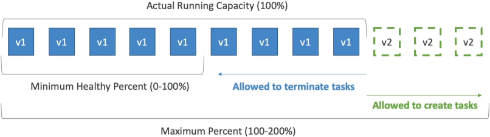
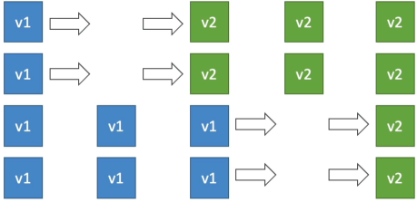
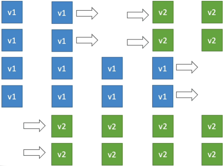

# ECS Rolling Updates

An **ECS Rolling Update** orchestrates a zero-downtime transition when a Service updates its task definition from v1 to v2. The rolling cadence is strictly controlled by two capacity parameters: `minimumHealthyPercent` (the lower-bound safety floor of active tasks required to maintain user traffic) and `maximumPercent` (the upper-bound surge ceiling of concurrent tasks allowed during the build phase).

## Key Takeaways

### The Two Core Levers (The Rules of the Game)

To master these calculations for the exam, you must look at your **Desired Task Count** (e.g., 4 tasks) as your baseline 100% capacity mark.

- **Minimum Healthy Percent**: The absolute floor of healthy tasks that ECS must keep running at any given second during the deployment.
  - _Example_: If your desired count is 4, and your minimum is set to 50%, ECS is allowed to instantly terminate 2 old tasks before it even begins building new ones. If it's set to 100%, ECS is forbidden from killing any old containers until new ones are healthy.
- **Maximum Percent**: The absolute ceiling of concurrent tasks that can exist during the deployment surge window.
  - _Example_: If your desired count is 4, and your maximum is set to 200%, ECS can spin up 4 brand-new v2 tasks right alongside your 4 old v1 tasks simultaneously, surging up to 8 total tasks.

### Scenario Walkthroughs (Exam Math Demystified)

Let's look at the exact step-by-step dance for the two classic scenarios Stephane outlines. Assume our **Desired Task Count** = 4 (100% capacity).

#### 📉 Scenario A: Min = 50% | Max = 100% (The Cost-Saver Mode)

This configuration is ideal when you have strict host infrastructure limits or a tight sandbox budget because you never exceed your original footprint count.

1. **The Starting Line**: 4 Old Tasks (`v1`) are running.
2. **The Cut**: Because Min is 50%, ECS calculates it only needs 2 healthy tasks online. It instantly **terminates 2 old `v1` tasks** → _Fleet drops to 2 tasks_.
3. **The Surge**: ECS spins up **2 brand-new `v2` tasks** → _Fleet scales back up to 4 tasks_.
4. **The Second Wave**: Once those 2 new tasks pass their load balancer health checks, the remaining **2 old `v1` tasks are terminated** → Fleet drops to 2 tasks.
5. **The Finish Line**: ECS provisions the final **2 new `v2` tasks** → _Fleet stabilizes at 4 clean `v2` tasks_.

#### ⚡ Scenario B: Min = 100% | Max = 150% (The High-Availability Standard)

This is the gold standard for production web apps. It guarantees that your user-facing processing capacity **never dips below your baseline requirements**.

1. **The Starting Line**: 4 Old Tasks (`v1`) are running.
2. **The Block**: Because Min is 100%, ECS is **not allowed to kill anything yet**.
3. **The Surge**: Because Max is 150%, ECS calculates it can temporarily run up to 6 total tasks (4×1.5). It instantly **provisions 2 brand-new `v2` tasks** → _Fleet surges up to 6 tasks_.
4. **The Shift**: The moment those 2 new `v2` tasks are healthy, ECS realizes it is sitting at 150% capacity. It **safely terminates 2 old `v1` tasks** → _Fleet drops back down to 4 tasks._
5. **The Second Wave**: ECS provisions the final **2 new `v2` tasks** → _Fleet surges back up to 6 tasks._
6. **The Finish Line**: The new tasks pass health checks, and ECS **terminates the last 2 old `v1` tasks** → _Fleet stabilizes at 4 clean `v2` tasks._

## Exam Tips

**The Frozen Update Diagnostic**: Imagine an exam scenario states, _"You manage a critical backend API service deployed via Amazon ECS on AWS Fargate. The service configuration specifies a Desired Task Count of 1. You push a new code revision to production. However, you notice the deployment immediately stalls, and CloudWatch logs reveal a scheduling error: ECS is unable to provision the new container task. You check your deployment configurations and see: minimumHealthyPercent = 100 and maximumPercent = 100. How do you fix this stuck deployment?"_  
The textbook diagnostic answer relies on breaking down the impossible math bounds. Let's analyze what you told ECS to do:

- With a desired count of 1 and a **Minimum of 100%**, ECS cannot terminate the single existing v1 task to make room. It must keep it alive.
- With a **Maximum of 100%**, ECS cannot spin up a new v2 task alongside the old one, because that would bring the total task count to 2 (which is 200% of your desired count).

You have effectively locked ECS in an architectural paradox! To break the deadlock, you must update the service's deployment configuration to increase the **Maximum Percent to at least 200%** (allowing the new task to surge alongside the old one) or drop the **Minimum Healthy Percent to 0%** (allowing the old task to die first before the new one boots up)!
