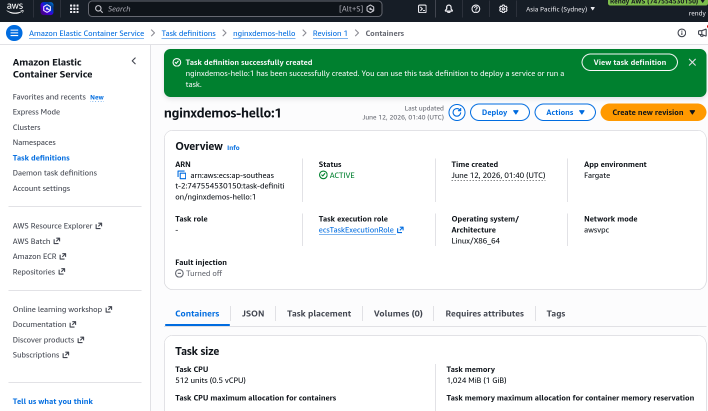
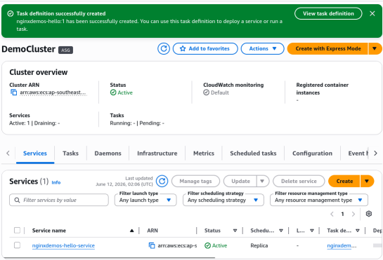
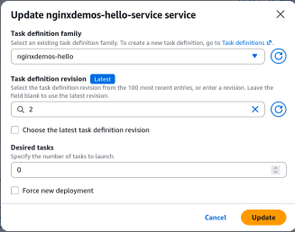

# Creating ECS Service - Hands On

This hands-on lab covers the lifecycle of deploying a containerized application via Amazon ECS. You will configure an immutable **Task Definition blueprint**, instantiate a long-running **ECS Service** on the **AWS Fargate** serverless launch type, link the tasks to a dynamic **Application Load Balancer (ALB)** target group pool, verify round-robin routing across multiple active subnets, and execute cost-containment procedures by scaling resource allocations back to zero.

## Hands On

### Phase 1: Engineer the Application Blueprint (`Task Definition`)

- Navigate to the **Amazon ECS Console** and click **Task definitions** in the left sidebar layout.
- Click **Create new task definition**.
- **Global Parameters Configuration**:
  - **Task definition family**: Type `nginxdemos-hello`.
  - **Infrastructure requirements**: Leave **AWS Fargate** checked On (ensuring a serverless, hands-off compute layer).
  - **Task size constraints**: Allocate precisely `0.5 vCPU` and `1 GB` of memory allocation footprint to keep sandbox costs inside the minimal tiers.
  - **Task Role vs. Task Execution Role**: Leave the _Task Role_ blank (since this Nginx container doesn't need to sign outbound AWS API threads). Retain the default ECS _Task Execution Role_ selector so AWS can cleanly handle plumbing CloudWatch log streams.
- **Container Specifications Mapping**:
  - **Name**: `nginxdemos-hello`.
  - **Image URI**: Pass the official Docker Hub public image location path: [nginxdemos/hello](https://hub.docker.com/r/nginxdemos/hello/).
  - **Port mappings**: Verify the container's physical interface maps **Port** `80` (**HTTP**) over to the host stack layer cleanly.
- Click **Create**. ECS compiles the manifest code and registers it as `Revision 1`.



### Phase 2: Deploy the Long-Running Infrastructure Orchestrator (`ECS Service`)

- Jump into your active **Clusters Dashboard** pane and click into `DemoCluster`.
- Under the **Services** tab grid table, click **Create**.
- **Deployment Topology Alignment**:
  - **Family Selection**: Choose your newly compiled `nginxdemos-hello` family blueprint.
  - **Service name**: Type `nginxdemos-hello-service`.
- **Environment Configuration**:
  - **Compute Options**: Select **Capacity provider strategy** and check the **Use Custom (Advanced)** radio button.
    - **Capacity provider selection**: Check the box for `FARGATE` to ensure your tasks run on the serverless execution fabric.
- **Deployment Configuration**:
  - **Number of tasks**: Set the desired task count to `1` to keep the cost minimal, but you can increase this number to have more concurrent tasks running for better load distribution.
- **Network & Ingress Security Layering**:
  - Under _Networking_, ensure your VPC subnets are selected.
  - **Security group**: Create a new group rule passing inbound traffic matching **Port** `80` (**HTTP**) from `Anywhere (0.0.0.0/0)` so you can browse the web utility.
- **Load Balancer Integration Config**:
  - **Load balancer type**: Select **Application Load Balancer (ALB)**.
  - **Load balancer name**: Type `DemoALBForECS`.
  - **Target group allocation**: Create a new target group named `nginxdemos-tg` using HTTP protocols on Port 80.
- Click **Create**.



### Phase 3: Trace the Ingress Handshake and Private IP Matrix

- Once the deployment status bar transitions into a steady active state, copy your ALB's public DNS Name from the EC2 load balancing panel:
  `ALB Public Address=DemoALBForECS-137596086.ap-southeast-2.elb.amazonaws.com`.
- Open a new browser window, paste the DNS link string, and hit Enter. The vibrant **Nginx Hello World demo dashboard** renders instantly!
- **The Internal Architecture Audit**: Notice the "Server Address" parameter displayed on the web interface. That is the internal **Private IP Address** (e.g., `172.31.x.x`) belonging to your Fargate task's dedicated Elastic Network Interface (ENI), cleanly proving that your containers stay completely hidden away from direct public routing lines while the ALB bridges the public traffic down the wire!

### Phase 4: Execute Cost Containment Procedures

- To simulate real-time traffic spike scaling orchestration, click **Update service** inside your ECS Service panel.
- Change the **Desired tasks** allocation counter parameter from `1` ⟶ `3`. Leave everything else unchanged and click **Update**.
- **The Serverless Magic Loop**: Fargate instantly provisions two additional, isolated compute layers without needing to wait for background EC2 server nodes to boot up. Within seconds, the task statuses flip from `PENDING` ⟶ `RUNNING`.
- **Verify Round-Robin Load Distribution**: Go back to your active browser tab containing your ALB link and smash the refresh button repeatedly. Notice how the internal Server Private IP address continuously cycles between three distinct IP coordinates. The load balancer is perfectly balancing the load across three distinct independent **Availability Zones (AZs)** simultaneously! 🚀

````
                                [ Global Public User ]
                                         │
                                         ▼
                            ┌────────────────────────┐
                            │ Public Application LB  │ (DemoALBForECS)
                            └────────────┬───────────┘
                                         │
                 ┌───────────────────────┼───────────────────────┐
                 │ (ap-southeast-2a)     │ (ap-southeast-2b)     │ (ap-southeast-2c)
                 ▼                       ▼                       ▼
     ┌──────────────────────┐┌──────────────────────┐┌──────────────────────┐
     │ Fargate Task Target1 ││ Fargate Task Target2 ││ Fargate Task Target3 │
     │  (Private IP .47)    ││  (Private IP .70)    ││  (Private IP .72)    │
     └──────────────────────┘└──────────────────────┘└──────────────────────┘
     ```
````

### Phase 5: Execute Cost-Containment Procedures

- To preserve your account budget limits after validating your setups, clean up your sandbox resources:
  - Click **Update service** inside your `nginxdemos-hello-service` management pane and change the **Desired tasks** count to `0`. Hit Update to let ECS automatically drain and terminate your active Fargate containers.
    
  - Toggle over to your **Auto Scaling Groups Dashboard** if you have lingering EC2 self-managed sandbox nodes running from previous labs, click edit, and set its **Desired Capacity** and **Minimum Capacity** to 0 as well. This guarantees zero surprise line-item tracking charges on your monthly statement!

## Exam Tips

| System Parameter Profile          | Standalone Task (RunTask API)                                                                | ECS Service Scheduled Architecture                                                    |
| --------------------------------- | -------------------------------------------------------------------------------------------- | ------------------------------------------------------------------------------------- |
| **Primary Execution Lifespan**    | Short-running / Transient workloads (Runs code to completion and then exits).                | Long-running / Persistent infrastructure (Designed to stay up indefinitely).          |
| **Self-Healing Capabilities**     | ❌ No. If a process encounters a fatal crash or the underlying hardware dies, it stays dead. | ✅ Yes. Continually monitors health; instantly scales up a new clone if a task fails. |
| **Load Balancer Target Mounts**   | ❌ No native automated load balancer scaling registration.                                   | ✅ Yes. Dynamically hooks network interfaces into target groups on scale-out actions. |
| **Classic Architectural Analogy** | Linux System Cron-Job / Automated DB Migration Script.                                       | Managed background process worker / Production Nginx Web Server cluster.              |

**The Crashing Web Server Recovery Trap**: Imagine an exam scenario states, \_"You are deploying a Node.js microservice API web server onto an Amazon ECS Fargate cluster. You configure the application to deploy by executing a standalone RunTask configuration loop via an automated script. After a week in production, the application container process encounters an unexpected out-of-memory exception error and crashes. Global clients immediately report dropping connections. How do you re-architect this deployment to guarantee maximum high availability with zero manual operational code patching?"  
**The textbook diagnostic answer relies on migrating the architecture from a standalone task to an ECS Service**.

- When you launch a task directly via the **RunTask API**, ECS simply boots the container up, lets it run, and washes its hands of the process lifecycle. The minute the node crashes, it remains completely dead in the water.
- To fix this flaw, you must wrap that exact same Task Definition inside an ECS Service definition. The Service Scheduler acts as a continuous tracking loops engine. The split-second your Node.js process encounters an error and dies, the service controller catches the state drop, kills the broken task container, and automatically provisions a fresh, healthy clone instance task to keep your production website up and running without missing a single beat!
