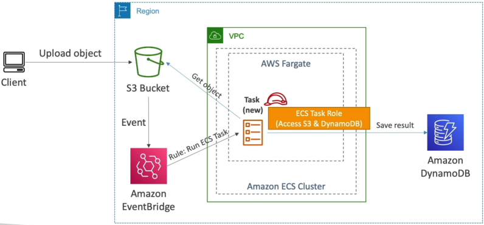
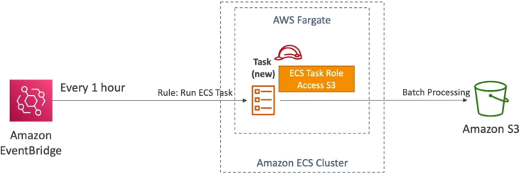
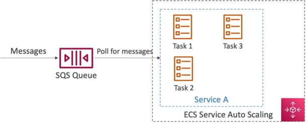
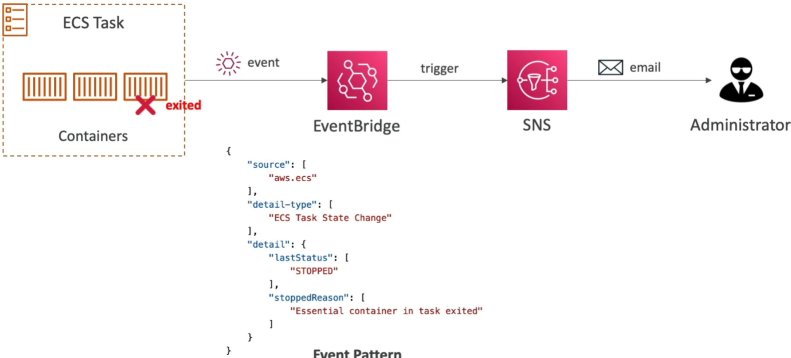

# ECS Solutions Architectures

Amazon ECS excels when deployed inside decentralized, event-driven topologies. By leveraging **Amazon EventBridge**, engineers can dynamically invoke serverless **AWS Fargate** container jobs based on object state changes inside S3 buckets or via structured cron cron-schedule patterns. To absorb high-velocity request spikes, long-running ECS tasks are paired with **Amazon SQS** queues to throttle and process workloads reliably via target metrics. Finally, EventBridge natively intercepts the internal **ECS Lifecycle Task State Changes** to emit automated failure alerts across the administrative matrix.

## Architecture 1: The Reactive S3 Object Processor (Serverless Batch)

Imagine a platform setup where external web clients upload massive multi-gigabyte raw data archives or video files into an Amazon S3 bucket. Running a continuous fleet of EC2 servers just sitting there waiting to process those files is an expensive resource waste.

Instead, you deploy a completely **Event-Driven Serverless Pipeline**:

### ⚙️ The Execution Lifecycle:

1. **The Inbound Mutation**: A user drops an asset into an **Amazon S3 Bucket**.
2. **The Interception Bridge**: Because the bucket has EventBridge notifications toggled On, S3 instantly dispatches a structured data payload containing the file's exact storage path over to **Amazon EventBridge**.
3. **The Target Rule**: EventBridge evaluates its rule filters, finds a match, and invokes a native `RunTask` **target configuration execution**.
4. **The Serverless Spin-Up**: AWS Fargate provisions a fresh compute runtime environment instantly. It injects your custom image, boots up the Docker container process, and hands it the file coordinates.
5. **The Permissions Separation (The Exam Lock)**: The container script wakes up and uses its **ECS Task Role** credentials to download the binary object file from S3.
   - The code processes the file (e.g., executing a video transcoding routine or parsing text lines).
   - The script writes the finished analytical metrics straight down into an **Amazon DynamoDB** database table layout, logs its final outputs to CloudWatch, and exits the system completely. Fargate tears down the compute node instantly, dropping your runtime cost overhead down to absolute zero!



## Architecture 2: The Automated Cron-Scheduler (Time-Driven)

When your corporate data compliance teams mandate executing structural system tasks at regular intervals—such as wiping temporary database tables, generating sales reports, or indexing folder structures every hour, this call out for **EventBridge Schedule** integration.

```math
\text{Time-Driven Lifecycle} \longrightarrow \text{EventBridge Cron (Every 1 Hour)} \longrightarrow \text{Invokes Fargate Task Instance} \longrightarrow \text{Executes Shared Storage Clean}
```

Your Docker container initializes, reads its configuration paths, runs its processing routines against your database grids, saves the outputs into an S3 backup bucket, and terminates cleanly. You pay only for the exact seconds the container was alive and processing data!



## Architecture 3: The Decoupled Worker Fleet (SQS Queue Interception)

If your platform needs to handle high-volume transaction spikes (like handling ticket orders on a holiday or processing bulk data invoices), throwing traffic directly at a web server cluster can easily overwhelm your containers, resulting in dropped connections and system timeout crashes.

The gold standard pattern is to interject an **Amazon SQS Queue** as a shock absorber:

### 🛡️ The Scaling Mechanics:

1. Your client frontend applications drop incoming workload records directly into an **Amazon SQS Queue**. The records sit safely inside the queue buffer infrastructure.
2. Inside your long-running **ECS Service**, your worker container tasks run loop code that continuously requests message bundles from SQS.
3. **The Scaling Trigger**: You configure AWS Application Auto Scaling to track a specific metric coming out of the SQS engine: `ApproximateNumberOfMessagesVisible`.
4. As the message counts stack up inside the queue, a CloudWatch alarm triggers a scaling event, and ECS scales up your Fargate container task counts. The expanded container fleet processes messages concurrently, empties the queue matrix, and lets Auto Scaling cleanly collapse the task fleet back down to baseline minimums when the surge passes.



## System Observability: Tracking Container Lifecycles

Because containers are highly dynamic and short-lived, chasing container failures inside raw logs can be a nightmare. S3 automatically drops a deep monitoring engine directly into your account: **ECS Task State Change Events**.

The exact millisecond any task inside your cluster transitions its status bounds (e.g., switching from `RUNNING` → `STOPPED`), ECS fires a highly structured event notification out to your default EventBridge bus.

### 🧩 The Forensic JSON Event Pattern Schema:

```json
{
  "version": "0",
  "id": "12345678-abcd-1234-abcd-1234567890ab",
  "detail-type": "ECS Task State Change",
  "source": "aws.ecs",
  "account": "123456789012",
  "time": "2026-06-12T19:05:43Z",
  "region": "ap-southeast-2",
  "resources": [
    "arn:aws:ecs:ap-southeast-2:123456789012:task/DemoCluster/abc123xyz"
  ],
  "detail": {
    "clusterArn": "arn:aws:ecs:ap-southeast-2:123456789012:cluster/DemoCluster",
    "lastStatus": "STOPPED",
    "desiredStatus": "STOPPED",
    "stopCode": "EssentialContainerExited",
    "stoppedReason": "Essential container in task exited with a non-zero exit code (1)"
  }
}
```

By tracking this specific schema inside EventBridge, you can route the output straight to an **Amazon SNS Topic**, firing automated email alerts or SMS notifications to your operations on-call pager the absolute second a critical production task crashes with a non-zero exit code!



## Exam Tips

**The Event-Driven Triage Challenge**: Imagine an exam scenario states, _"You are designing a decoupled data processing platform on AWS. The application must process inbound transactional CSV files uploaded by users into an S3 bucket. The processing logic takes roughly 25 minutes to execute per file, and the company mandates that the system must require absolute zero infrastructure server maintenance, zero pre-provisioned compute idling, and scale dynamically. How should you design this processing engine?"_
**The textbook distractor choice is to deploy an AWS Lambda function triggered natively by S3 Event Notifications**.

- **The Trap**: While Lambda is perfectly serverless and has zero maintenance overhead, AWS Lambda has a hard maximum execution execution time limit constraint of exactly 15 minutes (900 seconds). Because your processing script requires 25 minutes to complete its task loop, a Lambda function will time out and hard-crash mid-execution every single time!
- **The Gold-Standard Architectural Answer**: You must deploy an Amazon EventBridge rule that catches S3 Upload events and triggers an Amazon ECS task running on AWS Fargate.
- Fargate containers are completely serverless, carry zero pre-provisioned maintenance overhead, and do not possess a restrictive execution execution limit constraint. Your container task can run for hours or days until the script loops complete to absolute perfection, making it the premier choice for heavy batch-processing jobs!
