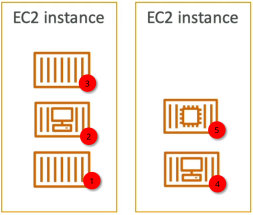
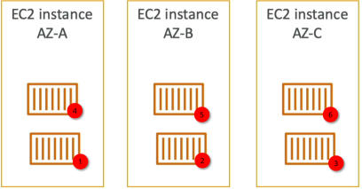

# ECS Task Placements

Amazon ECS uses a multi-step deterministic placement process to schedule tasks across an EC2 container instance cluster. The scheduler evaluates requirements sequentially: first verifying basic CPU/Memory resource capacity, then filtering nodes based on strict **Placement Constraints**, and finally optimizing placement by executing **Placement Strategies** (`binpack`, `spread`, or `random`). While strategies operate on a best-effort optimization loop, constraints enforce hard security and hardware compliance fences.

## Key Takeaways

### The Multi-Step Placement Evaluation Chain

When you or an automated Auto Scaling policy tells ECS to invoke a new task, the underlying scheduling engine steps through a strict 3-tiered logical checklist to select the perfect target host server:

```Plaintext
Step 1: Resource Filtering ──► Identifies hosts with enough free CPU, Memory, and available network ports.
             │
             ▼
Step 2: Hard Constraints ────► Drops hosts that fail explicit compliance boundaries (e.g., must be a t2 instance).
             │
             ▼
Step 3: Strategy Optimization ─► Evaluates remaining nodes to fulfill the desired target logic (e.g., binpack).
```

### ECS Task Placement Constraints (The Hard Enforcers)

Constraints are **absolute, non-negotiable rules**. If a cluster instance fails a constraint check, ECS is forbidden from placing the task there—even if the cluster completely runs out of space!

#### 🆔 1. `distinctInstance`W

- **The Rule**: Enforces that every single task clone must live on a completely separate, independent EC2 host machine. You will never see two instances of this specific task family cohabitating on the same server OS.
- **The Primary Use Case**: Perfect for infrastructure utility daemons, custom monitoring tools, or high-performance load routers that need standalone system access.

```json
"placementConstraints": [
  {
    "type": "distinctInstance"
  }
]
```

#### 🔍 2. `memberOf` (Cluster Query Language)

- **The Rule**: Evaluates host instances against a custom, advanced query expression string written in Cluster Query Language (CQL). It forces tasks onto nodes possessing specific metadata tags, custom attributes, or hardware profiles.
- **The Primary Use Case**: Restricting specialized memory-heavy graphics processing jobs strictly onto GPU-enabled instance tiers (e.g., checking if the instance type matches a specific family string).

```json
"placementConstraints": [
  {
    "type": "memberOf",
    "expression": "attribute:ecs.instance-type =~ t2.*"
  }
]
```

### ECS Task Placement Strategies (The Optimization Models)

Placement strategies are **best-effort configurations** designed to optimize how your containers cluster together across healthy instances. You must lock down these three primary types for the exam:

#### 📦 A. Binpack (The Ultimate Budget Saver)

- **The Logic**: Packs as many containers as physically possible onto a single EC2 host node before it spills over to open up a secondary instance. It optimizes placement based on the **least available amount of CPU or Memory**.
- **The Visual Flow**: Imagine filling up buckets with water one by one—you don't move to the next bucket until the current one is overflowing.
- **The Business Value**: **Maximum cost savings**. By fully saturating a minimal footprint of servers, your Auto Scaling Group can cleanly terminate empty, idling instances at the edge of the cluster network.

```json
"placementStrategy": [
  {
    "type": "binpack",
    "field": "memory"
  }
]
```



#### 🌐 B. Spread (The High-Availability Standard)

- **The Logic**: Distributes tasks completely evenly across a specified dimension parameter metric. The most common target fields are `attribute:ecs.availability-zone` (spreading across physical data centers) or `instanceId` (spreading across individual machines).
- **The Visual Flow**: If you have 3 tasks and 3 Availability Zones (AZ-A, AZ-B, AZ-C), ECS drops exactly one task per zone.
- **The Business Value**: **Maximum fault tolerance**. If an entire AWS data center loses power, your application fleet only drops by a fraction of its capacity, letting the surviving zones handle user traffic uninterrupted.

```json
"placementStrategy": [
  {
    "type": "spread",
    "field": "attribute:ecs.availability-zone"
  }
]
```



#### 🎲 C. Random (The Baseline Alternative)

- **The Logic**: Places tasks across remaining instances completely randomly with zero complex structural profiling calculations.
- **The Business Value**: Extremely low scheduling processing overhead, but offers no guarantee of resource utilization efficiency or geometric high availability.

## Exam Tips

**The Competing Strategy Architecture Trap**: Imagine an exam scenario states, _"You are managing an enterprise application on an Amazon ECS cluster using self-managed EC2 host instances spread across 3 Availability Zones. Your deployment profile requires that the application maintains maximum possible high availability across data centers, but at the same time, it must minimize hosting costs inside each individual data center by packing servers efficiently. How should you structure your placement strategy array?"_  
**The textbook structural answer relies on chaining multiple placement strategy blocks sequentially**.  
S3 allows you to pass an **ordered array** of optimization rules inside your configuration file layout. To fulfill this dual-requirement setup, you stack them like this:

1.  First, you declare a spread strategy targeting `attribute:ecs.availability-zone`. This guarantees that the scheduling engine splits your container batches across AZ-A, AZ-B, and AZ-C evenly for maximum high availability.
2.  Second, inside that regional zone bucket, you append a nested `binpack` **strategy targeting** `memory`.

By stacking them, ECS will first decide _which_ zone needs the task to keep the grid balanced, and then look inside that explicit zone to find the specific host node that is already closest to being full, packing the local instances to the rim before booting up new ones. You achieve ultimate disaster recovery and budget optimization simultaneously!

```json
{
  "cluster": "DemoCluster",
  "serviceName": "high-availability-cost-optimized-service",
  "taskDefinition": "wordpress:1",
  "desiredCount": 6,
  "launchType": "EC2",
  "placementStrategy": [
    {
      "type": "spread",
      "field": "attribute:ecs.availability-zone"
    },
    {
      "type": "binpack",
      "field": "memory"
    }
  ]
}
```
