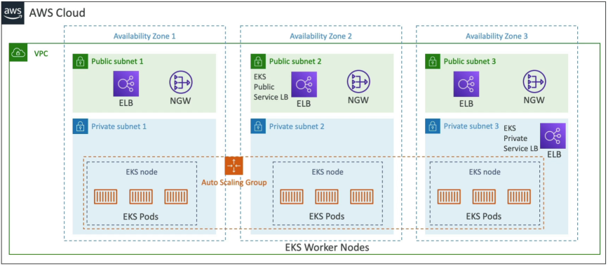

# Amazon EKS

**Amazon EKS** is a fully managed service that automates the deployment, scaling, and high-availability operations of open-source Kubernetes clusters on AWS. It replaces the classic ECS structural taxonomy with K8s primitives, launching application Pods across a scaling array of compute **Worker Nodes**. The compute layer can be run via AWS-optimized **Managed Node Groups**, highly customized **Self-Managed Nodes**, or entirely serverless **AWS Fargate** profiles, while decoupled persistent storage is mounted dynamically using CSI-compliant storage class drivers.



## Key Takeaways

### ECS vs. EKS Mapping

Your brain needs to instantly translate parameters across both orchestration frameworks. They share identical architectural goals, but their labeling taxonomies are completely split:
|System Attribute|Amazon ECS Framework|Amazon EKS (Kubernetes) Alternative|
|----------------|--------------------|-----------------------------------|
|**The Core Component**|🐳 **Docker Container**|📦 **Container** (Can use Docker, containerd, etc.)|
|**The Logical Deployment Unit**|📑 **ECS Task** (1+ containers sharing local specs)|🪺 **K8s Pod** (The absolute smallest deployable unit)|
|**The Blueprint Configuration**|📄 **Task Definition** (JSON schema manifest)|📜 **Pod Manifest** (Declarative YAML spec sheets)|
|**The Cluster Fleet Controller**|⚙️ **ECS Service**|🚢 **Deployment / ReplicaSet**|
|**The Compute Server Instance**|🖥️ **Container Instance** (Host EC2 running ECS Agent)|🏗️ **Worker Node** (Host EC2 running a `kubelet` agent)|

### The 3 Worker Node Scaling Flavors

When you deploy an EKS control plane, you dictate exactly how much manual server configuration management your operations team wants to handle:

#### 🛠️ A. Managed Node Groups (The Enterprise Balanced Track)

- **The Mechanics**: AWS handles the lifecycle orchestration of the underlying EC2 instances for you.
- **The Advantages**: The host servers are automatically integrated into an internal Auto Scaling Group managed directly by the EKS control plane. It natively handles standard rolling drain upgrades, OS security patch maintenance sweeps, and supports mixing **On-Demand and Spot instances** out of the box to maximize cloud savings!

#### 🏗️ B. Self-Managed Nodes (Ultimate Customization)

- **The Mechanics**: Your team manually spins up standard EC2 Auto Scaling Groups inside your subnets.
- **The Requirement**: You must use the pre-baked __Amazon EKS Optimized AMI_ (or code a custom corporate OS blueprint from scratch) and manually execute the configuration bootstrap script to register the host servers up into the EKS control plane grid. You retain 100% granular control over OS system kernels and network configuration.

#### ⚡ C. AWS Fargate Profiles (100% Serverless Kubernetes)

- **The Mechanics**: Total abstraction of the server layer. You do not manage a single EC2 host node or scale group in your account infrastructure.
- **The Workflow**: You declare an EKS Fargate Profile mapped to a specific Kubernetes namespace. The exact millisecond you execute a Pod deployment, AWS automatically provisions an isolated, hypervisor-secure serverless execution fabric beneath that specific Pod, eliminating background node administration entirely!

💾 Enterprise Storage Pluggability (The CSI Driver Fabric)

Because Kubernetes is built to be completely cloud-agnostic, it does not natively understand specific AWS storage types. Instead, it interacts via a standardized, pluggable integration layer called the **Container Storage Interface (CSI)**.

To mount persistent network folders onto your workloads, you declare a declarative `StorageClass` **manifest** inside your cluster. EKS hooks into the CSI driver sub-layers to provision storage arrays dynamically:

```math
\text{EKS Persistent Storage Array} = \begin{cases} \text{\textbf{Amazon EBS}} & \longrightarrow \text{High-performance block storage (Locked to a single AZ).} \\ \text{\textbf{Amazon EFS}} & \longrightarrow \text{Multi-AZ shared persistence (The exclusive choice for Fargate Pods).} \\ \text{\textbf{FSx for Lustre}} & \longrightarrow \text{Extreme-throughput file fabrics for heavy machine learning jobs.} \end{cases}
```

## Exam Tips

**The Pod IAM Isolation Triage**: Imagine an exam scenario states, _"You are deploying a microservice pod container onto an Amazon EKS cluster. The pod's application code needs to scan data records inside an Amazon DynamoDB table. A junior engineer proposes attaching an IAM programmatic access key directly onto the EC2 Worker Node's IAM Instance Profile. Why is this an anti-pattern, and what is the modern AWS security-compliant solution?"_  
**The textbook diagnostic answer relies on implementing a Pod-level identity framework to maintain strict least-privilege security**.  
- **The Flaw**: If you attach a DynamoDB access policy to the _EC2 Worker Node's Instance Profile_, **every single Pod running on that physical server inherits that permission!** If a non-privileged web-scraping container on that same host gets compromised, the attacker instantly gains full access to your production database backend.
- **The Historical Solution (IRSA)**: For years, developers used _IAM Roles for Service Accounts (IRSA)_. This uses an OpenID Connect (OIDC) identity provider link to cryptographically tie an AWS IAM role down to a specific Kubernetes ServiceAccount token.
- **The Modern 2026 Gold Standard (EKS Pod Identity)**: For modern cloud-native clusters, you deploy EKS Pod Identity. You install the lightweight _EKS Pod Identity Agent_ add-on onto your cluster node fleets. Then, you execute a direct API mapping command: `aws eks create-pod-identity-association`  
This clean association directly maps your targeted IAM Role to your specific K8s namespace and ServiceAccount. The underlying agent securely intercepts the pod's credential provider chain, providing short-lived, isolated AWS STS tokens directly to that one specific Pod without needing any complex OIDC trust policy wiring!