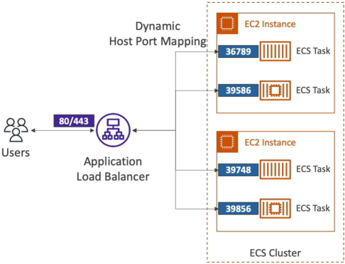
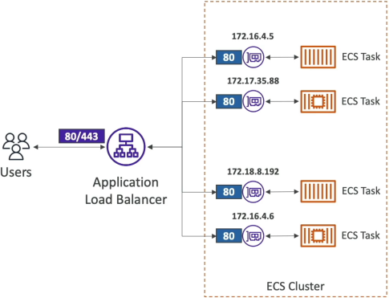
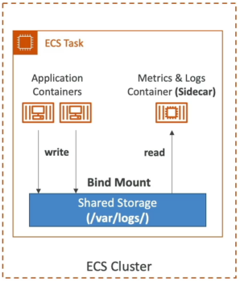

# Task Definitions - Deep Dive

An **Amazon ECS Task Definition** is an absolute structural blueprint written in JSON format that tells the cluster controller how to instantiate one or more Docker containers (up to 10 per task blueprint). It configures the core application image strings, memory/CPU quotas, environment variable mapping, IAM execution security boundaries, and local container-to-container shared storage volumes.

## Key Takeaways

### Networking & Ingress: Host Mapping vs. Fargate ENIs

The way network traffic crosses from the public web wire down into your application code shifts completely depending on your underlying container placement model.

#### 🏗️ The EC2 Launch Type: Dynamic Host Port Mapping

If you are running self-managed EC2 host instances, you map a **Container Port** (the port internal to the Docker container, like `80`) to a **Host Port** (the physical port exposed on the EC2 machine's operating system).

- **The Architectural Trap**: If you explicitly hardcode your host port to `8080`, **you can only run exactly ONE copy of that task per EC2 instance**. If you try to scale up a second copy, it will fail to initialize because Port `8080` is already bound by the first container!
- **The Modern Solution**: You leave the Host Port completely blank (or set it explicitly to `0` in the JSON schema).
  This activates **Dynamic Host Port Mapping**. The ECS Agent assigns a completely randomized ephemeral port (ranging between `32768` and `61000`) straight to each container clone.
- **The ALB Handshake**: Because the ports keep changing randomly, the **Application Load Balancer (ALB)** tracks the changes dynamically. The moment a new task spins up, the ECS Service automatically communicates the random host port over to the ALB’s Target Group mapping registry, ensuring public user requests route smoothly without interruption!
- **The Security Group Requirement**: Because the assigned ephemeral ports are completely random, your **EC2 Host Security Group** must open up the complete inbound port spectrum (`32768-61000`) whitelisting the **ALB's Security Group ID** as the exclusive source.
  

#### ⚡ The Fargate Launch Type: Clean `awsvpc` Mapping

Because AWS Fargate is entirely serverless, there is no physical host server for you to map ports onto.

- **The Mechanics**: Fargate forces the deployment of the `awsvpc` **network mode**. The exact millisecond your task boots up, ECS provisions a dedicated, physical **Elastic Network Interface (ENI)** straight into your private subnets.
- **The Interface Rules**: Your task inherits its own standalone **Private IP address**. Because there is no host interface blocking the route, you only specify the _Container Port_. If you run 4 copies of an Nginx container simultaneously on Fargate, **all 4 tasks will listen on Port `80` concurrently**, separate from each other on their own independent private IPs!
- **The Security Group Requirement**: You apply a Security Group directly onto the **Fargate Task ENI layout**. The rule simply needs to accept inbound traffic on your explicit container target port (e.g., allow Port `80` or `443`) sourced directly from your frontend ALB's Security Group ID.
  

### Environment Variable Injection Strategy

Baking secrets or database keys straight into a raw Docker image is a massive corporate security violation. If your image leaks or gets pushed to a public repository, your production databases are instantly compromised. Task Definitions provide three distinct, secure configuration lanes for injecting application variables at boot time:

```Plaintext
1. Hardcoded Plaintext ─► For non-sensitive constants (e.g., APP_LOG_LEVEL: "INFO")
2. Secret Vault References ─► Fetches variables from AWS Secrets Manager or SSM Parameter Store at runtime
3. S3 Bulk Loading ───────► Downloads a flat ".env" file directly from a secure bucket into container memory
```

- **The Runtime Resolver**: When you use options 2 or 3, your container doesn't save any configurations to disk. The split-second the container launches, the underlying ECS control plane reaches out to the designated secret repository or secure S3 location, extracts the strings, and drops them cleanly into the container's volatile application memory cache as native environment variables.

### Multi-Container Topologies & Shared Bind Mounts

While many basic task definitions run a single microservice container, complex production systems group multiple containers together inside a single task definition boundary to implement the **Sidecar Pattern**.

```
                           ┌──────────────────────────────┐
                           │      ECS Task Boundary       │
                           │                              │
 ┌──────────────────────┐  │  ┌────────────────────────┐  │
 │                      │  │  │ Application Container  │  │
 │  Incoming App Traffic│──┼─►│ (Writes to /var/log)   │  │
 │                      │  │  └───────────┬────────────┘  │
 └──────────────────────┘  │              │               │
                           │              ▼ (Bind Mount)  │
                           │  ┌────────────────────────┐  │
                           │  │  Shared Volume Storage │  │
                           │  └───────────┬────────────┘  │
                           │              │               │
                           │              ▼ (Read Access) │
                           │  ┌────────────────────────┐  │
                           │  │  Sidecar Log Forwarder │  │
                           │  │ (Pushes data to Splunk)│  │
                           │  └────────────────────────┘  │
                           └──────────────────────────────┘
```

- **The Use Case**: Your primary container runs your web server core app logic. A secondary sidecar container runs a specialized utility process—like an **AWS X-Ray daemon** for distributed application tracing or a **FluentBit/Log forwarder agent** that captures system logs.
- **The Shared Storage Bridge (Bind Mounts)**: Because containers have entirely isolated root file systems out of the box, Container A cannot look inside the directories of Container B. To pass metrics or log outputs between them, you define a logical **Volume Bind Mount** inside the task definition properties.
- The Operational Lifecycles: Both containers mount this shared volume path location simultaneously. The primary app container writes its log data to the shared folder, and the sidecar container continuously reads that exact same folder to ship metrics off-cluster.
  - On **EC2 Launch Types**: The storage backing this volume is allocated directly out of the host instance's local drive disk.
  - On **Fargate Launch Types**: The volume utilizes Fargate's high-speed ephemeral disk space allocation. Every Fargate container gets `20 GiB` of ephemeral storage for free out of the box, and you can scale this allocation up to `200 GiB` right inside the task properties to handle massive local caching data needs!



## Exam Tips

**The Secret Injection Permission Trap**: Imagine an exam scenario states, _"You are configuring an Amazon ECS Task Definition to deploy a container onto AWS Fargate. Your code requires an environment variable called DB_PASSWORD, which is safely housed inside AWS Secrets Manager. You configure the task definition JSON properties to reference the secret's ARN under the secrets container definition attribute. However, when the service attempts to launch, the tasks immediately loop crash with a status code: `ResourceInitializationError: unable to retrieve secrets from secrets manager`. How do you resolve this error?"_
**The textbook diagnostic answer relies on configuring the right IAM identity on the Task Definition layout**.

- **The Trap**: Avoid suggestions that tell you to modify the application's Task Role. The Task Role is passed to your custom container code _after_ it is already healthy and running.
- **The Fix**: Because fetching the secret keys from the vault and mapping them into environmental variables happens during the container bootstrapping phase before your application code ever starts, the entity executing the pull request is the core ECS infrastructure orchestrator. You must open your Task Definition settings and verify that your **Task Execution Role** possesses explicit `secretsmanager:GetSecretValue` IAM policy permissions!
