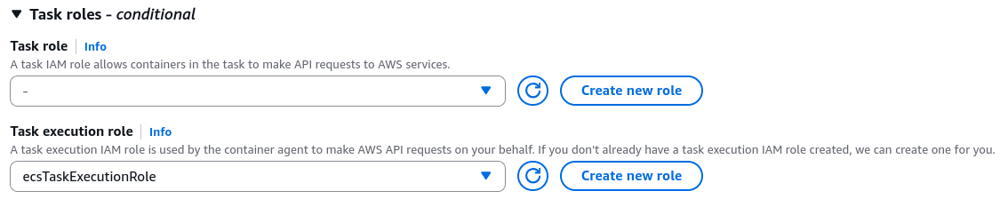
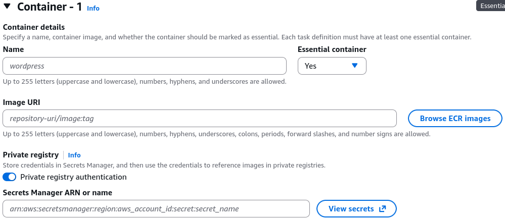
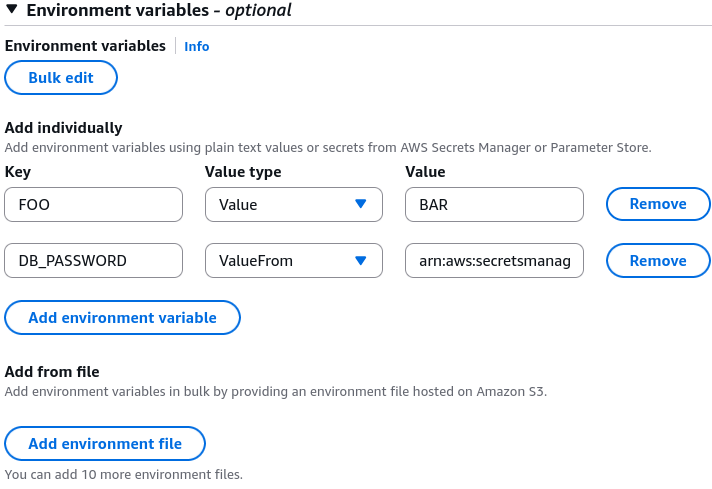
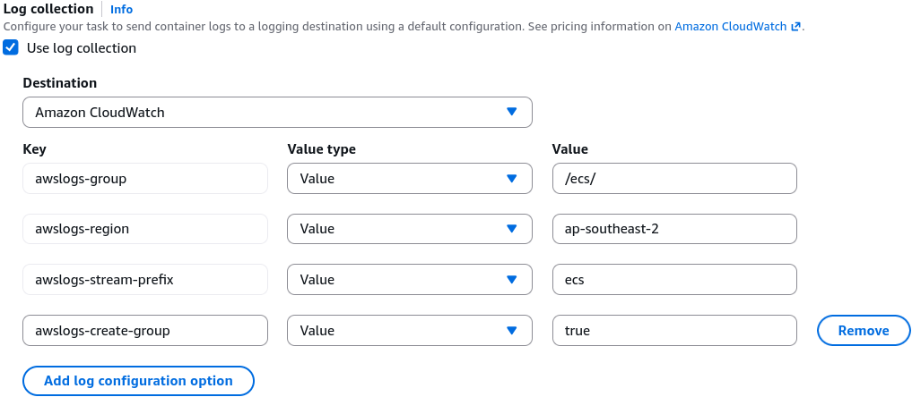
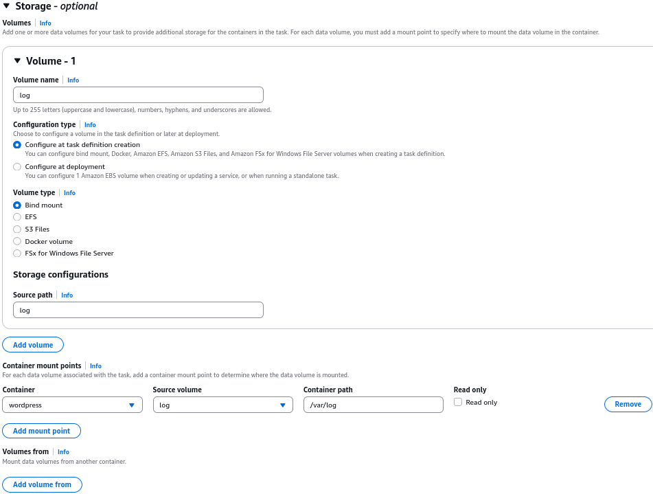
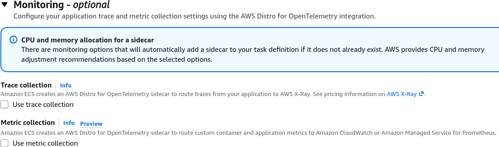

# Task Definitions - Hands On

This hands-on lab explores the multi-container configuration capabilities of the Amazon ECS Task Definition dashboard. Key concepts include managing **Essential vs. Non-Essential container lifecycles**, authenticating against **private registries**, securing environment variables via **AWS Secrets Manager / SSM Parameter Store**, implementing advanced edge telemetry via **AWS FireLens and X-Ray sidecars**, and creating local container storage channels via **Volume Bind Mounts**.

## Hands On

### Phase 1: Establish the Cluster Baseline

- Open the **Amazon ECS Console**, navigate to **Task definitions** in the left sidebar, and click **Create new task definition**.
- **Family Name**: Type `wordpress`.
- **Infrastructure Selection Strategy**: Check the box for **AWS Fargate** or **Amazon EC2**.
  - **The Resource Allocation Law**: If you choose Fargate, your CPU and Memory selections are hard-locked to discrete, pre-vetted step increments (e.g., 0.5 vCPU must pair with 1 GB to 4 GB of RAM). If you choose EC2, you can input completely custom, arbitrary numerical constraints.
  - **The Network Constraint**: Fargate forces you into the `awsvpc` **network mode**, giving every single task its own dedicated Elastic Network Interface (ENI).

### Phase 2: Decoupling the IAM Permissions

Locate the top-level identity blocks. This is a massive focus area on the DVA-C02 exam:

- **The Task Execution Role**: This is the _infrastructure bootstrap_ identity. The ECS Container Agent uses it _before_ the container boots up to pull images from private registries, log stdout streams to CloudWatch, and pull keys from Secrets Manager.
- **The Task Role**: This is the _runtime application_ identity. Your WordPress PHP code or Node.js logic inherits this profile dynamically to execute programmatic AWS API calls (e.g., reading an object from Amazon S3 or writing to a DynamoDB table).



### Phase 3: Navigating Advanced Container Definitions

Scroll down to the Container 1 properties section. S3 opens up an exhaustive configuration matrix:

1. **The Essential Container Lifeline**
   - Toggle the **Essential** switch option.
   - _The Relaunch Rule_: Every task definition requires at least **one** essential container. If an essential container encounters a fatal crash or returns a non-zero exit code, **the entire parent task is immediately killed and terminated by ECS**. If a non-essential container (like a minor background log-exporter sidecar) dies, the rest of the task continues running unhindered.
2. **Private Registry Authentication**
   - If your container image lives inside a protected, private Docker Hub or third-party repository rather than a public gallery, check the **Private repository authentication** box.
   - Paste the exact **Amazon Resource Name (ARN)** of an AWS Secrets Manager secret housing your corporate repository username and password credentials. The Task Execution role utilizes this ARN to securely authenticate and pull the image without leaking plaintext passwords.
     
3. **High-Leverage Environment Variable Injection**  
    You can pass environment configuration flags down to your code containers using three distinct options within the UI:
   - **Value**: Standard plaintext string mapping (e.g., `FOO` = `BAR`). Use this for non-sensitive data like `LOG_LEVEL` or `API_ENDPOINT_URL`.
   - **Value From**: Secure value resolution. Paste the ARN of a secret token inside **Secrets Manager** or a path parameter within **SSM Parameter Store** (e.g., `DB_PASSWORD` = `arn:aws:secretsmanager:...`). ECS securely resolves this key at boot time and drops it straight into the container's volatile memory.
   - **Environment Files**: Point the configuration directly to a `.env` configuration file stored inside a secure **Amazon S3 bucket** to perform bulk variable injection with zero console manual overhead.
     

### Phase 4: Storage, Telemetry, and Sidecar Plumbing

1. **Telemetry & Log Collection: Native vs. FireLens**
   - By default, toggling log collection routes your `stdout` streams natively into **Amazon CloudWatch Logs** (requiring you to specify the Log Group Name and region prefix parameters).
   - For advanced logging architectures, you can configure **AWS FireLens** (backed by Fluent Bit or Fluentd). This allows your task definition to seamlessly fork and multiplex log data out to entirely separate corporate enterprise targets like **Splunk, Datadog, Amazon OpenSearch, or Kinesis Data Streams** on the fly.
     
2. **Local Shared Storage (Bind Mounts)**
   - Scroll down to the Storage properties layout pane.
   - Click **Add volume**, input a logical volume identifier name, and select between a temporary **Bind Mount** or a persistent network **Amazon EFS** share.
   - Under the container properties settings, declare your explicit **Mount Points** mapping. This allows multiple containers running side-by-side inside the same task boundary to read and write to a single, unified local directory space (e.g., `/var/log`), making it perfect for custom log-scraping utilities!
     
3. **Automated X-Ray distributed tracing**
   - Under the monitoring sub-panel, check the box to enable Trace collection via **AWS X-Ray**.
   - The console will automatically inject a sidecar container called the **AWS Distro for OpenTelemetry (ADOT)** straight into your task definition matrix, resizing your CPU/Memory allocations to handle the tracing daemon overhead invisibly.
     

## Exam Tips

The Associate Developer testing tracks continuously evaluate your capacity to read a raw Task Definition JSON block and find hidden system configuration errors before pushing to production:

```JSON
{
  "containerDefinitions": [
    {
      "name": "wordpress-app",
      "image": "wordpress:latest",
      "essential": true,
      "portMappings": [
        {
          "containerPort": 80,
          "hostPort": 80,
          "protocol": "tcp"
        }
      ]
    },
    {
      "name": "mysql-db",
      "image": "mysql:8.0",
      "essential": true,
      "portMappings": [
        {
          "containerPort": 3306,
          "hostPort": 3306,
          "protocol": "tcp"
        }
      ]
    }
  ],
  "requiresCompatibilities": ["FARGATE"],
  "networkMode": "awsvpc"
}
```

**The Over-Architected Anti-Pattern Trap**: Imagine an exam scenario asks, _"You are reviewing a Task Definition JSON draft designed to launch a local WordPress app container alongside a local MySQL database container on **AWS Fargate** inside the `awsvpc` network mode. A junior developer hardcoded the `hostPort` values to explicitly match the internal `containerPort` values (as shown in the code snippet above). How will this impact your production deployments when you launch an ECS Service with a desired task count of 4?"_

**The textbook diagnostic answer relies on identifying that hostPort is completely invalid under the awsvpc network mode on Fargate**.

- **The Trap**: Junior developers will assume this will cause a port conflict on the host machine, preventing more than one copy of the task from scaling up on a cluster node.
- **The Reality**: Because Fargate utilizes the `awsvpc` network mode, **every single task instance receives its own completely independent Elastic Network Interface (ENI) and unique Private IP address**. There is no shared host network interface!

Therefore, setting `hostPort` to a non-zero value on Fargate is either entirely ignored or will throw a strict validation deployment error. To maintain pristine architecture compliance, **the `hostPort` parameter must either be completely omitted from the JSON file or explicitly set to match the `containerPort`** value exactly under the awsvpc network structure. The tasks will scale out across your subnets perfectly, with each task running its app on Port 80 and database on Port 3306 concurrently on their own clean IP spaces!
