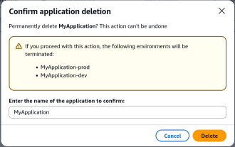
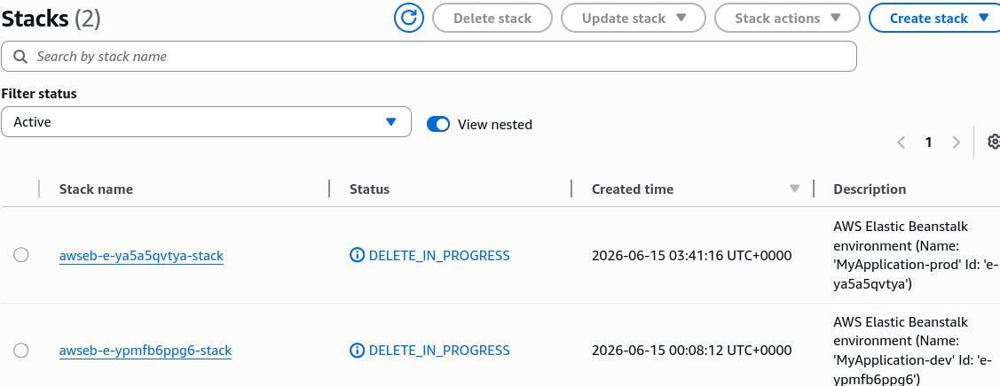
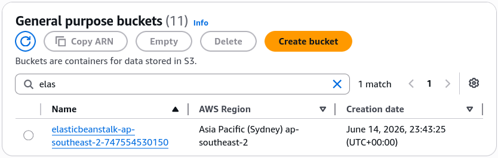

# Beanstalk Cleanup

When you're finished testing or iterating, leaving active high-availability environments running means you're continuously paying for Application Load Balancers, active EC2 instances across multiple Availability Zones, and CloudWatch metrics. To wipe the slate clean and guarantee you don't get surprise bills, you issue a single Delete Application command at the top-level Beanstalk layer. This automatically signals the underlying CloudFormation engine to systematically tear down every single infrastructure component it ever created.

## Hands On

### Phase 1: Initiating the Global Kill Switch

- **Console Execution**: Navigate to the top-level application dashboard (MyApplication), open the Actions dropdown menu, and select Delete Application.
- **MFA/Safety Confirmation**: The console prompts a safety challenge requiring you to explicitly re-type the exact application name to prevent accidental catastrophic production drops.

### Phase 2: CloudFormation Under-the-Hood Teardown

- **Cascading Deletions**: The moment you confirm, Beanstalk forwards a termination instruction to AWS CloudFormation. The status of your associated stacks immediately flips to DELETE_IN_PROGRESS.
- **Resource Scrubbing Lifecycle**: Because CloudFormation maintains a strict dependency map of your infrastructure, it executes the teardown in reverse order to ensure no orphaned resources are left behind. The engine purges:
    - The **Application Load Balancers (ALBs)** and their target groups.
    - The **Auto Scaling Groups (ASGs)**, which automatically terminates all running `t3.micro` EC2 instances.
    - All associated **CloudWatch Alarms** and dynamic scaling policies.
    - The underlying **EC2 Security Groups** and ingress firewall boundaries.

### Phase 3: The S3 Artifact Exception

- **Storage Preservation**: While CloudFormation wipes out the compute and networking stack, Beanstalk intentionally leaves its automatically generated **Amazon S3 deployment buckets** intact inside your account. This prevents accidental deletion of your deployment history and application source bundle `.zip` archives. If you want those gone too, you must manually empty and delete that specific S3 bucket yourself.

## Exam Tips

- **Orphaned Resource Management**: The exam sometimes introduces optimization scenarios where a company wants to ensure that deleting a development platform does not leave behind costly orphaned network components like Elastic IPs or Load Balancers. Knowing that Elastic Beanstalk structures its workloads on top of **CloudFormation** ensures you understand why a clean, complete, cascading teardown is guaranteed.
- **The Residual S3 Storage Artifact**: Keep a sharp lookout for trick questions asking if deleting a Beanstalk application purges everything inside your AWS account. Remember the exception: **The underlying Amazon S3 bucket housing your uploaded application version source code bundles is retained** to safeguard your artifacts.

### Practice Scenario

**Scenario**: A software engineering associate has completed testing a secondary multi-tier web application stack inside an AWS Elastic Beanstalk environment. To prevent incurring further infrastructure charges for the active Application Load Balancer and Auto Scaling Group fleet, the developer executes a "Delete Application" action from the Elastic Beanstalk console. What occurs on the backend during this process?
    - **A**. The running EC2 instances are stopped, but the Application Load Balancer remains active until manually deleted via the EC2 dashboard.
    - **B**. Beanstalk triggers a cascading deletion of the underlying AWS CloudFormation stack, which automatically tears down the load balancer, auto scaling group, instances, and security groups.
    - **C**. The application code is wiped from the servers, but the network infrastructure is converted into an independent CloudFormation template for reuse.
    - **D**. The entire AWS account goes into a restricted billing state until the underlying S3 buckets are manually scrubbed via the AWS CLI.

**Correct Answer: B**. Because Elastic Beanstalk abstracts its provisioning layer using AWS CloudFormation, dropping the application triggers a comprehensive, cascading stack teardown that removes all associated compute, balancing, and security components cleanly.