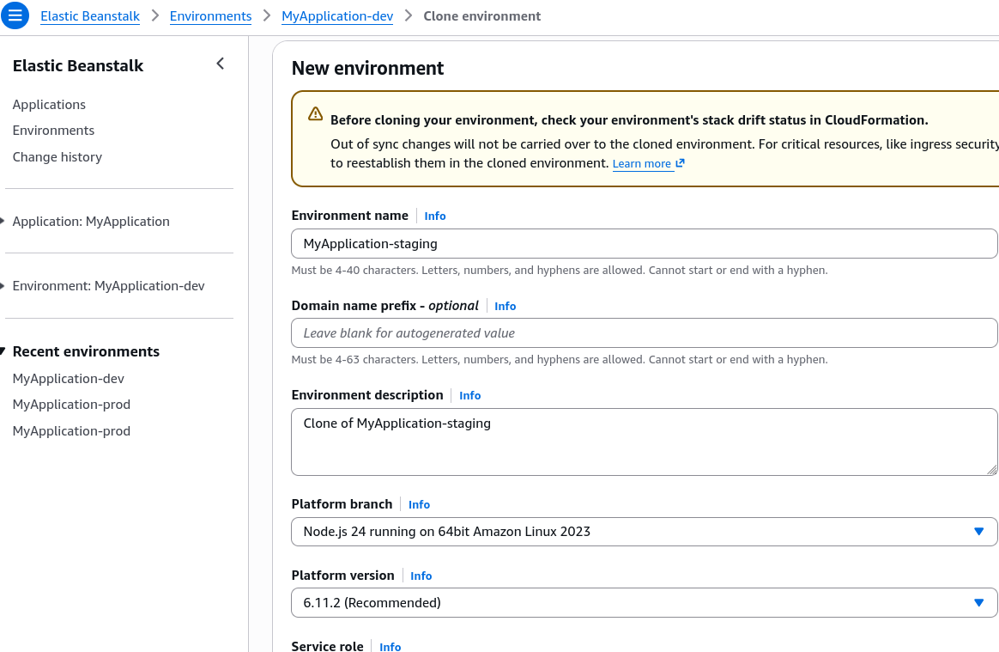

# Beanstalk Cloning

**Environment Cloning** lets you take an existing, fully configured Elastic Beanstalk environment and make an exact, carbon-copy duplicate of it under a brand-new environment name. Instead of manually re-clicking through dozens of settings in the AWS Console, Beanstalk reads the underlying architecture configuration of your source environment and spins up a matching stack. It is the ultimate tool for creating a staging or testing sandbox that mirrors your live production baseline perfectly.

## Key Takeaways

## Cloning Mechanics & State Handling

- **Configuration Integrity**: When you trigger a clone operation, Beanstalk duplicates _every single structural parameter_ from the original environment. This includes:
    - The exact same **Platform Version** and runtime engine (e.g., Node.js 18 v5.8.0).
    - The **Load Balancer Type** (ALB vs. NLB) along with all its custom listeners and routing processes.
    - Every single custom **Environment Property** (OS environment variables) configured in the original setup.
    - The exact same **Auto Scaling Group** (ASG) capacity bounds, instance types, and network subnet mappings.
- The **RDS Database Identity Trap**: If your source Beanstalk environment has an **internal RDS database** bundled inside its lifecycle, cloning the environment _will_ provision a brand-new, empty RDS database instance for the new environment. Crucial takeaway: **The actual data inside the source database is NOT copied over**. Only the structural configuration (engine type, instance class, security groups) is cloned.
- **Post-Clone Independence**: Once the cloning process finishes, the new environment is completely independent of the source. You are free to modify its instance sizes, scale down its capacity, or change its environment variables without risking any impact on your live application.

## Exam Tips

- **The Staging Blueprint Keyword**: If a question scenario says: _"A developer needs to create an isolated staging environment that precisely mirrors the network topology, instance settings, and configuration properties of the current production environment with minimal administrative effort"_, the answer is to **Clone the Environment** via the Beanstalk console or CLI.
- **The RDS Data Disconnect**: Watch out for sneaky exam distractors claiming that cloning a Beanstalk environment is an effective way to backup or migrate database data. **It is not**. Always remember that _cloning reproduces the infrastructure pattern, not the stateful database content_.

### Practice Scenario

**Scenario**: A company hosts a high-traffic web application on AWS Elastic Beanstalk with an integrated **Amazon RDS database created inside the Beanstalk environment wizard**. The development team needs to deploy a temporary QA test environment that uses the exact same instance configurations, environment variables, and load balancing setup as production. They select the "Clone Environment" feature in the Elastic Beanstalk console. What will be the outcome of this action?
    - **A**. A new environment will be created with identical infrastructure settings, and all data from the production RDS database will be automatically replicated to the new database.
    - **B**. The operation will fail because Elastic Beanstalk does not support cloning environments that contain load balancers.
    - **C**. A new environment will be created with identical infrastructure settings and environment variables, but the newly provisioned RDS database will be completely empty.
    - **D**. The existing production environment will be split into two separate clusters sharing the same original EC2 instances.  
**Correct Answer: C**. Elastic Beanstalk cloning perfectly duplicates the entire infrastructure setup, including the load balancers, configuration properties, and database settings. However, it only spins up a fresh, blank instance of the database; it does not clone or copy the data residing inside the source RDS instance.