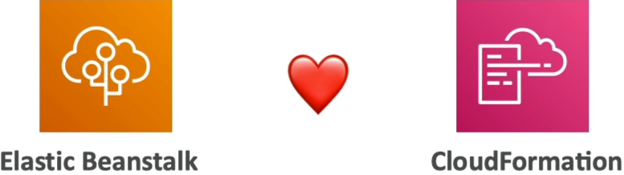
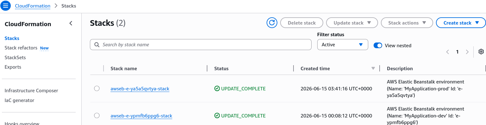

# Beanstalk & CloudFormation

Elastic Beanstalk isn't actually a standalone provisioning engine. Under the hood, it is entirely powered by **AWS CloudFormation**. When you create an environment or change configurations, Beanstalk secretly compiles your instructions into a CloudFormation template and executes a stack deployment. This means that by using the Resources block inside your `.ebextensions/` config files, you can tap directly into raw CloudFormation syntax to **provision any AWS resource** (like DynamoDB or ElastiCache) that isn't natively exposed in the standard Beanstalk UI dashboard.  

## Key Takeaways

### Under-the-Hood Stack Dynamics

#### Phase 1: Behind-the-Scenes Stack Generation

- **The Core Engine**: The moment you create an Elastic Beanstalk environment, AWS spins up a corresponding **CloudFormation Stack** named with an operational prefix (e.g., `awseb-e-xxxxxxxx-stack`).

- **Dev Stack Profile (Single Instance Preset)**: When inspecting a development sandbox stack in the CloudFormation console, the resource footprint is compact. CloudFormation explicitly provisions:
    - An **EC2 Instance** paired with an **Elastic IP (EIP)**.
    - A base **EC2 Security Group** controlling local ingress boundaries.
    - An **Auto Scaling Group (ASG)** constrained strictly to a fixed capacity footprint.

#### Phase 2: Production Stack Profile (High Availability Preset)

- **Fleet Complexity Scaling**: When shifting your Beanstalk tier to High Availability, the underlying CloudFormation stack scales out drastically to track up to 16+ separate interconnected infrastructure objects.
- **Component Mapping**: The automation engine shifts focus to provision:
    - An **Elastic Load Balancer (ALB)**, alongside dedicated structural **Listener Rules** and a **Target Group**.
    - Multiple **CloudWatch Alarms** tracking raw system telemetry thresholds (e.g., CPU utilization anomalies).
    - Dynamic **ASG Scaling Policies** bound directly to those CloudWatch alarms to handle seamless horizontal elastic expansion.

#### Phase 3: Extending Infrastructure as Code (IaC)

- **The Resources Namespace**: Within your .ebextensions/ .config files, you can introduce a top-level block titled Resources. This block accepts native CloudFormation resource schemas.
- **Custom Stack Ingestion**: If you need a private cache layer, you write a standard AWS CloudFormation resource block for `AWS::ElastiCache::CacheCluster`. When you push your code package, Beanstalk appends this snippet directly into its master stack manifest file and handles the deployment.

## Exam Tips

- **The Underlying Technology Matchup**: Keep an eye out for conceptual architecture questions asking which core AWS service handles the actual provisioning execution loops behind the Elastic Beanstalk engine. The answer is **AWS CloudFormation**.
- **Unlocking Extensibility via Resources**: If a scenario presents a situation where a development team wants to launch an application inside Elastic Beanstalk but requires an auxiliary AWS resource that is not available as a selectable option inside the native Beanstalk console user interface, look for the option that mentions: Add a custom `.config` file into the `.ebextensions/` folder and define the resource using a CloudFormation standard Resources block.

### Practice Scenario

**Scenario**: A company uses AWS Elastic Beanstalk to host its core corporate web application. The development lead wants to ensure that a dedicated Amazon S3 bucket used for processing uploaded assets is automatically provisioned alongside any new deployment environment stack instance. The configuration must be managed strictly as code within the source bundle. How can this requirement be achieved?
    - **A**. Write a shell script inside the `cron.yaml` template file to programmatically call the aws s3 mb CLI command.
    - **B**. Create a custom configuration file ending in `.config` inside the root `.ebextensions/` directory, and declare the S3 bucket resource schema using native **AWS CloudFormation** syntax under the Resources section.
    - **C**. Manually deploy an independent **AWS Systems Manager (SSM)** automation document to pre-create the bucket boundaries.
    - **D**. Use the EB CLI `eb config` console command to alter the default underlying operational Linux AMI kernel image.  
**Correct Answer: B**. Because Elastic Beanstalk runs on top of CloudFormation, adding standard CloudFormation resource components under the Resources block within an `.ebextensions` configuration file allows you to seamlessly extend your architecture footprint directly via your app code bundle.