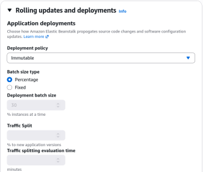
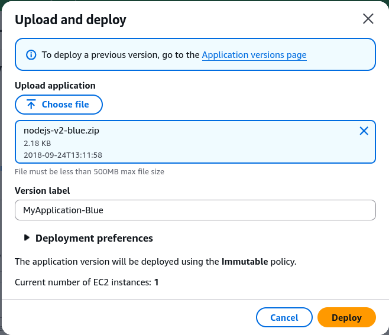
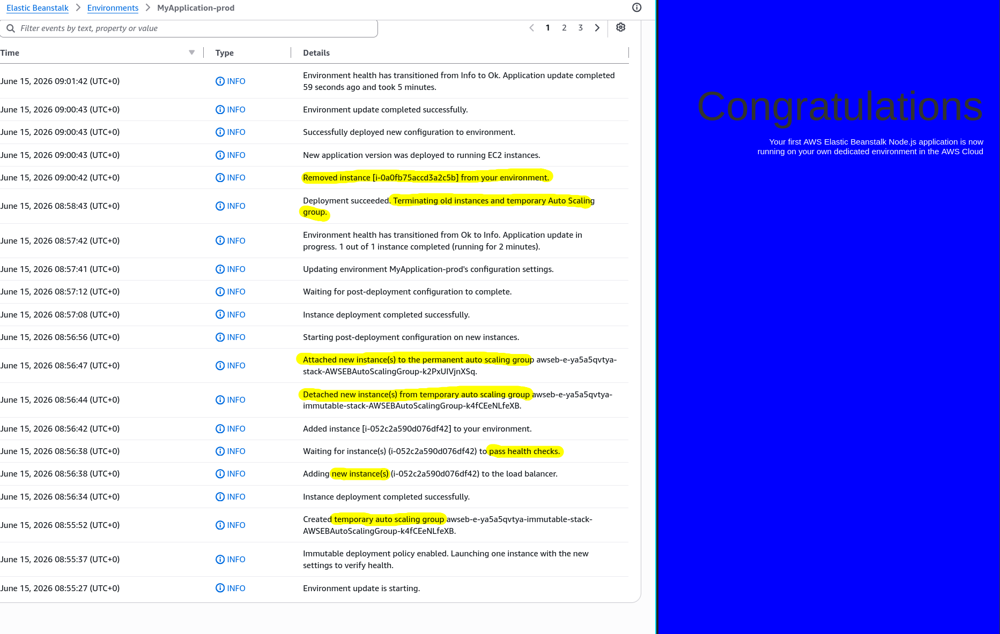
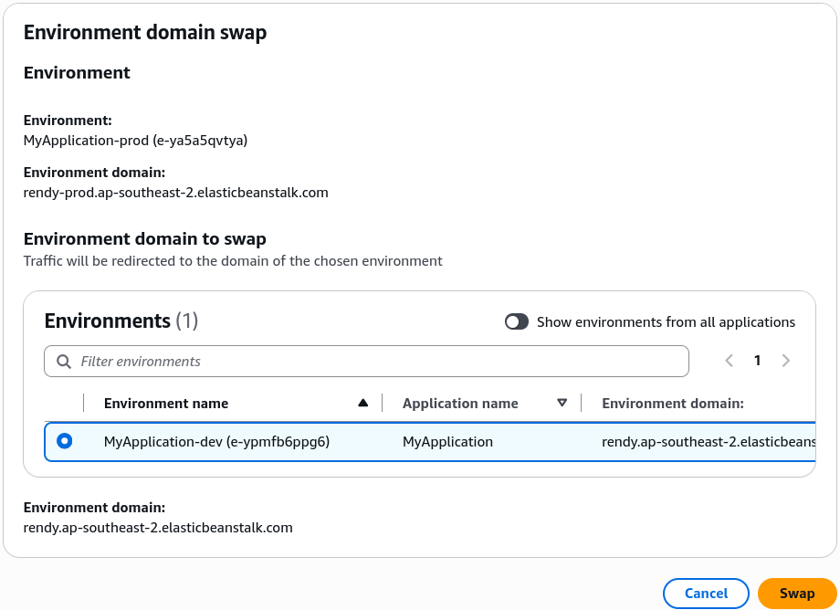

# Beanstalk Deployment Modes Hands On

We are taking our `prod` environment from the previous lab and configuring its deployment policy to **Immutable**. To test it, we upload a new version of our Node.js app packaged as a `.zip` file (changing the background from green to blue). Beanstalk spins up a temporary Auto Scaling Group (ASG), launches a single instance to verify its health, clones the capacity, shifts the instances to the permanent ASG, and deletes the old fleet—all with zero downtime. Finally, we execute an **Environment URL Swap** to instantly trade traffic profiles between our dev and prod environments via DNS.

## Hands On

### Phase 1: Environment Configuration Adjustment
- **Targeting Settings**: In the left-hand console navigation under your `prod` environment, dive into **Configuration** and edit **Updates, monitoring, and logging**.
- **Policy Selection**: Locate **Application Deployments** and toggle the policy from the default over to **Immutable**.
- **UI Artifact Check**: Notice that when **Immutable** or **All at Once** is chosen, the "Batch Size" configuration fields (Fixed/Percentage) are greyed out. Those constraints only apply to Rolling and Rolling with Additional Batch strategies.
- **Save State**: Scroll to the bottom and hit Apply to let Beanstalk update the environment's management rules.



### Phase 2: Application Source Bundle Review

- Download the sample Node.js application from [AWS Docs](https://docs.aws.amazon.com/elasticbeanstalk/latest/dg/nodejs-getstarted.html)
- **The Zip Package Structure**: AWS Elastic Beanstalk expects a flat root `.zip` file containing your application source files. Key structural files include:
    - **app.js / server.js**: The Node.js application entry point running your web server.
    - **index.html**: The static web assets serving your frontend layout.
    - **cron.yaml**: Optional configuration file used to schedule background tasks directly on the instances.
    - **.ebextensions/**: A critical directory housing custom `.config` files to inject custom scripts, environment variables, or resource modifications into the EC2 instances.
- **Code Modification**: Modify `index.html` to update the background color style block variable from green to blue (background-color: blue), and save the new bundle as nodejs-v2-blue.zip.

### Phase 3: Pushing the Immutable Update

- **Code Upload**: Click **Upload and Deploy** on your Beanstalk dashboard, choose your new `nodejs-v2-blue.zip` bundle, and give it a version label like `MyApplication-Blue`.

- **Execution Sequence**: Click **Deploy** and watch the Beanstalk event logs. The system orchestrates the following exact immutable lifecycle sequence:
```Plaintext
[Step 1: Canary Step] ──► Beanstalk launches 1 single EC2 instance in a new temporary ASG.
                                 │
                                 ▼
[Step 2: Health Check] ─► The single instance is registered to the ALB and evaluated.
                                 │
                                 ▼
[Step 3: Fleet Expansion]► If healthy, Beanstalk scales the temporary ASG up to match target capacity.
                                 │
                                 ▼
[Step 4: Migration] ────► New instances are detached from temp ASG and merged into permanent ASG.
                                 │
                                 ▼
[Step 5: Clean Up] ─────► The old v1 EC2 instances and the temporary ASG are completely terminated.
```


### Phase 4: Executing an Environment Domain Swap (Blue/Green)

- **Testing Isolation**: Open the URL endpoint for `prod` (now showing your new blue version) and compare it against the `dev` environment URL (still running the green version).
- **Initiating the CNAME Swap**: On the main application level, locate the actions menu and click **Swap Environment Domains**. Select your `dev` environment as the target destination and hit Swap.
- **DNS Propagation**: Beanstalk alters the internal routing map at the Route 53 or CNAME tier. After a 5-minute propagation delay, hitting your original prod URL displays the `green` version, and hitting the dev URL yields the `blue` version.


### Deployment Packaging Constraints

When creating a deployment source bundle for Elastic Beanstalk, you must always zip the files from inside the root directory, not the containing folder itself. The structural boundary equation for an acceptable Beanstalk payload signature is:

```math
\text{Bundle}_{\text{valid}} = \{ \text{app.js}, \text{index.html}, \text{.ebextensions/} \} \subseteq \text{Root}(\text{.zip})
```

### Multi-Environment CNAME Swap Mechanics

When performing a Swap Environment Domains action, Beanstalk acts on the specific host CNAME prefixes (E1​ and E2​) associated with each distinct environment ID record mapping under the hood:

```math
\text{Swap}(E_{1}\text{.elasticbeanstalk.com} \longleftrightarrow E_{2}\text{.elasticbeanstalk.com})
```

This visual model outlines how the DNS abstraction switches underneath your user-facing environment URLs when you trigger a CNAME Swap:
```
                [ User Traffic to: prod.elasticbeanstalk.com ]
                                        │
                         ┌──────────────┴──────────────┐
                         │   DNS CNAME Pointer Stage   │
                         └──────────────┬──────────────┘
                                        │
                        ┌───────────────┴───────────────┐
                        │   BEFORE SWAP   │ AFTER SWAP  │
                        ▼                 ▼             ▼
          ┌───────────────────────────┐     ┌───────────────────────────┐
          │     Prod Environment      │     │      Dev Environment      │
          │   (Active Infra Fleet)    │     │   (Staging Infra Fleet)   │
          │                           │     │                           │
          │   App Code Version: v2    │     │   App Code Version: v1    │
          │    Background: BLUE       │     │    Background: GREEN      │
          └───────────────────────────┘     └───────────────────────────┘
```

## Exam Tips

- **Zip Packaging Failures**: The exam loves to test deployment issues. If a developer deploys a `.zip` archive to Beanstalk and the application throws a missing script error, it is almost always because they zipped the _outer folder_ instead of selecting the files directly and zipping them from the root. Beanstalk needs to see files like `app.js` and `.ebextensions` at the absolute root of the file system.
- **The CNAME Swap Advantage**: If an exam question mentions a scenario where an update requires structural database schema changes or a massive underlying OS platform change (e.g., upgrading from an older Node.js version to a brand new one), internal deployments (like Rolling or Immutable) might fail or cause incompatibilities. The correct answer is to **Clone the environment, perform the updates on the new environment, and execute a Swap Environment Domains (CNAME Swap) operation**.

### Practice Scenario

**Scenario**: A developer wants to deploy a major software patch to a production application running on AWS Elastic Beanstalk. The patch includes changing the underlying EC2 operating system version. The developer must ensure there is zero downtime, and if unexpected system issues arise, the traffic must be immediately redirected back to the original operational setup. Which approach should the developer take?
    - **A**. Update the application deployment configuration settings to use an All at Once policy.
    - **B**. Configure the application deployment preferences to run an Immutable deployment directly on the live fleet.
    - **C**. Create a new deployment bundle containing a .ebextensions directive to forcefully upgrade the OS patch inline using a Rolling deployment.
    - **D**. Clone the existing Beanstalk environment, apply the new runtime platform configurations and app patch version to the cloned environment, test its performance, and then use the Swap Environment Domains option.

**Correct Answer: D**. When changing the underlying managed platform or major OS configurations, spinning up a parallel cloned environment and executing a CNAME/Domain Swap is the recommended AWS best practice. It insulates production entirely until you're completely satisfied and can instantly be reverted by swapping back if an edge-case bug shows up.