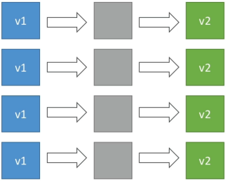
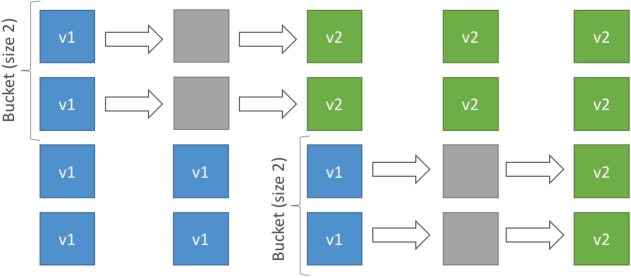
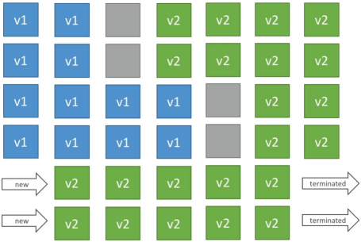
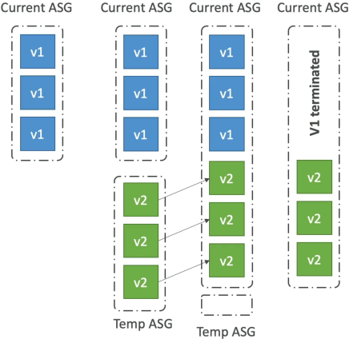
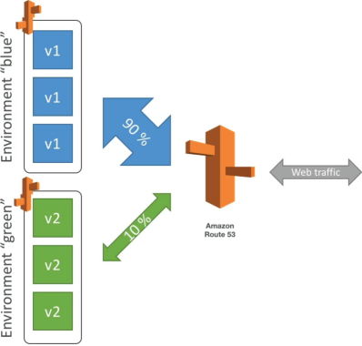
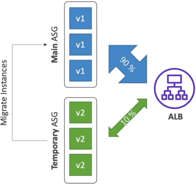

# Beanstalk Deployment Modes

When you update an app on Elastic Beanstalk, you have six distinct ways to push the new code. They range from the reckless but blazing-fast **All at Once** (which pulls your entire app offline to update) to sophisticated production methods like **Immutable, Traffic Splitting, and Blue/Green** that orchestrate multiple instance sets or environments to ensure zero downtime. Mastering these is all about balancing three trade-offs: **Deployment Speed, Infrastructure Cost, and Downtime/Rollback Risk.**

## Key Takeaways

### Method 1: In-Place (Upgrading Existing Fleet)

- **All at Once**
    - **Mechanics**: Beanstalk nukes the version 1 (`v1`) application on all existing instances simultaneously and flashes version 2 (`v2`).
    - **Downtime**: Yes. The app goes dark during the installation gap.
    - **Cost**: Zero extra cost.
    - **Best For**: Dev/Test environments where you just need to iterate fast and nobody cares if the server drops for a minute.  

- **Rolling**
    - **Mechanics**: Modifies instances in small subsets called buckets or batches. While bucket A is offline upgrading to `v2`, bucket B is still online serving `v1` traffic. Once bucket A passes health checks, Beanstalk moves to bucket B.
    - **Downtime**: No downtime, but your application runs below full capacity during the rollout because active instances are temporarily offline.
    - **Cost**: Zero extra cost.
    - **Risk**: Users will experience a mixed-version state (`v1` and `v2` running simultaneously). If a buggy deployment hits, rolling back requires re-deploying the old version across the buckets, which takes a long time.  


### Method 2:Capacity-Guaranteed Methods (Zero Performance Impact)

- **Rolling with Additional Batch**
    - **Mechanics**: Like standard Rolling, but avoids running under capacity. Beanstalk spins up a brand-new batch of temporary EC2 instances running `v2` _first_. Then, it upgrades the older instances bucket-by-bucket.
    - **Downtime**: **Zero downtime**. The fleet always stays at or above 100% target performance capacity.
    - **Cost**: Small additional cost for the temporary instances, which are terminated at the end of the lifecycle.  

- **Immutable**
    - **Mechanics**: Beanstalk leaves your original Auto Scaling Group (ASG) completely alone. It provisions a parallel **temporary ASG** and deploys a single `v2` instance to test the waters (canary testing). If that instance passes health checks, Beanstalk scales up the temporary ASG to match full capacity, merges the instances into the main ASG, and terminates the old `v1` instances.
    - **Downtime**: **Zero downtime**.
    - **Cost**: High temporary cost (doubles your instance footprint during deployment).
    - **Rollback**: Blazing fast. If `v2` fails, Beanstalk just deletes the temporary ASG. Your original fleet was never touched.  


### Method 3: Traffic Routing Environments (Advanced Control)
- **Blue/Green**
    - **Mechanics**: A completely **external/manual architecture pattern** relative to the standard Beanstalk engine. You spin up an entirely separate, distinct Beanstalk environment (Green) running `v2` alongside your live environment (Blue) running `v1`.
    - **Routing Control**: You manually use Route 53 weighted routing policies or the Beanstalk **Swap Environment URLs** feature to cut traffic over.
    - **Cost**: High (dual environments running together), but provides long-term isolation for extensive staging tests.  

- **Traffic Splitting (Canary Testing)**
    - **Mechanics**: Fully automated within a single environment. Beanstalk launches a temporary ASG with matching capacity running `v2`. It instructs the Application Load Balancer (ALB) to route a precise, small percentage of live production traffic (e.g., 10%) to the new code.
    - **Evaluation**: Beanstalk monitors the health metrics of the split traffic for a configured duration. If errors spike, it triggers an **automated rollback** instantly by shifting ALB weights back to 100% on the original fleet. If healthy, `v2` instances migrate to the main ASG and old instances are cleared.  


#### Traffic Splitting Canary Flow

```Plaintext
                        [ Live Public User Traffic ]
                                      │
                                      ▼
                        ┌───────────────────────────┐
                        │ Application Load Balancer │
                        └──────┬─────────────┬──────┘
                               │             │
                    (90% Traffic)             (10% Canary Traffic)
                               │             │
                               ▼             ▼
               ┌─────────────────┐         ┌──────────────────────┐
               │    Main ASG     │         │    Temporary ASG     │
               │  (Active Fleet) │         │  (Canary Evaluation) │
               │                 │         │                      │
               │   Instances:    │         │      Instances:      │
               │   Running v1    │         │      Running v2      │
               └─────────────────┘         └──────────┬───────────┘
                                                      │
                                                      ▼
                                           ┌──────────────────────┐
                                           │ Beanstalk Health     │
                                           │ Engine Monitoring    │
                                           └──────────┬───────────┘
                                                      │
                            ┌─────────────────────────┴─────────────────────────┐
                            ▼                                                   ▼
                [ Metrics Pass: 200 OK ]                            [ Metrics Fail: 5xx Errors ]
                            │                                                   │
                            ▼                                                   ▼
   Scale up v2 / Migrate to Main ASG / Purge v1                       Automated Rollback (ALB -> 100% Main)
   ```

## Exam Tips

- **Spotting Keywords**: 
    - If the prompt says: _"Minimize costs, deployment speed is critical, and downtime is acceptable"_ → **All at Once**.
    - If it says: _"Zero downtime, no extra cost, performance degradation during deployment is acceptable"_ → **Rolling**.
    - If it says: _"Zero downtime, maintaining full application capacity at all times with minimal cost"_ → **Rolling with Additional Batch**.
    - If it says: _"Zero downtime, fastest and cleanest rollback mechanism with no modification to existing instances"_ → **Immutable**.
    - If it says: _"Automated canary testing by sending a small percentage of real production traffic to a temporary group"_ → **Traffic Splitting**.
- **The Manual Blue/Green Trick**: If an exam question mentions swapping environment CNAME URLs or utilizing Route 53 weights across two separate Beanstalk environments, it is pointing specifically to **Blue/Green**, not an internal deployment setting.

### Practice Scenario

**Scenario**: A company runs a critical web application on AWS Elastic Beanstalk. A developer needs to push a new software version to production. The business requirements state that the application must maintain full operational performance capacity during the rollout, and if the new version contains code bugs, the system must support an immediate, low-risk rollback without affecting the running fleet. Which deployment method should be selected?
    - **A.** All at Once
    - **B.** Rolling
    - **C.** Rolling with Additional Batch
    - **D.** Immutable
**Correct Answer: D. Immutable** fulfills all criteria. It leaves the original instances entirely pristine and spins up a separate temporary fleet. This guarantees full performance capacity is maintained and allows for an instant rollback (just delete the new temporary ASG) if things break. While Rolling with Additional Batch protects capacity, its rollback requires an in-place reverse deployment, making it higher risk than Immutable.