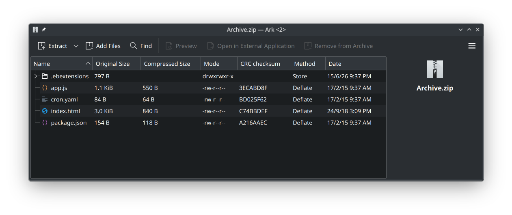
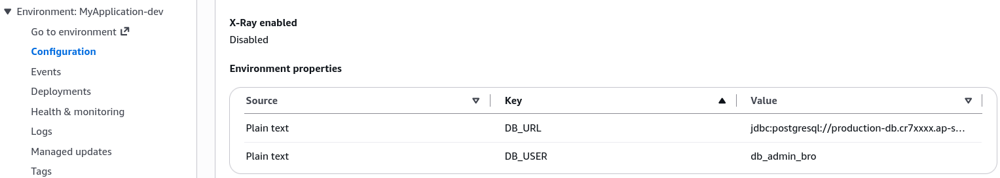

# Beanstalk Extensions

Every single button, toggle, and environment variable you configure manually in the Elastic Beanstalk UI can be completely automated through code using **Elastic Beanstalk Extensions** (`.ebextensions`). By dropping specially formatted configuration files inside a specific directory at the root of your source code bundle, you can inject system environment variables, modify OS-level settings, or even provision extra AWS resources like DynamoDB tables or ElastiCache clusters automatically during your application deployments.

## Key Takeaways

### Elastic Beanstalk Structure

#### Phase 1: Local Code Workspace Packaging

- **The Root Directory Constraint**: You must create a folder named exactly `.ebextensions/` at the absolute root of your project directory. If it is hidden inside a subdirectory, Beanstalk will completely ignore it.
- **File Naming Rules**: The configuration files inside `.ebextensions/` can be written in either **YAML** or **JSON**, but they must end with a `.config` file extension (e.g., `environment-variables.config`).
- **The option_settings Block**: Inside the `.config` file, you use the `option_settings` namespace to map out configurations. To define environment variables that your code can read at runtime, you target the specific AWS namespace: `aws:elasticbeanstalk:application:environment`.

Here is how the YAML file looks under the hood:

```yaml
option_settings:
  aws:elasticbeanstalk:application:environment:
    DB_URL: "jdbc:postgresql://production-db.cr7xxxx.ap-southeast-2.rds.amazonaws.com:5432/mydb"
    DB_USER: "db_admin_bro"
```

```math
\text{DeploymentBundle} = \begin{cases} \text{/ (Root)} \\ ├── \mathbf{.ebextensions/} \\ │   └── \text{environment-variables.config} \\ ├── \text{app.js} \\ └── \text{package.json} \end{cases}
```
#### Phase 2: Deploying the Configuration Bundle

- **Zipping Root Content**: Select the files inside your project directory—including your application scripts (`app.js`) and your newly created `.ebextensions/` folder—and compress them directly into a flat root archive (`nodejs-V3-ebextensions.zip`).
- **Console Upload Execution**: Navigate to your environment console, click Upload and Deploy, label the application version (e.g., `MyApplication-EBExtensionsDemo`), and submit. Beanstalk extracts the archive, discovers the `.ebextensions/` block, and immediately adjusts the infrastructure state.

#### Phase 3: Resource Verification & Lifecycle Binding

- **Properties Validation**: Once the deployment logs finish processing, navigate to the Configuration dashboard in Beanstalk and scroll down to Environment properties. The keys `DB_URL` and `DB_USER` will appear pre-populated straight from your code file.
- **The Lifecycle Trap**: You can use these configuration files to spin up raw infrastructure components (like an ElastiCache or a DynamoDB table). However, any AWS resource created inside an `.ebextensions` file belongs explicitly to that Beanstalk environment. **If you terminate the Beanstalk environment, those auxiliary resources are instantly deleted along with it**.


### Architectural Dependency

```Plaintext
                [ Zip File Payload: nodejs-V3-ebextensions.zip ]
                                        │
                                        ▼
                  ┌───────────────────────────────────────────┐
                  │ Elastic Beanstalk Deployment Orchestrator │
                  └─────────────────────┬─────────────────────┘
                                        │
                       (Extracts and Scans Root Directory)
                                        │
                                        ▼
                        ┌──────────────────────────────┐
                        │ Found .ebextensions/ folder? │
                        └──────┬────────────────┬──────┘
                               │                │
                           ( YES )            ( NO ) ──► Standard Code Deploy Only
                               │
                               ▼
               ┌─────────────────────────────────┐
               │ Parses files ending in .config  │
               └───────────────┬─────────────────┘
                               │
         ┌─────────────────────┴─────────────────────┐
         ▼                                           ▼
 [ Option Settings Processed ]             [ AWS Resources Block Parsed ]
         │                                           │
         ▼                                           ▼
Injects Keys into EC2 OS Environment        Provisions Managed Cluster Stack
(e.g., DB_URL, DB_USER)                     (DynamoDB, ElastiCache, etc.)
                                                     │
                                                     ▼
                                      ⚠️ WARNING: Deleting Environment
                                      will destroy these resources!
```

## Exam Tips

- **The Exact Folder and File Naming Scheme**: The exam loves to test your attention to detail regarding syntax layout. They will give you options like `ebextensions/`, `.ebextension/`, or files named `config.yaml`. These are all wrong. The folder must have a leading dot (`.ebextensions/`) and the files must end in .config.
- **Production Database Best Practice**: If a scenario asks where to place a production database when utilizing Beanstalk, **never** write it inside an `.ebextensions` configuration block. Because its lifecycle is chained to the environment, an accidental deletion of the Beanstalk stack will destroy production data. Instead, provision the RDS database independently outside of Beanstalk, and use `.ebextensions` strictly to declare the connection string environment properties.

### Practice Scenario

**Scenario**: A developer needs to deploy a Python application to AWS Elastic Beanstalk. The application requires three custom OS environment variables to establish a connection to an external database cluster. Additionally, these variables must be version-controlled alongside the application source code. How should the developer configure this?
    - **A**. Create a file named `env.yaml` inside a directory named `.ebextensions/` at the project root, and declare the keys under the options namespace.
    - **B**. Create a file ending with .config inside a directory named `.ebextensions/` at the root of the source bundle, and define the variables under the `aws:elasticbeanstalk:application:environment` namespace.
    - **C**. Define the environment variables directly inside the application's `requirements.txt` file.
    - **D**. Use the AWS CLI to manually run `aws elasticbeanstalk update-environment` commands before running each build pipeline iteration.  
**Correct Answer: B**. To bundle configuration settings alongside your application code for source control, you must place a `.config` file within the `.ebextensions/` root directory and use the correct environment namespace blocks.