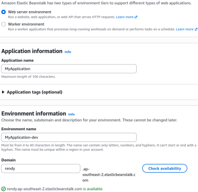
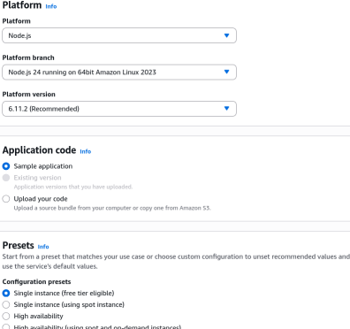
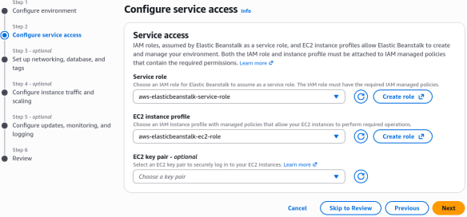
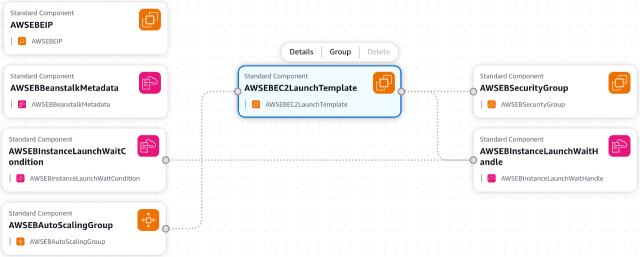
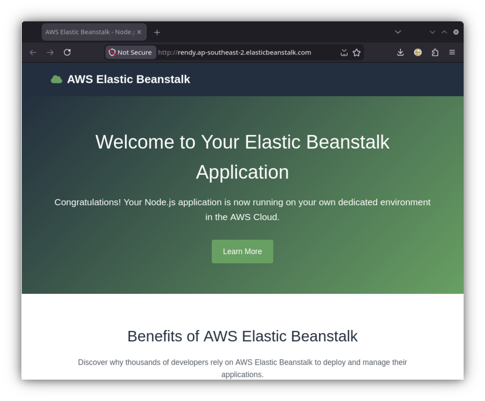
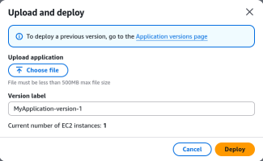
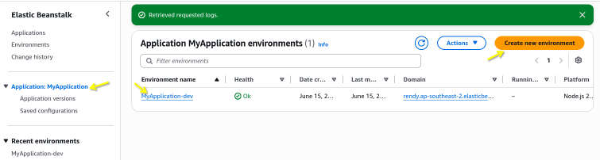

# Beanstalk First Environment

Launching an Elastic Beanstalk environment triggers **AWS CloudFormation** to systematically provision the underlying compute and networking layers. Under **Single Instance Mode**, Beanstalk skips the load balancer and builds exactly one **EC2 Instance** bound to an **Elastic IP address**, tracking health metrics natively via a unified dashboard. Operating this pipeline safely requires separating infrastructure orchestration authority (**Service Role**) from container code runtime authority (**EC2 Instance Profile**).

## Key Takeaways

### The Setup

#### 🛠️ Step 1: Initialize the Application Framework

1. Open your **AWS Management Console** dashboard, search for **Elastic Beanstalk**, and click the service link.
2. Click the orange **Create application** execution button in the upper right quadrant.
3. **Configure Environment Tier**: Select the Web server environment radio toggle.
4. **Application Name**: Type exactly `MyApplication` inside the designated input box.
5. **Environment Name**: Look down at the auto-generated field; type `MyApplication-dev`. Choose domain that you want or leave the Domain prefix blank to allow AWS to randomize a public DNS entry for you.  


#### 💻 Step 2: Establish the Platform Branch & Presets

1. Scroll down to the **Platform** dropdown card.
2. **Platform Selection**: Choose **Node.js**. Leave the _Platform branch_ and _Platform version_ locked onto their recommended latest default values.
3. **Application Code**: Ensure the radio selector is checked on Sample application.
4. **Configuration Presets**: Under the tier settings block, explicitly select the **Single instance (free tier eligible)** preset lane. This instructs the underlying scripts to skip provisioning a costly load balancer layout.
5. Click **Next**.  


#### 🔐 Step 3: Configure Service Access Permissions

```Plaintext
Identity Layer 1: Service Role ──────► Authorizes Beanstalk plane to script resources via CloudFormation
Identity Layer 2: Instance Profile ──► Authorizes physical EC2 Host to talk out to S3 / CloudWatch
```

##### Allocation 1: Service Role
- Look at the **Service role** field. If a default role doesn't exist, select **Create role**.
- In the new tab, maintain the default Trusted Entity Type to **AWS Service**, service to **Elastic Beanstalk** and use case to **Environment**. Click **Next**.
- AWS automatically attach the `AWSElasticBeanstalkEnhancedHealth` and `AWSElasticBeanstalkManagedUpdatesCustomerRolePolicy` managed policies to this role, granting it the necessary permissions to orchestrate your environment's infrastructure. Click **Next**.
- Name the role `aws-elasticbeanstalk-service-role` and click **Create role**.
- Go back to the original tab, click the refresh icon next to the dropdown, and select your newly minted `aws-elasticbeanstalk-service-role` from the list.

##### Allocation 2: EC2 Instance Profile

- Look at the existing dropdown fields, if you don't see any profile that has necessary policies for EC2 instance access, click the **Create role**.
- See the default value for the Trusted Entity Type is set to **AWS Service**. Service is set to **Elastic Beanstalk** and use case is set to **Compute**. Click **Next**.
- AWS automatically attaches the:
    - `AWSElasticBeanstalkMulticontainerDocker` ⟶ Provide the instances in your multicontainer Docker environment access to use the Amazon EC2 Container Service to manage container deployment tasks.
    - `AWSElasticBeanstalkWebTier` ⟶ Provide the instances in your web server environment access to use Amazon S3, Amazon CloudWatch, and AWS X-Ray to manage application logs and metrics.
    - `AWSElasticBeanstalkWorkerTier`⟶ Provide the instances in your worker environment access to upload log files to Amazon S3, to use Amazon SQS to monitor your application's job queue, to use Amazon DynamoDB to perform leader election, and to Amazon CloudWatch to publish metrics for health monitoring.
- Click **Next**. Name the role `aws-elasticbeanstalk-ec2-role` and click **Create role**.
- Return to your active Beanstalk wizard tab, click the **Refresh** button next to the _EC2 instance profile dropdown_, and select your newly minted profile from the registry list!
- Click **Skip to review** to bypass the advanced network sub-panels, scroll to the bottom of the summary checklist, and smash **Submit**!


#### 🔍 Step 4: Trace the Underlying Infrastructure Stack

The moment you hit create, Beanstalk transfers execution authority to an invisible tracking engine. Let's audit what it builds:

1. Open a new tab and head into the **AWS CloudFormation** dashboard. You will observe a fresh stack processing active CREATE_IN_PROGRESS events.
2. Click into the Resources sub-tab. You can watch CloudFormation systematically mount an **Auto Scaling Group**, script a **Security Group**, allocate a dedicated static **Elastic IP (EIP)**, and spin up a physical **EC2 compute server node**.
3. Go to **Template** tab. Beanstalk generates a raw CloudFormation declarative text template under the hood. You can see exactly how the resources hook together, and even copy this template to use as a baseline for your own custom infrastructure-as-code projects in the future! In the **Infrastructure composer**, you can see the visual diagram of the resources that are being created.

3. Return to the Elastic Beanstalk dashboard interface. Once the status indicator transitions to a vibrant green `OK`, click the public URL string `CNAME` generated at the top of the environment pane.
4. **The Validation**: A clean greeting card rendering the AWS Elastic Beanstalk emblem will materialize over the live web wire—your platform code layer is completely active!


#### EC2 Instance Profile

When you hit that **Submit** button, Beanstalk translates your single instance dropdown preference into a raw CloudFormation declarative text stack under the hood.

By loading this template block into the visual canvas, you can observe exactly how the resources hook together:

```
🌐 Public Traffic (Your Custom CNAME URL)
      │
      ▼
 🟢 Elastic IP Address (Persistent Static Boundary)
      │
      ▼
 🖥️ EC2 Host Node (Running Node.js Platform Branch)
      │
      ▼
 🛡️ Auto Scaling Group (Locked to exactly 1 Task Instance Max)
```
- **The Engine (CloudFormation)**: Beanstalk does not spin up resources magically. It generates a CloudFormation stack. If you navigate to the CloudFormation console, you will see a matching stack executing CREATE_IN_PROGRESS events, building your ASG, setting up Security Groups, and spinning up your T3-micro instance step-by-step.

### Advanced Management Consoles: App-Centric Control

Once the status indicator transitions to a healthy, green `OK`, Beanstalk serves up a centralized management suite built specifically for application support engineers, keeping you out of the low-level EC2 tabs:

- **Upload new versions**: You can upload new code iterations as immutable zip bundles directly from your local machine. Beanstalk automatically stores these versions inside a durable S3 bucket, giving you a clean version history and easy rollback points.

- **Logs Collection**: You can request a "Tail" (last 100 lines) or a full bundle of logs with one click. Beanstalk automatically SSHs into the instance behind the scenes, scrapes the engine log paths, and aggregates your application outputs cleanly onto your screen.
- **Monitoring Matrix**: Aggregates real-time tracking graphs for CPU utilization, network I/O data, and target request counts without forcing you to write custom CloudWatch dashboard layouts.
- **Configuration Drift**: Want to scale up from Single Instance to High Availability? You don't rewrite code. You navigate to the _Configuration_ panel, edit the capacity metrics to attach an Application Load Balancer, and click apply. Beanstalk updates the CloudFormation stack seamlessly via rolling update rules!
- **Multiple Environments**: You can spin up multiple environments under the same parent application workspace. This allows you to run a low-cost `dev-env` right alongside a high-availability `prod-env` using different platform branches or application versions.


## Exam Tips

**The Dropped Database Catastrophe**: Imagine an exam scenario states, _"You used Elastic Beanstalk to rapidly spin up a development web server. To make setup fast, you navigated to the Database configuration settings inside the Beanstalk setup wizard and toggled on an Amazon RDS database engine instance directly within the environment workspace bounds.
A few weeks later, your testing cycle completes, and a junior developer selects Delete Application from the Beanstalk console to clean up the environment stack. You suddenly realize that all of your QA testing data and baseline application records have been permanently vaporized. How do you prevent this data destruction pattern in production?"_  
**The textbook gold-standard answer is to NEVER couple your database lifecycle directly inside your Elastic Beanstalk environment container bounds!**  
- **The Trap**: Toggling the RDS database button inside the Beanstalk setup wizard is fine for a temporary hackathon sandbox, but it links the database directly to the CloudFormation stack lifecycle of that environment. The second you terminate or delete that specific Beanstalk environment tier, CloudFormation will mercilessly wipe and delete the attached RDS database instance right along with it!
- **The Production Fix**: You must always provision your Amazon RDS database instances separately, outside of the Elastic Beanstalk application space entirely. You then pass the database's endpoint connectivity URL and secure credential tokens down into the Beanstalk container instances using **Environment Variables**. Now, your app code can scale out, scale in, or delete its environment stacks completely down to zero, while your precious persistent database tables remain completely safe and un-impacted out on the network wire!