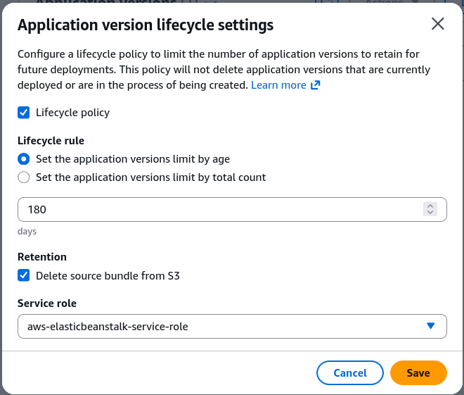

# Beanstalk Lifecycle Policy Overview + Hands On

AWS restricts every account to a hard ceiling of **1,000 application versions per region**. If you keep pushing new code revisions without cleaning up your history, your deployment pipeline will eventually crash. To solve this, you use a **Beanstalk Application Lifecycle Policy**. This automates the purging of stale code artifacts based either on **total count** or **time age**. Even if a version triggers a deletion rule, Beanstalk will safely ignore it if it's currently deployed to a live environment. Plus, you can configure it to scrub the reference from the Beanstalk UI while safely keeping the raw `.zip` file stored in your Amazon S3 bucket.

## Key Takeaways

### Hands-On: Lifecycle Policy Configuration

#### Phase 1: Under-the-Hood Storage Inspection

- **Navigating to the Artifact Store**: Open the Amazon S3 Console and look for the globally unique bucket automatically provisioned by AWS on your behalf (e.g., `elasticbeanstalk-ap-southeast-2-747554530150`).
- **Verifying Source Bundles**: Every time you trigger an `eb deploy` or an upload, your zipped source code bundles (like nodejs-v2-blue.zip) are dropped into this bucket. Beanstalk simply creates metadata references pointing to these physical S3 objects.

### Phase 2: Activating the Lifecycle Rule

- **Console Location**: From the Beanstalk console, navigate to your application tier (`MyApplication`), select **Application versions** on the left menu, and click **Lifecycle Settings**.
- **Policy Trigger Configuration**: Toggle **Application lifecycle policy** to enabled. You have two distinct ways to define the clean-up criteria:
    - **Limit by Count**: Define the max capacity envelope (e.g., keep a maximum of `200` total versions). If a new version pushes the total to 201, the oldest un-deployed file gets dropped.
    - **Limit by Age**: Set a retention timeline (e.g., delete any bundle older than `180` days).

### Phase 3: S3 Deletion Strategy & IAM Execution

- **Data Retention Rules**: Determine the fate of the physical S3 artifact using one of two options:
    - **Retain source bundle**: This removes the version from the Beanstalk dashboard registry but keeps the actual `.zip` file inside your S3 bucket. (Highly recommended to prevent absolute data loss).
    - **Delete source bundle**: Completely wipes the metadata from Beanstalk and purges the binary object out of Amazon S3.
- **IAM Permissions Mapping**: Assign the AWS Elastic Beanstalk Service Role (`aws-elasticbeanstalk-service-role`) to the lifecycle policy. This gives the background worker thread the authorization required to `fire s3:DeleteObject` API calls against the storage tier.

## Exam Tips

- **The 1,000 Version Error Scenario**: If an exam question describes a scenario where your CI/CD pipelines (like CodePipeline or Jenkins) suddenly start failing to upload new application deployment packages to Elastic Beanstalk with a limit-exceeded error, the root cause is that you hit the 1,000 version cap. The solution is to configure an **Application Lifecycle Policy**.
- **The "Accidental Production Deletion" Distractor**: Watch out for trick questions that ask: "If I set a lifecycle policy to keep only 5 versions, will my older production environment break?" The answer is No. Active environment versions are explicitly excluded from lifecycle deletions.

### Practice Scenario

**Scenario**: A company has been deploying updates daily to an AWS Elastic Beanstalk application over the past two years. During a recent release, the automated build tool throws an error stating that no new application versions can be created. The developer needs to resolve this issue immediately and ensure that future automated deployments do not get blocked, while still keeping historical source bundles in place for rollback safety. What should the developer do?
    - **A**. Request an AWS Service Limit increase for Elastic Beanstalk instances in the AWS Service Quotas console.
    - **B**. Enable an Application Lifecycle Policy in the Beanstalk settings, set a maximum version count constraint, and select the option to retain the source bundle in Amazon S3.
    - **C**. Delete the entire Elastic Beanstalk application tier and recreate it to clear the system cache.
    - **D**. Modify the code deployment strategy to use All at Once to clear out previous environment states.

**Correct Answer: B**. The failure is caused by reaching the 1,000 application version limit. Enabling a lifecycle policy fixes this by pruning the metadata records from the Beanstalk UI, while choosing to retain the source bundle ensures the raw zip files are kept safe in S3 for recovery or rollback.