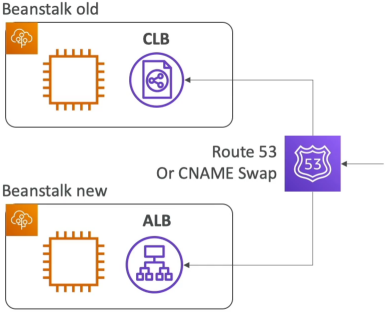
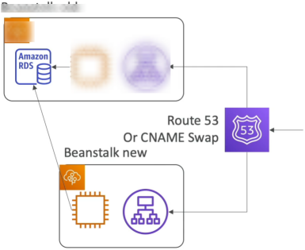

# Beanstalk Migrations

Once an Elastic Beanstalk environment is live, certain core architectural settings are permanently locked in. You cannot change the Load Balancer type (e.g., upgrading an old Classic Load Balancer to a modern Application Load Balancer), and you cannot easily untie a bundled RDS database from the environment's lifecycle without risking catastrophic data loss. To fix these limitations, you must execute a structural migration: you spin up a parallel, cleanly configured Beanstalk stack and gracefully pivot traffic over using a CNAME swap or Route 53 DNS updates.

## Key Takeaways

### Structural Migration Playbooks

#### Playbook 1: Shifting Load Balancer Types (ALB ↔️ NLB ↔️ CLB)

- **Scenario**: You have an older Beanstalk environment running with a Classic Load Balancer (CLB) and want to upgrade to an Application Load Balancer (ALB) for better Layer 7 routing features.
- **The Constraint:** You can modify the settings of an existing load balancer (like adding a listener rule), but you can never change the type itself.
- **The Migration Steps**:
    1. Manually create a brand-new Beanstalk environment within the same application tier.
    2. During the setup wizard, select your desired modern target (e.g., **Application Load Balancer**).
    3. Deploy your current application source bundle code to this new environment.
    4. Execute a **Swap Environment Domains (CNAME Swap)** or update your Route 53 DNS records to route traffic to the new cluster.
    5. Terminate the old environment once you verify the new one is handling traffic flawlessly.

#### Playbook 2: Decoupling a Bundled RDS Database for Production

- **Scenario**: You initially created an RDS database instance directly inside the Beanstalk environment wizard for a quick dev/test setup. Now, you want to migrate to a production-grade architecture where the database is independent of the Beanstalk lifecycle.
- **The Risk**: Keeping an RDS instance bundled inside Beanstalk means if someone accidentally hits "Terminate Environment," your production database is instantly erased.
- **The Decoupling Steps**:
    1. **Hardening the State**: Go to the RDS console and take a manual snapshot of your database immediately as a safeguard.
    2. **Activating Deletion Protection**: Drill into the settings of the bundled RDS instance _within the RDS Console and explicitly toggle_ **Enable Deletion Protection** to `ON`.
    3. **Building the Lean Fleet**: Launch a brand-new Beanstalk environment. This time, **do not** provision a database inside the wizard. Instead, pass the connection endpoints of the existing RDS database into the new environment's **Environment Properties**.
- **Traffic Pivot**: Initiate a **CNAME Swap** to shift all live production users seamlessly over to the new environment that communicates with the isolated database.
- **CloudFormation Cleanup**: Issue a delete command on the old Beanstalk environment. The underlying CloudFormation engine will successfully tear down the EC2 instances and ALB, but it will hit a hard wall when trying to nuke the database, putting the stack into a `DELETE_FAILED` state. Go straight into the AWS CloudFormation Console, manually delete the residual stack, and instruct it to **skip/ignore** the RDS resource. Your database is now completely free and independent.

## Exam Tips

- **The Load Balancer Upgrade Trap**: Watch out for questions asking how to upgrade an environment from a Classic Load Balancer to an Application Load Balancer. The options suggesting _"modify the environment settings inline"_ or _"clone the environment and change the load balancer type"_ are total bait. The only correct answer is to create a **new environment from scratch and swap the URLs**.

- **The "How to Decouple RDS" Sequence**: The exam loves testing the exact operational ordering for database separation. If you see a scenario trying to move a Beanstalk database to standalone production, look for the choice that includes: Enable Deletion Protection in the RDS console → Create a new environment without a database → Use environment variables to connect → Swap CNAMEs → Manually clean up CloudFormation.

### Practice Scenario

**Scenario**: A development team has deployed a retail application on AWS Elastic Beanstalk. During initial creation, an Amazon RDS database was bundled inside the environment. The company now wants to transition this setup to production. The team must decouple the RDS database from the Beanstalk environment lifecycle to ensure that future infrastructure updates do not jeopardize the database persistence. What sequence of steps should the developer take?
    - **A**. Clone the Beanstalk environment, select "Disable RDS" in the cloning configurations, and perform an environment URL swap.
    - **B**. Enable deletion protection on the RDS instance, create a new Beanstalk environment without an integrated database, pass the database endpoint via Environment Properties, swap the environment domains, and terminate the old environment while cleaning up the remaining CloudFormation stack.
    - **C**. Run an `eb deploy` command with an updated `cron.yaml` file instructing Beanstalk to drop its internal database dependencies.
    - **D**. Back up the database using AWS Backup, delete the Beanstalk environment completely, create a new environment, and run a script to restore the table structures.

**Correct Answer: B**. To decouple a bundled database safely, you must turn on RDS deletion protection, launch an independent parallel environment referencing that same database, swap the CNAME configurations, and handle the residual CloudFormation cleanup manually.