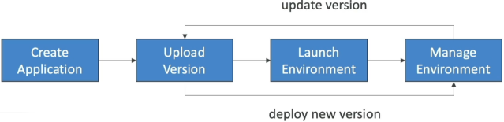
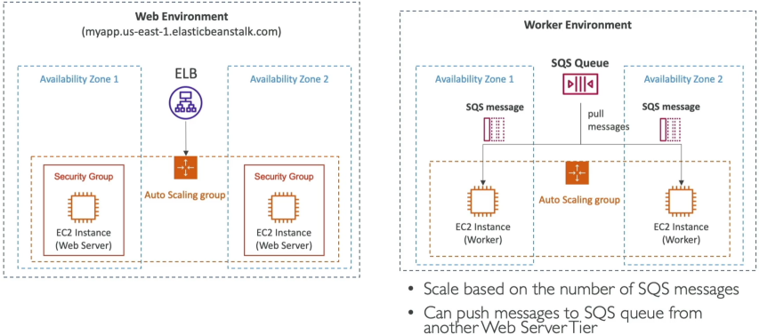
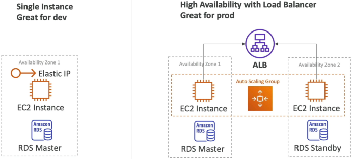

# Elastic Beanstalk Overview (High Level)

When you look at the architecture of a production-grade web application, it almost always follows the same blueprint: an Application Load Balancer sitting out in front, an Auto Scaling Group dynamically resizing a fleet of EC2 instances across multiple Availability Zones, a secure database layer in the back, and maybe a caching layer.

## Key Takeaways

### The 3 Core Logical Components

To manage your code smoothly inside the Beanstalk ecosystem, you must understand how it organizes assets under a strict parent-child logical chain:

```plaintext
📂 1. The Application Workspace (The overall project container)
     │
     ├── 💾 2. Application Versions (Immutable zip bundles stored in S3)
     │
     └── 🌐 3. Environments (The active running infrastructure blocks)
             ├── Dev Environment ──► Runs Version 2.0 (Single Instance)
             └── Prod Environment ─► Runs Version 1.0 (High Availability)
```
1. **The Application**: Think of this as your top-level project folder container. It acts as the umbrella workspace housing all your secondary configurations, platform codes, and environment stacks.
2. **Application Versions**: Every time you compile a new code change, you zip it up and upload it as a uniquely labeled iteration asset (e.g., `v1.0`, `v2-beta`). **Behind the scenes, Beanstalk stores these deployable raw artifacts inside a highly durable Amazon S3 bucket**. If a new deployment breaks, you simply point your environment back to an older version label to roll back instantly!
3. **The Environment**: The actual physical execution space running your code. An environment can only host **one single application version at a time**. However, you can spin up multiple environments simultaneously under the same parent application workspace—allowing you to easily isolate a cheap `dev-env` stack right alongside an ultra-resilient, multi-AZ `prod-env` cluster!


### Environment Architectural Tiers: Web vs. Worker

This is a high-leverage concept for the **DVA-C02** exam. Beanstalk separates environment architectures into two entirely distinct processing layers depending on the nature of the application traffic:

#### 🌐 A. The Web Server Tier (The Frontend/API Layer)

- **The Architecture**: `Public Users` ⟶ `Application Load Balancer` ⟶ `Auto Scaling Group (EC2 Instances)`.
- **The Use Case**: Traditional, low-latency applications designed to directly catch and process synchronous HTTP/HTTPS web requests from browsers or external client APIs.

#### 👷 B. The Worker Tier (The Background Batch Layer)

- **The Architecture**: `Inbound Tasks` ⟶ `Amazon SQS Queue` ⟶ `Auto Scaling Group (EC2 Worker Instances)`.
- **The Use Case**: Designed for resource-heavy, asynchronous background processing tasks (like image resizing, video transcoding, or mass database sync loops) that would otherwise choke a frontend web server.
- **The Secret Engine (The `SQSD` Daemon)**: Inside a Worker Tier, your EC2 instances don't handle direct public internet connections. Instead, Beanstalk installs a specialized background utility called the **SQS Daemon** (`sqsd`) onto every instance node. This daemon continuously polls your designated Amazon SQS queue, extracts message payloads, and transforms them into standard local **HTTP POST requests** delivered straight to your application code process running on `localhost`.
- **The Scaling Trigger**: Unlike the Web Tier (which scales on metrics like CPU or Network I/O), the Worker Tier dynamically scales out its EC2 counts based natively on the message backlogs inside the queue via CloudWatch!



### ⚙️ Deployment Topology Modes

When spinning up a new Beanstalk environment, your choice of deployment topology dictates your exact operational infrastructure costs and resilience profile:

- **Single Instance Mode (The Budget Sandbox)**: Provisions exactly **one single EC2 instance** paired with a fixed **Elastic IP address** routing traffic directly to it. There is no load balancer built into this layout, which keeps your sandbox costs at an absolute minimum. It is the gold standard for rapid local prototyping, remote dev work, or low-profile internal testing loops.
- **High Availability Mode (The Production Standard)**: Provisions a fully redundant **Elastic Load Balancer** sitting right out in front of an automated **Auto Scaling Group** that scales your EC2 server instances smoothly across multiple **Availability Zones (AZs)**. This is the mandatory choice for production workloads, guaranteeing that if a single AWS data center experiences a physical hardware crash, your application shifts traffic to alternate zones cleanly without a drop of downtime!


## Exam Tips

**The Custom Environment Architecture Triage**: Imagine an exam scenario asks, _"Your development team needs to deploy a custom internal tool written in an esoteric, niche programming language that is not natively included in the pre-configured AWS Elastic Beanstalk platform runtime lists. The application must still leverage Beanstalk's automated capacity provisioning and multi-AZ load balancing architecture. How can you deploy this workload cleanly with the lowest operational overhead?"_  
**The textbook gold-standard answer is to package your application inside a custom Docker configuration block.**  
- **The Trap**: Avoid distractors that suggest migrating your entire team away from Beanstalk over to self-managed EC2 or EKS clusters just because the language runtime isn't explicitly listed in the baseline dropdown menu. This destroys development velocity.
- **The Reality**: While Beanstalk natively supports language engines like Node.js, Python, Go, Java, and PHP out of the box, it also provides robust, premium **Docker Platform Branches**. By wrapping your esoteric code structure inside a standard `Dockerfile`, you can upload that bundle straight into a Beanstalk Docker environment. Beanstalk will pull down the container layers, build out the infrastructure layout, and manage the scaling loops exactly like a standard app—giving you ultimate execution flexibility!