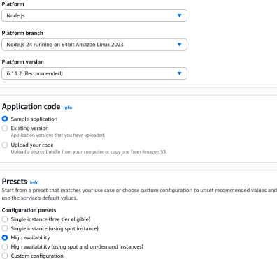
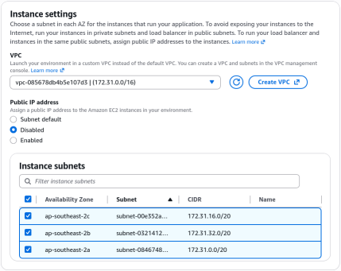
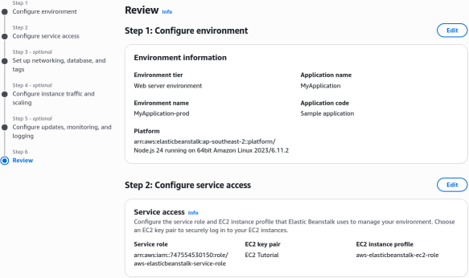
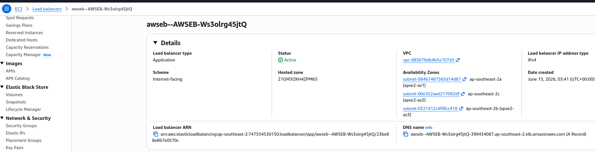
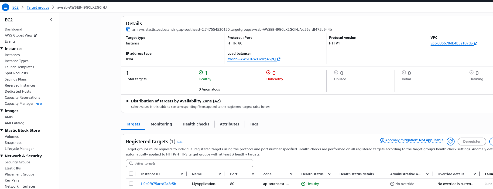
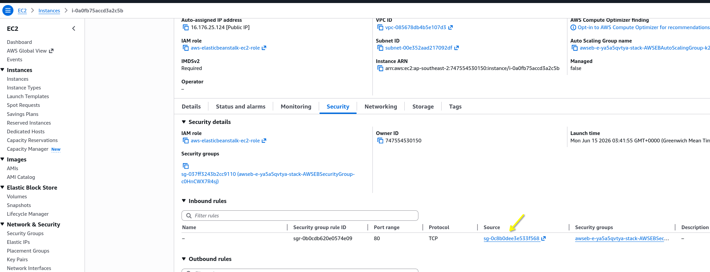
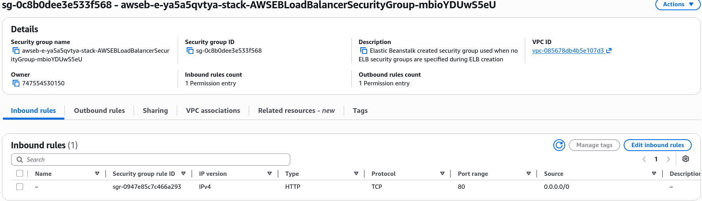
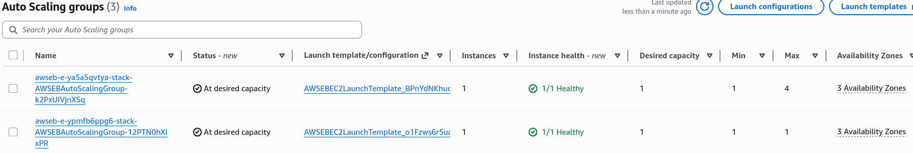
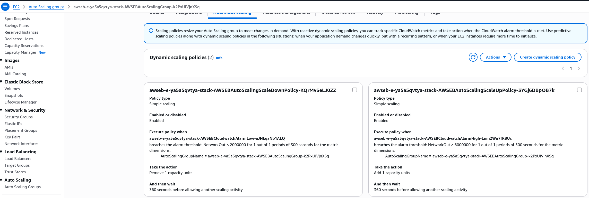

# Beanstalk Second Environment

We are spinning up a second AWS Elastic Beanstalk environment named `prod` within our existing application. Instead of going cheap with a single instance like a dev sandbox, we are picking the **High Availability (HA)** preset. Beanstalk completely handles the heavy lifting behind the scenes by provisioning an Application Load Balancer (ALB), an Auto Scaling Group (ASG), and wiring up security groups so traffic flows safely. Even though the app code is the exact same Node.js sample, the underlying infrastructure is now hardened for production.

## Hands On

### Phase 1: Initial Environment & Platform Setup
- Open `MyApplication` application workspace and click **Create Environment**.
- **Environment Tier Selection**: Choose the **Web server environment** tier to handle standard HTTP/HTTPS web requests.
- **Naming Strategy**: Name the environment `MyApplication-prod` to cleanly separate your production workloads from your development environment.
- **Platform Configuration**: Select the **Node.js** managed platform to match the codebase requirements.
- **Preset Selection**: Choose **High Availability** instead of Single Instance. This instructs Beanstalk to architect a multi-AZ, load-balanced infrastructure pattern from the jump.
- **Service Access**: Assign the pre-created IAM service roles to give Beanstalk permission to manage resources on your behalf, then proceed to optional settings.


### Phase 2: Network & Multi-AZ Instance Settings

- **VPC Assignment**: Select your target Custom or Default VPC to host the infrastructure.
- **Subnet Mapping**: Select **all available subnets** across different Availability Zones for the EC2 instances to guarantee fault tolerance.
- **IP Allocation**: Disable public IP assignments for the EC2 instances. Because an entry-point load balancer is being used, public IPs on individual instances are an unnecessary security risk.
- **Database Lifecycle De-coupling**: Skip the in-wizard database creation. Creating an RDS database here links its lifecycle directly to Beanstalk—meaning if you delete the environment, your database gets dropped too.  


### Phase 3: Capacity, Load Balancing, & Security Hardening

- **Auto Scaling Group Bounds**: Set the ASG capacity parameters with a **minimum of 1** and a **maximum of 4** instances using `t3.micro` types.
- **Scaling Triggers**: Configure network or CPU thresholds within the ASG settings to determine exactly when Beanstalk should dynamically scale out or scale in.
- **Load Balancer Configuration**: Deploy a **Public Application Load Balancer (ALB)** spanning three subnets.
- **Security Group Isolation**: Let Beanstalk auto-configure the rules to enforce the principle of least privilege.
    - The system provisions an ALB security group opening Port 80 to the world (`0.0.0.0/0`).
    - It provisions an EC2 security group that strictly restricts inbound Port 80 access only to traffic originating from the ALB's security group ID.


### Phase 4: Verification and Deployment

- **Safe Submission**: Use the **Skip to Review** feature if the console configurations get messy, verify your parameters on the final dashboard, and click **Submit**.
- **Resource Mapping Validation**: Once the 10-minute deployment completes, navigate to the AWS console to verify that the newly generated ALB target group points to the active EC2 instance, and the ASG is actively managing the live production capacity constraints.

### Phase 5: Post Deployment Review

- **Application Load Balancer** has been created in three AZs

- **Target group** is healthy and routing to the EC2 instance

- In **EC2 instance** view, we can see the security group referencing pattern in place. The instance only accepts inbound traffic on port 80 from the ALB's security group ID.

- If you checked the **ALB SG**, you would see that it has an open port 80 for outbound and inbound traffic from anywhere.

- Checking the **ASG**, you will see that there're two new instances, one for our dev environment and one for our prod environment.

- If you check the **ASG's scaling policies**, you will see Beanstalk already set up two dynamic scalling policies based on `NetworkOut`.

- That's it! That's the power of Beanstalk. We now have two environments, prod and dev.

### Security Groups

When Beanstalk structures its security groups to isolate backend instances from the public internet, it uses security group referencing. Instead of opening a port to an arbitrary IP range, the instance firewall rules reference the exact structural ID of the load balancer's security group.

The firewall constraint rule for the EC2 Instance Inbound Security Group is modeled as:
```math
\text{Inbound\_Rule} = \{ \text{Protocol: TCP}, \text{Port: 80}, \text{Source: } \text{sg-LoadBalancerID} \
```

### Architecture Mapping

```Plaintext
[Public Internet Users]
          │
          │ (HTTP / Port 80)
          ▼
┌────────────────────────────────────────────────────────┐
│        Application Load Balancer (ALB)                 │
│        Security Group: Inbound 0.0.0.0/0               │
└────────────────────────┬───────────────────────────────┘
                         │
                         ├───────────────────────┐
                         │ (Target Group Routing)│
                         ▼                       ▼
┌────────────────────────────────┐       ┌────────────────────────────────┐
│      Availability Zone A       │       │      Availability Zone B       │
│                                │       │                                │
│  ┌──────────────────────────┐  │       │  ┌──────────────────────────┐  │
│  │   EC2 Instance (Prod)    │  │       │  │   EC2 Instance (Prod)    │  │
│  │                          │  │       │  │                          │  │
│  │   Security Group Rule:   │  │       │  │   Security Group Rule:   │  │
│  │   Inbound: Only ALB SG   │  │       │  │   Inbound: Only ALB SG   │  │
│  └──────────────────────────┘  │       │  └──────────────────────────┘  │
└────────────────────────────────┘       └────────────────────────────────┘
                         ▲                       ▲
                         └───────────┬───────────┘
                                     │
                 ┌───────────────────┴───────────────────┐
                 │       Auto Scaling Group (ASG)        │
                 │         Bounds: Min 1 / Max 4         │
                 └───────────────────────────────────────┘
```
1. **Public Internet** traffic hits the public-facing **Application Load Balancer (ALB)** sitting across 3 distinct Availability Zones.
2. The ALB continuously evaluates the **Target Group** health checks to ensure traffic only shifts to operational instances.
3. Traffic passes through the internal **EC2 Security Group**, which validates that the request explicitly originated from the ALB's security group wrapper.
4. The **Auto Scaling Group** tracks cloud metrics, automatically scaling the `t3.micro` instance fleet within the bounds of 1 to 4 instances.

## Exam Tips

- **The Database Trap**: The exam loves to test your production separation of concerns. **Never** bundle an RDS database directly into your Beanstalk environment configuration file for production workloads. If you delete the Beanstalk environment to swap platforms, your production database gets wiped out. For production architectures, always provision the RDS instance externally and pass the endpoint via Beanstalk Environment Properties.
- **Security Group Rules**: Make sure you recognize the secure pattern for an HA web app. The instances should never have `0.0.0.0/0` open on port 80. They must only accept traffic where the source is the ALB's security group ID.

### Practice Scenario

- **Scenario**: A developer is deploying a high-availability Node.js application using AWS Elastic Beanstalk. The security team mandates that backend EC2 instances must not be directly accessible from the public internet, but must still receive HTTP traffic. How should this be configured?
- **A**. Configure the EC2 instances with public IPs and set their security groups to allow inbound port 80 traffic from `0.0.0.0/0`.
- **B**. Deploy a High Availability environment preset, which provisions an Application Load Balancer. Configure the EC2 instance security group to accept inbound port 80 traffic only from the Application Load Balancer's security group.
- **C**. Deploy a Single Instance environment preset and manually attach an Internet Gateway directly to the EC2 instance.
- **D**. Use an external Network Load Balancer and configure the EC2 instances to use a NAT Gateway for all inbound public web requests.

Correct Answer: **B**. Elastic Beanstalk's High Availability preset automates this exact architecture, securing backend instances by letting the ALB handle public entry and referencing its security group at the instance level.
