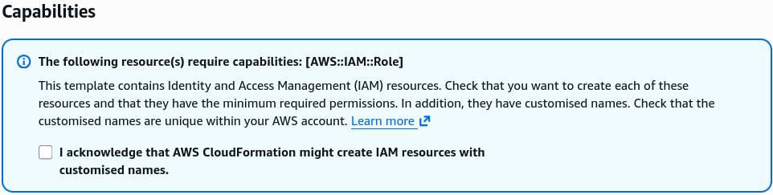

# CloudFormation - Capabilities

Whenever a CloudFormation template attempts to create, update, or modify security infrastructure (**IAM resources** like users, roles, groups, or policies), AWS blocks the deployment by default. To bypass this security guardrail, you must explicitly pass a configuration acknowledgment called a **Capability**. If you're building IAM resources with hardcoded, custom names, you pass `CAPABILITY_NAMED_IAM`; if they use auto-generated names, you pass `CAPABILITY_IAM`. Forgetting to flag these in your CLI command or console wizard results in an immediate `InsufficientCapabilitiesException` crash.

## Key Takeaways

AWS wants to make absolutely sure you don't accidentally deploy a CloudFormation template that creates backdoor admin users or malicious security roles without you explicitly giving the green light.

### Capability Tokens & Name Binding

- **The Acknowledgment Framework**: Capabilities are not settings you write _inside_ the YAML template code. They are operational parameters you pass to the CloudFormation service during the API call execution phase (either by ticking a checkbox at the bottom of the console wizard or appending a flag in the AWS CLI).
- **`CAPABILITY_IAM`**: You must acknowledge this token if your template generates IAM resources (e.g., `AWS::IAM::Role`) but leaves the naming properties blank, allowing CloudFormation to dynamically generate a unique physical ID placeholder name string for that resource.
- **`CAPABILITY_NAMED_IAM`**: You must acknowledge this token if your template explicitly hardcodes a dedicated, custom name using properties like `RoleName: "MyCustomRoleName"`. Hardcoded IAM names are considered a higher security risk because they are easy targets for malicious actors seeking well-known access points.
- **`CAPABILITY_AUTO_EXPAND`**: This token is required when your template leverages advanced macro engines or nested stack architectures. It signals to the engine that the code blueprint will undergo dynamic transformation expansion before the live resources are actually calculated and built.
- **The `InsufficientCapabilitiesException` Block**: If your pipeline throws this exact exception error, the deployment stops dead in its tracks. No resources are built. To fix it, you simply re-run the exact same template but make sure you append the missing capability validation arguments to your execution command.

### Structural Security Declarations & Capability Mappings

When declaring IAM components within your workspace, the template properties trigger the necessity for explicit runtime permissions flags.

Here is how a named security role is structured inside a YAML deployment template:

```YAML title="s3_capabilities.yaml"
Resources:
  MySecureExecutionRole:
    Type: "AWS::IAM::Role"               # Triggers IAM capability requirements
    Properties:
      RoleName: "App-Prod-S3-Worker-2026" # Hardcoded Name -> Requires CAPABILITY_NAMED_IAM!
      AssumeRolePolicyDocument:
        Version: "2012-10-17"
        Statement:
          - Effect: "Allow"
            Principal:
              Service: "ec2.amazonaws.com"
            Action: "sts:AssumeRole"
      ManagedPolicyArns:
        - "arn:aws:iam::aws:policy/AmazonS3ReadOnlyAccess"
```

To execute this specific deployment template via the terminal without crashing, the structural CLI parameter command must pass the explicit capability array matrix:

```bash
aws cloudformation create-stack \
  --stack-name DeployNamedSecurity \
  --template-body file://s3_capabilities.yaml \
  --capabilities CAPABILITY_NAMED_IAM
```

- If you create/updating the stack with Console, you will see a checkbox at the bottom of the wizard during the **Configure stack options** step. You must tick the box that says: _"I acknowledge that AWS CloudFormation might create IAM resources..."_ This is the console equivalent of passing the `CAPABILITY_IAM` or `CAPABILITY_NAMED_IAM` flag in the CLI.
  

## Exam Tips

- **Spotting the Exception Fix**: If a scenario question states that a developer’s automated CI/CD pipeline (like AWS CodePipeline or a GitHub Actions runner) is throwing an `InsufficientCapabilitiesException` during the deployment of a CloudFormation template, look for the answer that mentions adding the `capabilities` **parameter** to the build script or checking the IAM acknowledgment box in the console.
- **Choosing Between `CAPABILITY_IAM` vs. `CAPABILITY_NAMED_IAM`**: Read the prompt text carefully. If the question describes a template that spins up an IAM role without specifying a custom string name value, `CAPABILITY_IAM` is enough. If the template contains a property like `RoleName` or `UserName` with a hardcoded string, you must select `CAPABILITY_NAMED_IAM`.

### Practice Scenario

**Scenario**: A cloud developer is configuring an automated script to deploy an application infrastructure stack using the AWS CLI command `aws cloudformation create-stack`. The accompanying YAML template defines an `AWS::IAM::Policy` along with an `AWS::IAM::Role` resource that has its `RoleName` property hardcoded to `CorporateExecutionRole`. When the pipeline script runs, the execution fails immediately with an `InsufficientCapabilitiesException` error message. How can the developer correct the deployment script?

- **A**. Update the YAML configuration to wrap the IAM resources inside a CloudFormation `Conditions` logic gate.
- **B**. Re-run the command after adding the flag parameter `--capabilities CAPABILITY_NAMED_IAM` directly into the AWS CLI execution string.
- **C**. Grant the developer's personal IAM user profile full administrative write access across the global IAM tier.
- **D**. Modify the template file structure to use an `.ebextensions/` hidden folder deployment bundle.

**Correct Answer: B**. When a CloudFormation template creates IAM resources with explicit custom string names (such as setting the `RoleName` parameter directly), AWS demands an explicit confirmation acknowledgment at execution runtime. Adding the `--capabilities CAPABILITY_NAMED_IAM` flag satisfies this security checkpoint and clears the exception blockage.
