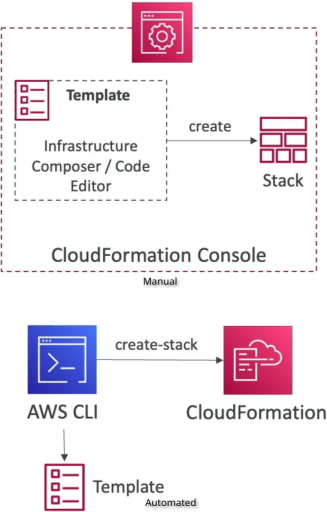
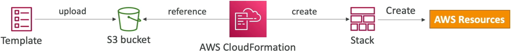

# CloudFormation Overview

AWS CloudFormation is a native **Infrastructure as Code (IaC)** engine that lets you declare exactly what you want your entire AWS environment to look like using a single text file written in **YAML** or **JSON**. Instead of clicking through dashboards to build EC2 instances, link security groups, and attach databases, you declare them as components in a static file. CloudFormation reads your code, maps out the structural dependencies, and automatically provisions everything in the exact sequence required.

## Key Takeaways

### Structural Mechanics & Core Lifecycles

- **The Declarative Paradigm**: CloudFormation uses declarative programming. This means you only specify the **final target state** of what you want built (e.g., "I need an S3 bucket and a DynamoDB table"). You do not have to write a script detailing the steps or the ordering; CloudFormation handles the backend orchestration and dependency chain mapping entirely on its own.
- **The Deployment Pipeline:**
    1. You write a template locally as a text file (`.yaml` or `.json`).
    2. The file is uploaded to an Amazon S3 bucket (either **manually** or automated through the CLI/Console).
    3. CloudFormation references that S3 file path and builds a Stack.
    
- **The Concept of a Stack**: A Stack is a single management unit representing a collection of real AWS resources. If you push a template containing an ALB, 3 instances, and an RDS database, that collective whole is treated as a single stack. If you hit "Delete Stack", CloudFormation automatically cleans up every single associated resource safely, preventing orphaned resource costs.
- **Updating Infrastructure Infrastructure Changes**: You cannot edit a running infrastructure stack inline. To change a setting (e.g., upgrading an instance size), you modify your local source code template, save a new version, upload it, and issue a **Stack Update**.

### Structural Block Hierarchy & Layout Specifications

A CloudFormation text document contains up to seven structural configuration zones. Out of all these segments, the **`Resources` block is the only absolute mandatory element required** to form a valid deployment template.

```math
\text{Template}_{\text{Structure}} = \begin{cases} \text{AWSTemplateFormatVersion: "2010-09-09"} \\ \text{Description: "My App Baseline Stack"} \\ \text{Parameters: } \{ \dots \} \\ \text{Mappings: } \{ \dots \} \\ \text{Conditions: } \{ \dots \} \\ \mathbf{Resources: } \{ \dots \} \\ \text{Outputs: } \{ \dots \} \end{cases}
```

### Local-to-Cloud Workflow



```Plaintext
  ┌──────────────────────────────────┐
  │ Local Text Editor / IDE Workspace│ ──► Writes declarative YAML/JSON code
  │ (Defines Resources, Parameters)  │
  └───────────────┬──────────────────┘
                  │
                  │ (Console Upload / CLI Push)
                  ▼
  ┌─────────────────────────────────┐
  │      Amazon S3 Staging Storage  │ ──► Template template file is staged (.yaml)
  └───────────────┬─────────────────┘
                  │
                  │ (CloudFormation Stack Engine Read)
                  ▼
  ┌─────────────────────────────────────────────────────────────────┐
  │                    AWS CloudFormation Stack Engine              │
  │                     [ Status: CREATE_IN_PROGRESS ]              │
  └─────┬───────────────────────┬──────────────────────────────┬────┘
        │                       │                              │
        │ (Dependency Order 1)  │ (Dependency Order 2)         │ (Dependency Order 3)
        ▼                       ▼                              ▼
┌───────────────────────┐ ┌──────────────────────────┐ ┌────────────────────┐
│  EC2 Security Group   │ │   EC2 Compute Clusters   │ │  Amazon S3 Storage │
│ (Built first for net) │ │ (References Sec Group)   │ │  Bucket Resource   │
└───────────────────────┘ └──────────────────────────┘ └────────────────────┘
```

## Exam Tips

- **The Mandatory Section Trap**: This is a free point if you spot it on the exam. AWS loves to ask: _"Which of the following blocks is the only absolutely required section inside an AWS CloudFormation template?"_ The answer is Resources. Everything else—including parameters, mappings, outputs, and descriptions—is completely optional.
- **Separation of Concerns Strategy**: When designing microservices or scaling cloud operations, do not place every single corporate resource inside a massive single file. The recommended AWS best practice is to separate stacks by concern (e.g., map a _Networking Stack_ for VPCs/subnets, an _Application Stack_ for compute nodes, and a _Storage Stack_ for DynamoDB databases).

### Practice Scenario

**Scenario**: A cloud software associate wants to build a repeatable deployment solution to spin up testing environments on demand. The architecture pattern requires creating a Amazon DynamoDB table, an Amazon S3 bucket, and an EC2 instance. The developer wants to ensure the setup can be fully version-controlled using Git and completely torn down without leaving behind rogue, unmanaged resource charges. What should the developer use?
    A. Write a Python bash script that issues manual, sequence-dependent `aws ec2` and `aws s3api` CLI creation parameters.
    B. Construct a single declarative AWS CloudFormation template defining all three target structures inside the `Resources` section, then manage the fleet via CloudFormation Stacks.
    C. Deploy an AWS Systems Manager (SSM) agent inside a pre-existing golden image baseline snapshot.
    D. Manually click through the AWS Management Console and apply custom project tags to each resource tier.

**Correct Answer: B**. CloudFormation is the premier native solution for Infrastructure as Code (IaC). Defining your components inside the Resources block of a template allows you to version-control your systems through Git and manage the entire lifecycle holistically as a single stack unit.