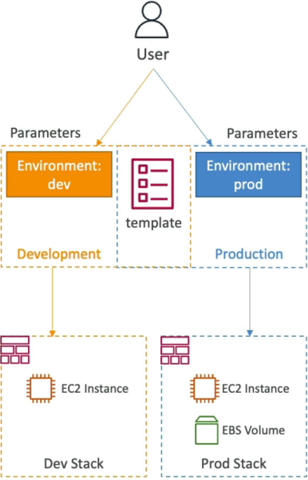

# CloudFormation - Conditions

**Conditions** act as control-flow logic gates (like `if/else` statements in regular code) that determine whether CloudFormation should actually provision a specific resource or output during stack execution. They evaluate dynamic runtime indicators—like environment variables (`dev` vs. `prod`) or user-provided parameters—and if the evaluation passes as true, the resource gets built. If it evaluates as false, CloudFormation completely skips over it, saving you money and keeping your environments perfectly trimmed.

## Key Takeaways

### Logical Gates & Resource Evaluation

- **The Condition Evaluation Layer**: Conditions are evaluated at the absolute beginning of the stack deployment phase. They look at your inputs and resolve down to a binary state: `True` or `False`.
- **Built-in Logical Operators**: You construct conditional rules inside a top-level `Conditions` block using standard logical matching functions:
  - `Fn::Equals` (`!Equals`): Compares two strings or numbers to check if they match exactly.
  - `Fn::And` (`!And`): Passes true only if all nested evaluations are true.
  - `Fn::Or` (`!Or`): Passes true if at least one nested evaluation is true.
  - `Fn::Not` (`!Not`): Inverts the evaluated result of a function.
- **The Condition: Property Hook**: To bind a condition to an actual AWS asset, you introduce the `Condition:` property key directly into the metadata of your target resource or output block.
  - If the condition evaluates to `True` → The resource is fully provisioned.
  - If the condition evaluates to `False` → The resource block is ignored by the engine, and zero API calls are fired down to that service.

### Control-Flow Syntax & Environmental Flags

When constructing environment gates, your template maps user parameters against static logic states.

The validation layout for a parameter-driven environment condition block uses this exact syntax framework:

```YAML
Parameters:
  EnvType:
    Type: "String"
    Default: "dev"
    AllowedValues: ["dev", "prod"]

Conditions:
  CreateProdResources:                # Condition Logical ID
    !Equals [ !Ref EnvType, "prod" ] # Returns true ONLY if EnvType equals "prod"
```

To dynamically toggle an additional high-capacity block storage (EBS) volume attachment strictly when the condition holds true, the resource binding is declared as follows:

```YAML
Resources:
  ProdEBSVolume:
    Type: "AWS::EC2::Volume"
    Condition: "CreateProdResources"   # The engine checks this logic gate first!
    Properties:
      Size: 100
      AvailabilityZone: "ap-southeast-2a"
```



## Exam Tips

- **The Single Template, Multiple Environments Pattern**: If an exam prompt asks: _"How can a developer design a repeatable Infrastructure as Code solution that deploys a baseline server setup to development environments, but automatically appends an Amazon RDS database read-replica ONLY when deployed into a production account using the same file?"_ Look for an answer that uses a **CloudFormation Template with a Condition block mapped via the `Condition:` property tag**.
- **Scope Limits**: Do not get bogged down trying to memorize the raw syntactic parameters of multiple complex `Fn::And` or `Fn::Or` code structures. For the Developer Associate, you simply need to know that conditions exist, can be tied to resources or outputs, and are driven by logical operators matching your parameters or mappings.

### Practice Scenario

Scenario: A cloud application engineer is designing a unified AWS CloudFormation template to deploy an application infrastructure across different stages. The business logic dictates that a high-capacity Amazon ElastiCache Redis cluster must be provisioned alongside the compute nodes when the stack is pushed to production, but must be completely omitted when deployed to development to keep sandbox costs low. How can this behavior be automated?

- **A**. Write a Python macro and run it within the Mappings block during build execution pipelines.
- **B**. Define a conditional rule in the Conditions section that evaluates the environment stage parameter, and append the Condition: key pointing to that rule inside the ElastiCache resource block metadata.
- **C**. Use an external systems manager shell script to manually terminate the cache cluster right after the stack hits create-complete.
- **D**. Force separate JSON files to be uploaded to individual S3 staging buckets for each respective deployment environment.

**Correct Answer: B**. CloudFormation Conditions are explicitly designed to handle environmental branching logic within a single template file. By mapping a logical gate to the `Condition:` property on a resource, you can dynamically control its creation footprint entirely based on runtime parameters.
