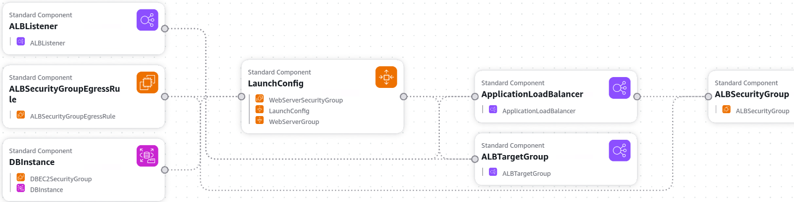
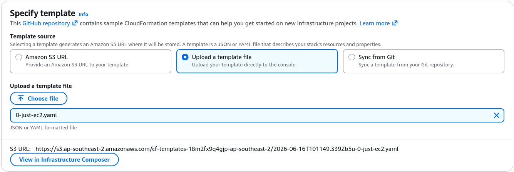
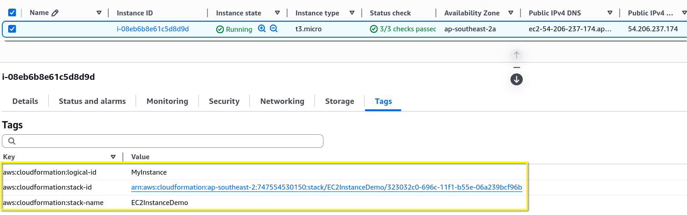

# Create Stack Hands-On

We are logging into the AWS Console and anchoring ourselves specifically in the Sydney (`ap-southeast-2`) region because Amazon Machine Image (AMI) IDs are strictly region-locked. We review how complex templates translate into drag-and-drop structural diagrams inside Infrastructure Composer (formerly Application Composer). Then, we upload a minimal YAML template named `0-just-ec2.yaml`. AWS stages this file in Amazon S3, parses the declarative block, and provisions an isolated `t3.micro` EC2 instance in Availability Zone `ap-southeast-2` without us clicking a single button inside the EC2 wizard.

## Hands On

### Infrastructure Blueprint: Phase-by-Phase Setup

#### Phase 1: Regional Alignment & Visualization Review

- **The Regional Boundary Guard**: Switch your console destination directly to `ap-southeast-2`. Running a CloudFormation template with a hardcoded ImageId in the wrong region causes the stack engine to crash immediately with an invalid AMI identifier error.
- **Canvas Examination**: Explore a [sample WordPress block template](http://cloudformation-templates-us-east-1.s3.us-east-1.amazonaws.com/WordPress_Multi_AZ.template) inside Infrastructure Composer. Note how complex, multi-tier YAML configurations parse into clean interactive nodes (like `WebServerSecurityGroup` or `LaunchConfig`) on a visual canvas, showing how infrastructure blocks map to each other.


#### Phase 2: Minimal EC2 Template Deployment

- `Code Structural Inventory`: Open up the basic target file `0-just-ec2.yaml` in your workspace. The blueprint contains the exact bare minimum structural parameters required to instantiate an AWS compute node:
```YAML title="0-just-ec2.yaml"
---
Resources:
  MyInstance: # The Logical ID of the resource
    Type: AWS::EC2::Instance # The resource type
    Properties:
      AvailabilityZone: ap-southeast-2a
      ImageId: ami-0c78ef10ebf8c08db # Amazon Linux 2023 AMI 2023.12.20260611.0 x86_64 HVM kernel-6.1 ap-southeast-2
      InstanceType: t3.micro
```

#### Phase 3: Launching the Stack Pipeline

- **Wizard Execution**: Inside the CloudFormation dashboard, click **Create Stack** (with new resources).
- **The S3 Staging Event**: Choose **Upload a template file** and point it to your local `0-just-ec2.yaml`. The moment you select it, the AWS Console quietly uploads that raw text file into an automated tracking bucket inside **Amazon S3**.
- **Naming and Submission**: Title your stack `EC2InstanceDemo`, click through the default permission screens, and hit Submit.


#### Phase 4: Lifecycle Monitoring & Tag Verification

- **Tracking State Transitions**: Refresh the **Events** tab immediately. You will watch the deployment machine execute the provisioning pipeline:
    1. `EC2InstanceDemo - CREATE_IN_PROGRESS`
    2. `MyInstance - CREATE_IN_PROGRESS`
    3. `MyInstance - CREATE_COMPLETE`
    4. `EC2InstanceDemo - CREATE_COMPLETE`
- **Resource Introspection**: Head over to the **Resources** tab, find the generated **Physical ID** (the instance ID string like `i-0xxxxxx`), and click it. This jumps you straight into the live Amazon EC2 Dashboard.
- **Metadata Tag Verification**: Look at the **Tags** tab on the newly created instance. CloudFormation automatically injects three system auditing tags onto every resource it spins up:


## Exam Tips

- **AMI Region Locking Trap**: This is a huge trap on the developer exam. AMIs are strictly region-specific. An AMI ID that represents Amazon Linux 2023 in `us-east-1` does not exist or points to a completely different image in `ap-southeast-2` (Sydney). If a question states that an uploaded template works perfectly in one region but crashes with an object isolation error when deployed in another, the hardcoded `ImageId` value is the root cause.
- **Tracking Resource Origin via Tags**: If an auditing scenario asks how to quickly identify which specific CloudFormation stack created an untagged, orphaned volume or EC2 instance inside a crowded corporate account, look for answers that check the standard prefix tags: `aws:cloudformation:stack-name` and `aws:cloudformation:logical-id`. CloudFormation appends these by default without you writing them.

### Practice Scenario

**Scenario**: A development team copies a valid AWS CloudFormation template that successfully deploys an auto-scaled development environment in the `us-east-1` region. However, when they attempt to deploy the exact same template file inside the `eu-west-1` region to spin up a European staging cluster, the stack creation immediately fails and returns the error status: _CloudFormation received a 400 response. Value (ami-0c7217cdde317cfec) for imageId is invalid_. How should the developer fix this?
    - **A**. Grant the CloudFormation execution service role explicit IAM permissions to perform s3:GetObject against global bucket targets.
    - **B**. Modify the template to use a `t2.micro` instance type instead of regional compute boundaries.
    - **C**. Replace the hardcoded ImageId value with the corresponding valid AMI identifier unique to the `eu-west-1` region, or abstract it using a CloudFormation Mappings block.
    - **D**. Re-run the stack creation process using JSON format instead of YAML to bypass string validation checks.

**Correct Answer: C**. Because AMI IDs are strictly bound to their respective geographic AWS regions, copying a template with a hardcoded image ID across regional lines will cause the stack generation engine to fail. The value must be updated to match the target region's local image catalog.