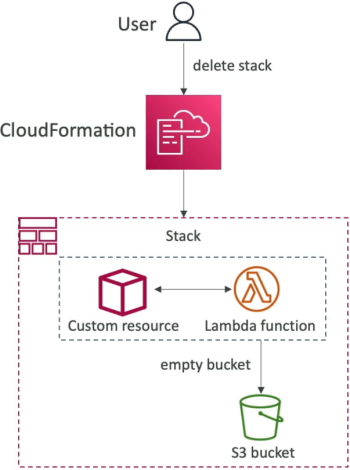

# CloudFormation - Custom Resources

CloudFormation Custom Resources allow you to extend the native capabilities of Infrastructure as Code. By defining a resource block prefixed with `Custom::`, you tell CloudFormation to hand over control to an external worker—most commonly an **AWS Lambda** function or an **Amazon SNS topic**—during stack operations. This backend worker executes custom code scripts whenever the stack goes through a Create, Update, or Delete phase, allowing you to handle complex provisioning tasks, third-party token exchanges, or advanced cleanup steps natively inside the stack's lifecycle.

## Key Takeaways

When you are building cutting-edge architectures, you will eventually hit a wall where a brand-new AWS feature, a third-party API, or an on-prem asset isn't natively supported by standard `AWS::*` resource types.

### The Lambda-Backed Custom Protocol

- **The Service Token Bridge**: Every custom resource declaration requires a mandatory property called the `ServiceToken`. This parameter houses the exact Amazon Resource Name (ARN) of the target Lambda function or SNS topic. Crucially, this backing resource must reside in the **same AWS region** as the CloudFormation stack.
- **The Lifecycle Payload Exchange**: When CloudFormation hits your custom resource block in its execution graph, it doesn't try to build anything itself. Instead, it fires an asynchronous event payload over to your Lambda function. This payload contains a critical field called `RequestType`, which passes a value of either `Create`, `Update`, or `Delete`.
- **The cfn-response Callback Contract**: This is a vital architectural rule: **Lambda must send a response back to CloudFormation**. Your function code must capture the pre-signed S3 URL provided in the request payload and send back a `SUCCESS` or `FAILED` signal. If your Lambda function errors out or hits a timeout before posting this callback, CloudFormation will freeze, hang for _up to_ two hours, and eventually crash with a generic timeout failure.

### Structural Custom Resource Syntax & Schema Layout

When creating a custom hook, you can invent any resource name descriptor you want, as long as you format the root type using the explicit `Custom::` naming convention wrapper.

The validation schema structure for a lifecycle-backed custom code block maps out using this exact layout definition:

```YAML
Resources:
  MyEmptyS3BucketLambdaHook:
    Type: "Custom::S3BucketPurger"       # Custom user-defined identifier string
    Properties:
      ServiceToken: !GetAtt PurgeBucketLambda.Arn  # Direct pointer to backing Lambda ARN
      TargetBucketName: !Ref MyProductionStorageBucket  # Custom Input parameter passed to Lambda
```

### The Classic Exam Scenario: The S3 Bucket Purge Pipeline



```Plaintext
       ┌────────────────────────────────────────────────────────┐
       │     Developer Triggers: Delete Stack Command           │
       └───────────────────────────┬────────────────────────────┘
                                   │
                                   ▼
       ┌────────────────────────────────────────────────────────┐
       │               AWS CloudFormation Engine                │
       │   Encounters: Type: "Custom::S3BucketPurger"           │
       └───────────────────────────┬────────────────────────────┘
                                   │
               (Fires JSON Request payload with RequestType: Delete)
                                   │
                                   ▼
       ┌────────────────────────────────────────────────────────┐
       │             Backing AWS Lambda Function                │
       │  Runs custom Boto3 script: bucket.objects.delete()     │
       └───────────────────────────┬────────────────────────────┘
                                   │
                (Empties all files & posts SUCCESS token back)
                                   │
                                   ▼
       ┌────────────────────────────────────────────────────────┐
       │          Target S3 Storage Bucket (Now 100% Empty)     │
       │   CloudFormation issues native DeleteBucket API call   │
       └───────────────────────────┬────────────────────────────┘
                                   │
                                   ▼
       ┌────────────────────────────────────────────────────────┐
       │     🛑 FINAL STATE: Stack Cleans Up Flawlessly! ✅     │
       └────────────────────────────────────────────────────────┘
```

## Exam Tips

- **The Empty S3 Bucket Resolution**: This is an absolute mandatory pattern to memorize. If the exam question states: _"A developer needs to ensure that deleting a CloudFormation stack automatically destroys an Amazon S3 bucket, but the deletion currently fails because the bucket contains application logging objects"_ the correct answer is to **Create a CloudFormation Custom Resource backed by an AWS Lambda function that programmatically purges all objects inside the bucket upon receiving a `Delete` request type**.
- **The Stack Hanging Bug**: If you encounter a troubleshooting scenario where a custom resource stack gets stuck in `CREATE_IN_PROGRESS` or `DELETE_IN_PROGRESS` for hours before failing, the root cause is **the backing Lambda function code failed to send a response payload back to the pre-signed S3 URL callback address**, blocking the state engine wrapper.

### Practice Scenario

**Scenario**: A software engineer is using an AWS CloudFormation template to manage application infrastructure. The template includes an Amazon S3 bucket used for staging dynamic build artifacts. During testing, whenever the stack is deleted, the teardown fails at the S3 bucket resource stage because the bucket is not empty. The engineer wants the entire deletion process to be completely automated without requiring any manual manual console steps. How can this be achieved?

- **A**. Change the S3 bucket resource block configuration properties to set `DeletionPolicy: Delete` inline.
- **B**. Modify the pipeline role to include the wildcard execution string parameter `s3:ForceBucketDeletion`.
- **C**. Re-upload the template as a JSON file and add an inline bash command under the Mappings block header registry.
- **D**. Configure a CloudFormation Custom Resource backed by an AWS Lambda function, write code within the function to drop all objects in the bucket when the `RequestType` equals `Delete`, and ensure the bucket resource depends on the custom resource cleanup.

**Correct Answer: D**. CloudFormation cannot natively delete an Amazon S3 bucket if it houses data objects. To automate the purge, you must intercept the stack lifecycle using a **Custom Resource** hooked to an **AWS Lambda function** that scrubs the object data volumes completely clean during the `Delete` phase before CloudFormation drops the bucket structure.
