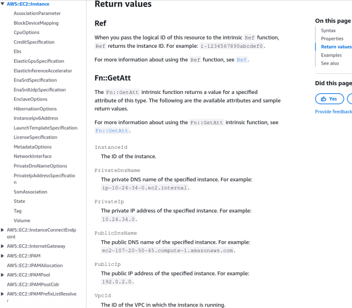
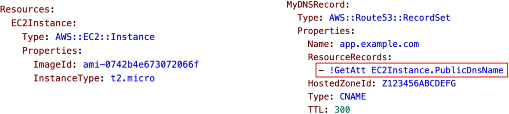

# CloudFormation - Intrinsic Functions

AWS CloudFormation templates aren't just rigid files; they are highly dynamic thanks to **Intrinsic Functions**. These functions allow you to perform real-time variable injection (`!Ref`), dig deep into a resource to pull specific live infrastructure data (`!GetAtt`), encode configuration bootstrap scripts for EC2 instances (`!Base64`), and link detached infrastructure components together (`!ImportValue`). Mastering these functions is all about knowing exactly what value each function extracts and how to use their clean YAML shorthands.

## Key Takeaways

- _Must know_ intrinsic functions for **DVA-C02**: `!Ref`, `!GetAtt`, `!Base64`, `!FindInMap`, `!ImportValue` and Condition functions (`!Equals`, `!And`, `!Not`).
- Other intrinsic functions that exist but are not tested on the exam include: `!Join`, `!Sub`, `!ForEach`, `!ToJsonString`,`!Cidr`, `!GetAZs`, `!Select`, `!Split`, `!Transform` and `!Length`. You can find the full list in the [AWS documentation](https://docs.aws.amazon.com/AWSCloudFormation/latest/DeveloperGuide/intrinsic-function-reference.html).

### Deep Dive

#### The `!Ref` Function

- **Mechanics**: The baseline tracking function.
- **Return Behavior**: As we discussed in our parameters overview, `!Ref` plays two different roles depending on the input argument:
  - Passed a **Parameter Name** → Returns the literal value provided by the user.
  - Passed a **Resource Logical ID** → Returns the core unique identifier (the physical ID) of that resource (e.g., returning an `i-0xxxxxx` string for an `AWS::EC2::Instance`).

```YAML
Resources:
  DBSubnet1:
    Type: AWS::EC2::Subnet
    Properties:
      VpcId: !Ref MyVPC
```

#### The `!GetAtt` (Get Attribute) Function

- **Mechanics**: While `!Ref` only gives you the baseline ID of a resource, `!GetAtt` lets you drill down to retrieve highly specific structural properties generated after the resource is provisioned.
- **Return Behavior**: You can only extract attributes explicitly exposed by [AWS in the official documentation](https://docs.aws.amazon.com/AWSCloudFormation/latest/TemplateReference/aws-resource-ec2-instance.html#aws-resource-ec2-instance-return-values). For an `AWS::EC2::Instance`, `!GetAtt` can retrieve attributes like:
  - `PrivateIp` or `PublicIp`
  - `PrivateDnsName` or `PublicDnsName`
    
- **Syntax**: Expressed as an array sequence or dot-notation string: `!GetAtt MyEC2Instance.PublicDnsName`.
- **Real-World Case**: Imagine you need to provision a public web server and automatically map its address to an Amazon Route 53 DNS record stack. You use `!GetAtt MyEC2Instance.PublicDnsName` to dynamically pipe the live server address straight into the Route 53 resource record block.
  

#### The `!Base64` Function

- **Mechanics**: Converts an unencoded plain text string into a Base64-encrypted format string.
- **Primary Use Case**: Enforcing compliance when writing custom **EC2 UserData** scripts. The AWS virtualization layer requires all initialization launch scripts passed to an instance to be encoded in `Base64` format. You wrap your startup script block with `!Base64` to handle this transformation automatically.

```YAML
Resources:
  WebServer:
    Type: AWS::EC2::Instance
    Properties:
      UserData:
        !Base64 |
          #!/bin/bash
          dnf update -y
          dnf install -y httpd
```

#### Reviewing Core Logic & & Lookup Helpers

- `!FindInMap`: Extracts a hardcoded attribute from a nested multidimensional table array based on regional or environmental keys.
- `!ImportValue`: Reaches outside the boundaries of the local template to pull in globally exported asset IDs (like a core VPC ID) published by independent producer stacks.
- **Condition Functions** (`!Equals`, `!And`, `!Not`): Evaluates dynamic environmental states down to a binary logic gate to determine if a resource should compile or stay unprovisioned.

## Exam Tips

- `!Ref` vs. `!GetAtt` **Selection Criteria**: This is a classic exam favorite. If a question scenario asks you to pass the Instance ID of an EC2 instance to another resource, use `!Ref`. If it asks you to pass the Public IP Address or Availability Zone of that instance, you must select `!GetAtt`.
- **The UserData Requirement Pattern**: If you see an exam question detailing an issue where a shell bootstrap configuration script inside an EC2 instance's `UserData` property is failing to execute because the text format is improper, look for an answer that wraps the script block with the `!Base64` intrinsic function wrapper.

### Practice Scenario

**Scenario**: A developer is constructing an AWS CloudFormation template to deploy an application cluster. The template contains an `AWS::EC2::Instance` resource with the logical ID `ApplicationServer`. The developer also needs to configure an Amazon Route 53 Record Set resource within the same template, which requires the public IP address of the newly spun-up instance to resolve the routing destination. Which syntax string should the developer use to dynamically fetch this value?

- **A**. `!Ref ApplicationServer`
- **B**. `!GetAtt ApplicationServer.PublicIp`
- **C**. `!ImportValue ApplicationServer.PublicIp`
- **D**. `!FindInMap [ ApplicationServer, PublicIp ]`

**Correct Answer: B**. While the `!Ref` function only yields the core physical asset instance ID string, the `!GetAtt` function allows you to drill down into the resource specification catalog to extract post-provisioned contextual attributes, such as `PublicIp`, at deployment runtime.
