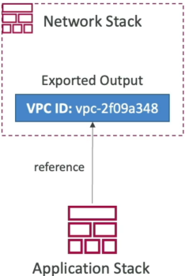

# CloudFormation - Outputs & Exports

The `Outputs` section is an optional block used to export key resource identifiers (like a VPC ID, Subnet ID, or Security Group ID) out of a completed stack. By stamping an `Export` wrapper on an output, you publish that value to a global regional registry. Any other independent CloudFormation stack in your account can then snatch that value using the `!ImportValue` function. This enables a clean **Separation of Concerns**—allowing your network team to manage the core VPC architecture while application developers safely import those network blocks into their standalone app stacks.



## Key Takeaways

### Infrastructure Blueprint: Cross-Stack Export & Ingestion Mechanics

- **The Export Protocol (Producer Stack)**: When declaring an output you want to share, you must include an `Export` block with a `Name` key. This string handle acts as a global pointer.
  - **Crucial rule**: Export names must be absolutely unique within that specific AWS region and account.
  - **The Import Protocol (Consumer Stack)**: To ingest that shared asset inside a completely separate template, you drop the `!ImportValue` intrinsic function (shorthand for `Fn::ImportValue`) and pass it the exact global export name string.
- **The Cross-Stack Dependency Lock**: The moment a consumer stack successfully imports a value from a producer stack, CloudFormation injects a hard **dependency lock** between them.
  - You **cannot** delete the producer stack while its exports are actively being used by another stack.
  - You **cannot** modify or remove the exported property configuration inside the producer template.
  - To make any modifications or tear down the base layer, you must first delete or update every single consumer stack to sever the reference hooks.

### Structural Cross-Stack Architecture Syntax

To establish cross-stack communication, the configuration layout splits into a producer block definition and a consumer injection block.

#### 📡 The Producer Blueprint: Exporting a Resource Reference

```YAML
# Inside Stack A: "Core-Networking-Stack"
Resources:
  SSHSecurityGroup:
    Type: "AWS::EC2::SecurityGroup"
    Properties:
      GroupDescription: "Global corporate SSH ingress firewall rule."

Outputs:
  SharedSSHSGId:
    Description: "The physical ID of our shared corporate SSH security group"
    Value: !Ref SSHSecurityGroup   # Fetches the physical sg-xxxx ID string
    Export:
      Name: "prod-global-ssh-security-group-id"  # GLOBAL UNIQUE ID WITHIN REGION
```

#### 🧲 The Consumer Blueprint: Importing the Shared Asset

````YAML
# Inside Stack B: "App-Deployment-Stack"
Resources:
  MyWebServerNode:
    Type: "AWS::EC2::Instance"
    Properties:
      InstanceType: "t2.micro"
      ImageId: "ami-0c7217cdde317cfec"
      SecurityGroups:
        - !ImportValue "prod-global-ssh-security-group-id"  # Dynamically hooks into Stack A
        ```
````

## Exam Tips

- **The Multi-Stack Collaboration Pattern**: The developer exam heavily favors architectural scalability. If a question states: _"A company's security engineering team creates and maintains all network security groups, while the development team builds independent application environments that must reuse those exact security groups. What is the most efficient configuration strategy?"_ Look for an answer that uses **CloudFormation Stacks with `Outputs`, unique Export Names, and `!ImportValue` inside the application templates**.
- **Tracking Down Deletion Failures**: If you face a scenario where a CloudFormation stack keeps throwing a `Delete_Failed` status, and the error logs read that an exported resource name is currently referenced by another stack, the solution is: **Locate and delete or update the dependent consumer stack first, then delete the base layer stack**.

### Practice Scenario

**Scenario**: A cloud software engineer is trying to delete a legacy network foundation AWS CloudFormation stack named `Network-Base-Stack`. However, the deletion process immediately fails with an error stating that the export value `VPC-Production-ID` is currently in use by other active stacks. What step must the developer perform to successfully clean up and delete the stack?

- **A**. Edit the template of `Network-Base-Stack` to drop the Outputs block entirely and run an inline Stack Update.
- **B**. Identify all dependent consumer stacks referencing `VPC-Production-ID`, update or delete those consumer stacks to remove the dependency references, and then re-execute the deletion on `Network-Base-Stack`.
- **C**. Force execution of the delete operation by adding the `--force-teardown` parameter string inside the AWS CLI.
- **D**. Modify the underlying Amazon S3 staging bucket configurations to bypass CloudFormation stack execution policies.

**Correct Answer: B**. Due to the strict cross-stack dependency lock mechanism in CloudFormation, a stack hosting an exported output value cannot be destroyed while other templates are actively importing that token. Every consumer reference hook must be cleared or deleted out of the account before the producer stack can be completely wiped.
