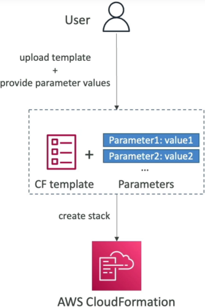

# CloudFormation - Parameters

**Parameters** are the ultimate way to inject dynamic user inputs into your templates at runtime. Instead of hardcoding values like specific instance sizes or security group names, you define them as parameters so anyone in your company can reuse the same code block. They aren't just raw strings either; they act as a security blanket for your infrastructure by enforcing validation rules, regex patterns, and masked entry fields.



## Key Takeaways

### Infrastructure Blueprint: Parameter Formatting & Intrinsic Referencing

- **The Parameter Blueprint Logic:** You define parameters in a top-level `Parameters` block. When someone launches your stack via the console, these parameters transform into clean UI inputs (like dropdown menus or password text fields).
- **Validation & Safety Constraints**: You can lock down inputs using built-in validators:
  - **AllowedValues**: Creates a strict dropdown array list (e.g., only letting users pick from `t2.micro`, `t2.small`, or `t2.medium`).
  - **NoEcho**: The ultimate security flag. Setting `NoEcho: true` masks the user input in the console UI with asterisks and completely scrubs it from CloudFormation execution history.
- **The `!Ref` Intrinsic Function**: To map your parameter choice down to a resource property, you use the `!Ref` function (shorthand for `Fn::Ref`).

#### The Dual Personality of !Ref

You must remember for the exam that `!Ref` handles two completely different things depending on what string you pass to it:

1. **If you pass a Parameter Name**: `!Ref` returns the actual value inputted by the user at runtime.
2. **If you pass a Resource Logical ID**: `!Ref` returns a specific core identifier of that resource (e.g., passing an AWS::EC2::Instance logical ID returns the physical InstanceId string like i-0xxxxxxxx).

### Out-of-the-Box Injection: Pseudo Parameters

AWS automatically injects a collection of predefined environment variables into every stack template. You don't declare these; they are ready to go by default. Key pseudo parameters include:

- `AWS::AccountId`: Dynamically injects the 12-digit AWS Account ID running the template.
- `AWS::Region`: Programmatically grabs the current execution region (e.g.,`ap-southeast-2`), making your templates instantly portable across the globe without hardcoding text locations.
- `AWS::StackName`: Returns the name assigned to the active stack wrapper.

### Structural Parameter Topologies & Safe Password Masks

When structuring inputs, the data model maps constraints directly to the parameter configuration keys.

The validation structure for a secure input variable block uses this exact syntax framework:

```YAML
Parameters:
  DBPassword:
    Type: "String"
    Description: "Enter your production database master password, bro."
    MinLength: 8
    MaxLength: 32
    NoEcho: true                 # Masks entry in UI and deletes from cloud logging
```

## Exam Tips

- **The NoEcho Credential Protection**: The exam loves to test you on security compliance. If a question describes a scenario where database master credentials or private API keys are being passed into a CloudFormation template and showing up in plain text inside the console logs, the fix is to append NoEcho: true immediately onto that specific parameter definition.
- **Pseudo Parameter Portability**: If a scenario requires you to construct an Amazon Resource Name (ARN) string dynamically within a template across multiple regions and accounts without hardcoding metadata, use sub-string interpolation combining pseudo parameters: `!Sub "arn:aws:s3:::my-app-bucket-${AWS::AccountId}-${AWS::Region}"`.

### Practice Scenario

**Scenario**: A cloud engineer is updating a shared AWS CloudFormation template that provisions backend database components. The security engineering team notes that during stack creation, the sensitive administrator password parameter value is exposed in plain text within the stack's event description deployment logs. Which property must the developer add to the password parameter configuration block to hide this sensitive string?

- **A**. NoEcho: true
- **B**. Masked: true
- **C**. Type: AWS::SSM::Parameter::SecureString
- **D**. ConstraintDescription: "Secret"

**Correct Answer: A**. Setting the NoEcho: true property on a CloudFormation parameter tells the underlying engine to replace the literal text value with asterisks inside the console UI and permanently hide it from appearing in any deployment event description logs.
